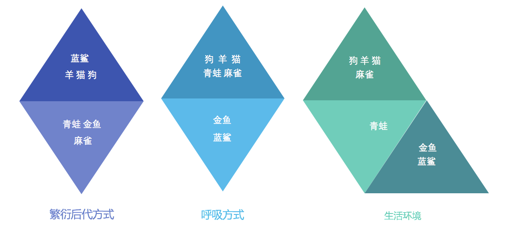

# 聚类算法简介

在正式进入 K-means 模型前，我们先简单看一下聚类算法。

## 认识聚类算法

聚类算法是一种无监督学习方法，它可以将一组数据划分为若干个子集，使得同一子集中的数据点尽可能相似，不同子集中的数据点尽可能不同。聚类算法的目标是使得数据点之间的距离尽可能的小，也就是说，希望数据点在聚类过程中尽可能的聚集在一起。

使用不同的聚类准则，产生的聚类结果也会不同。

聚类算法在现实中的应用非常广泛，例如：

- 用户画像，广告推荐，Data Segmentation，搜索引擎的流量推荐，恶意流量识别
- 基于位置信息的商业推送，新闻聚类，筛选排序
- 图像分割，降维，识别；离群点检测；信用卡异常消费；发掘相同功能的基因片段

## 聚类算法与分类算法最大的区别

我们之前一直在关注有监督学习，而聚类是无监督学习。

在聚类算法中根据样本之间的相似性，将样本划分到不同的类别中，对于不同的相似度计算方法，会得到不同的聚类结果，常用的相似度计算方法有欧式距离法。
