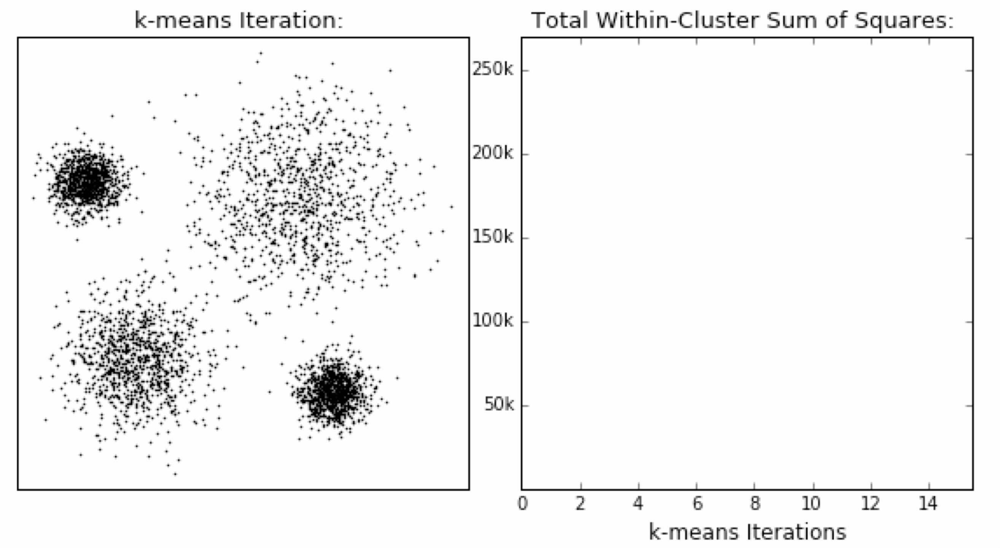

# 模型评估

对于聚类算法，有监督学习的评估方法大部分都不再适用了，我们需要一些新的评估方法。

## 误差平方和(SSE, The sum of squares due to error)

非常直白，例如下图：

在 k-means 中：

公式各部分内容：

SSE 图最终的结果是对图松散度的衡量，随着聚类迭代其值会越来越小，直到最后趋于稳定：

如果质心的初始值选择不好,SSE 只会达到一个不怎么好的局部最优解：

## “肘”方法 (Elbow method) — 确定 K 值

1. 对于 n 个点的数据集，迭代计算 k from 1 to n，每次聚类完成后计算每个点到其所属的簇中心的距离的平方和；
2. 平方和是会逐渐变小的，直到 k==n 时平方和为 0，因为每个点都是它所在的簇中心本身。
3. 在这个平方和变化过程中，会出现一个拐点也即“肘”点，**下降率突然变缓时即认为是最佳的 k 值**。

在决定什么时候停止训练时，肘形判据同样有效，数据通常有更多的噪音，在**增加分类无法带来更多回报时，我们停止增加类别**。

## \[选读\]轮廓系数法（Silhouette Coefficient）

结合了聚类的凝聚度（Cohesion）和分离度（Separation），用于评估聚类的效果：

其目的在于使内部距离最小化，外部距离最大化

求出所有样本的轮廓系数后再求平均值就得到了平均轮廓系数。

平均轮廓系数的取值范围为\[-1, 1\]，系数越大，聚类效果越好。

簇内样本的距离越近，簇间样本距离越远

## \[选读\]CH 系数（Calinski-Harabasz Index）

类别内部数据的协方差越小越好，类别之间的协方差越大越好（换句话说：类别内部数据的距离平方和越小越好，类别之间的距离平方和越大越好），

这样的 Calinski-Harabasz 分数 s 会高，分数 s 高则聚类效果越好。

m 为训练集样本数，k 为类别数。

使用矩阵的迹进行求解的理解：

矩阵的对角线可以表示一个物体的相似性

在机器学习里，主要为了获取数据的特征值，那么就是说，在任何一个矩阵计算出来之后，都可以简单化，只要获取矩阵的迹，就可以表示这一块数据的最重要的特征了，这样就可以把很多无关紧要的数据删除掉，达到简化数据，提高处理速度。

CH 需要达到的目的：

​**用尽量少的类别聚类尽量多的样本，同时获得较好的聚类效果。**
