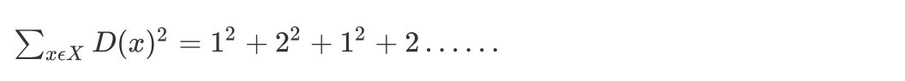

# 算法优化

## K-Means 的优缺点

### 优点

1. 原理简单（靠近中心点），实现容易
2. 聚类效果中上（依赖 K 的选择）
3. 空间复杂度 o(N)，时间复杂度 o(IKN)

### 缺点

1. 对离群点，噪声敏感 （中心点易偏移）
2. 很难发现大小差别很大的簇及进行增量计算
3. 结果不一定是全局最优，只能保证局部最优（与 K 的个数及初值选取有关）

那么有没有什么办法可以改进 K-means 算法的缺点呢？下面介绍几种优化方法。

## Canopy 算法配合初始聚类

**优点**：

1. Kmeans 对噪声抗干扰较弱，通过 Canopy 对比，将较小的 NumPoint 的 Cluster 直接去掉有利于抗干扰。
2. Canopy 选择出来的每个 Canopy 的 centerPoint 作为 K 会更精确。
3. 只是针对每个 Canopy 的内做 Kmeans 聚类，减少相似计算的数量。

**缺点**：

算法中 T1、T2 的确定问题 ，依旧可能落入局部最优解

## K-means++

其中：

为方便后面表示，把其记为 A

kmeans++目的，让选择的质心尽可能的分散

如下图中，如果第一个质心选择在圆心，那么最优可能选择到的下一个点在 P(A)这个区域（根据颜色进行划分）

## 二分 k-means

实现流程:

1. 所有点作为一个簇
2. 将该簇一分为二
3. 选择能最大限度降低聚类代价函数（也就是误差平方和）的簇划分为两个簇。
4. 以此进行下去，直到簇的数目等于用户给定的数目 k 为止。

隐含的一个原则：

因为聚类的误差平方和能够衡量聚类性能，该值越小表示数据点越接近于他们的质心，聚类效果就越好。所以需要对误差平方和最大的簇进行再一次划分，因为误差平方和越大，表示该簇聚类效果越不好，越有可能是多个簇被当成了一个簇，所以我们首先需要对这个簇进行划分。

二分 K 均值算法可以加速 K-means 算法的执行速度，因为它的相似度计算少了并且不受初始化问题的影响，因为这里不存在随机点的选取，且每一步都保证了误差最小

## k-medoids（k-中心聚类算法）

K-medoids 和 K-means 是有区别的，不一样的地方在于中心点的选取

- K-means 中，将中心点取为当前 cluster 中所有数据点的平均值，对异常点很敏感!
- K-medoids 中，将从当前 cluster 中选取到其他所有（当前 cluster 中的）点的距离之和最小的点作为中心点。

算法流程：

1. 总体 n 个样本点中任意选取 k 个点作为 medoids
2. 按照与 medoids 最近的原则，将剩余的 n-k 个点分配到当前最佳的 medoids 代表的类中
3. 对于第 i 个类中除对应 medoids 点外的所有其他点，按顺序计算当其为新的 medoids 时，代价函数的值，遍历所有可能，选取代价函数最小时对应的点作为新的 medoids
4. 重复 2-3 的过程，直到所有的 medoids 点不再发生变化或已达到设定的最大迭代次数
5. 产出最终确定的 k 个类

k-medoids 对噪声鲁棒性好。

## Kernel k-means

kernel k-means 实际上，就是将每个样本进行一个投射到高维空间的处理，然后再将处理后的数据使用普通的 k-means 算法思想进行聚类。

## ISODATA

类别数目随着聚类过程而变化；

对类别数会进行合并，分裂，

“合并”：（当聚类结果某一类中样本数太少，或两个类间的距离太近时）

“分裂”：（当聚类结果中某一类的类内方差太大，将该类进行分裂）

## Mini Batch K-Means

适合大数据的聚类算法

大数据量是什么量级？通常当样本量大于 1 万做聚类时，就需要考虑选用 Mini Batch K-Means 算法。

Mini Batch KMeans 使用了 Mini Batch（分批处理）的方法对数据点之间的距离进行计算。

Mini Batch 计算过程中不必使用所有的数据样本，而是从不同类别的样本中抽取一部分样本来代表各自类型进行计算。由于计算样本量少，所以会相应的减少运行时间，但另一方面抽样也必然会带来准确度的下降。

该算法的迭代步骤有两步：

1. 从数据集中随机抽取一些数据形成小批量，把他们分配给最近的质心
2. 更新质心

​ 与 Kmeans 相比，数据的更新在每一个小的样本集上。对于每一个小批量，通过计算平均值得到更新质心，并把小批量里的数据分配给该质心，随着迭代次数的增加，这些质心的变化是逐渐减小的，直到质心稳定或者达到指定的迭代次数，停止计算。
