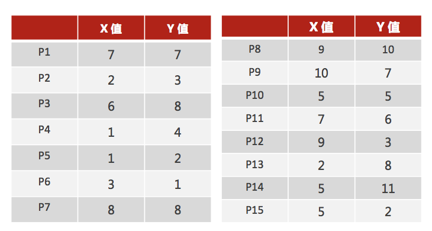
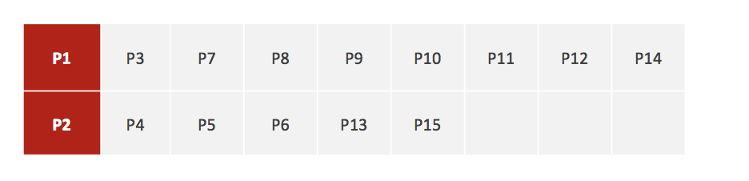
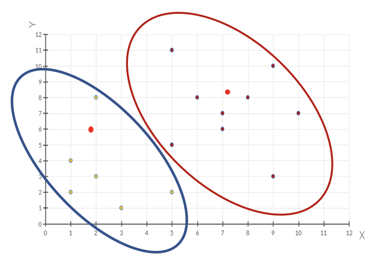

# k-means 算法实现流程

K-means 算法是一种非常经典的无监督学习算法，它可以用来对数据集进行聚类。聚类是指将相似的数据点分到同一类，不同类的数据点尽量分开。

K-means 算法是一种**无监督学习**、**聚类**算法。

## 聚类步骤

1. 随机设置 K 个特征空间内的点作为初始的聚类中心
2. 对于其他每个点计算到 K 个中心的距离，未知的点选择最近的一个聚类中心点作为标记类别
3. 接着对着标记的聚类中心之后，重新计算出每个聚类的新中心点（平均值）
4. 如果计算得出的新中心点与原中心点一样（质心不再移动），那么结束，否则重新进行第二步过程

我们可以通过下图解释实现流程：

简单来说，就是将数据集分为 K 个簇，然后将数据集中的每个点分配到距离最近的 K 个簇中，然后重新计算 K 个簇的中心点，直到中心点不再移动为止。

从实现上就是这么简单。在原理方面，K-means 仍然利用了损失与优化的思想，即寻找使得损失函数最小的解。损失函数一般采用平方误差函数，即将每个点到其所属的簇的中心点的距离的平方和，我们将在后面的小节详细介绍。

由于第一步随机选取的位置不同，导致最终结果可能不同，我们实际上在实现 K-means 算法时，一般会多次随机初始化 K 个聚类中心，然后选择其中距离最小的作为初始聚类中心，然后迭代多次，选择结果最好的作为最终结果。

## 案例

下面我们模拟一个详细的聚类场景：

如图所示，我们有 15 组数据，每个数据包含 X 与 Y 值，我们希望这 15 组数据可以划分为 2 类，下面我们手动走一下 K-means 算法的步骤：

1.随机设置 2 个特征空间内的点作为初始的聚类中心（本案例中设置 p1 和 p2）

2.对于其他每个点计算到 K 个中心的距离，未知的点选择最近的一个聚类中心点作为标记类别

3.接着对着标记的聚类中心之后，重新计算出每个聚类的新中心点（平均值）

4.如果计算得出的新中心点与原中心点一样（质心不再移动），那么结束，否则重新进行第二步过程【经过判断，需要重复上述步骤，开始新一轮迭代】

5.当每次迭代结果不变时，认为算法收敛，聚类完成，K-Means 一定会停下，不可能陷入一直选质心的过程。

