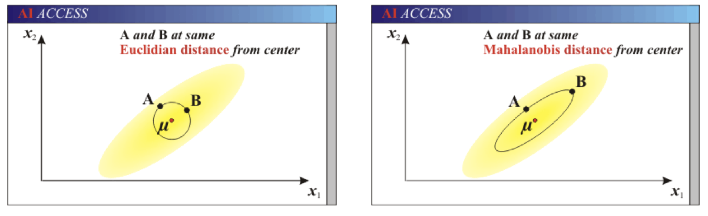

# 距离度量

本节我们简单介绍一下机器学习中常见的距离计算公式

## 欧式距离(Euclidean Distance)

欧氏距离是最容易直观理解的距离度量方法，我们小学、初中和高中接触到的两个点在空间中的距离一般都是指欧氏距离。

如果你对线代比较了解，欧式距离也可以被称作“二范数”

## 曼哈顿距离(Manhattan Distance)

在曼哈顿街区要从一个十字路口开车到另一个十字路口，驾驶距离显然不是两点间的直线距离。这个实际驾驶距离就是“曼哈顿距离”。曼哈顿距离也称为“城市街区距离”(City Block distance)。

## 切比雪夫距离 (Chebyshev Distance)

国际象棋中，国王可以直行、横行、斜行，所以国王走一步可以移动到相邻 8 个方格中的任意一个。国王从格子(x1,y1)走到格子(x2,y2)最少需要多少步？这个距离就叫切比雪夫距离。

## 闵可夫斯基距离(Minkowski Distance)

闵氏距离不是一种距离，而是一组距离的定义，是对多个距离度量公式的概括性的表述。

两个 n 维变量间的闵可夫斯基距离定义为：

其中 p 是一个变参数：

- 当 p=1 时，就是曼哈顿距离；
- 当 p=2 时，就是欧氏距离；
- 当 p→∞ 时，就是切比雪夫距离。
- 根据 p 的不同，闵氏距离可以表示某一类/种的距离。

## 标准化欧氏距离 (Standardized EuclideanDistance)

标准化欧氏距离是针对欧氏距离的缺点而作的一种改进。

思路：既然数据各维分量的分布不一样，那先将各个分量都“标准化”到均值、方差相等。

## 余弦距离(Cosine Distance)

几何中，夹角余弦可用来衡量两个向量方向的差异；机器学习中，借用这一概念来衡量样本向量之间的差异。

二维空间中向量 A(x1,y1)与向量 B(x2,y2)的夹角余弦公式：

两个 n 维样本点的夹角余弦为：

夹角余弦取值范围为\[-1, 1\]。余弦越大表示两个向量的夹角越小，余弦越小表示两向量的夹角越大。当两个向量的方向重合时余弦取最大值 1，当两个向量的方向完全相反余弦取最小值-1。

## 汉明距离(Hamming Distance)

两个等长字符串 s1 与 s2 的汉明距离为：将其中一个变为另外一个所需要作的最小字符替换次数。

汉明重量：是字符串相对于同样长度的零字符串的汉明距离，也就是说，它是字符串中非零的元素个数：对于二进制字符串来说，就是 1 的个数，所以 11101 的汉明重量是 4。因此，如果向量空间中的元素 a 和 b 之间的汉明距离等于它们汉明重量的差 a-b。

应用：汉明重量分析在包括信息论、编码理论、密码学等领域都有应用。比如在信息编码过程中，为了增强容错性，应使得编码间的最小汉明距离尽可能大。但是，如果要比较两个不同长度的字符串，不仅要进行替换，而且要进行插入与删除的运算，在这种场合下，通常使用更加复杂的编辑距离等算法。

## 杰卡德距离(Jaccard Distance)

杰卡德相似系数(Jaccard similarity coefficient)：两个集合 A 和 B 的交集元素在 A，B 的并集中所占的比例，称为两个集合的杰卡德相似系数，用符号 J(A,B)表示：

杰卡德距离(Jaccard Distance)：与杰卡德相似系数相反，用两个集合中不同元素占所有元素的比例来衡量两个集合的区分度：

## 马氏距离(Mahalanobis Distance)

下图有两个正态分布图，它们的均值分别为 a 和 b，但方差不一样，则图中的 A 点离哪个总体更近？或者说 A 有更大的概率属于谁？显然，A 离左边的更近，A 属于左边总体的概率更大，尽管 A 与 a 的欧式距离远一些。这就是马氏距离的直观解释。

马氏距离是基于样本分布的一种距离。

马氏距离是由印度统计学家马哈拉诺比斯提出的，表示数据的协方差距离。它是一种有效的计算两个位置样本集的相似度的方法。

与欧式距离不同的是，它考虑到各种特性之间的联系，即独立于测量尺度。

马氏距离也可以定义为两个服从同一分布并且其协方差矩阵为 ∑ 的随机变量的差异程度：如果协方差矩阵为单位矩阵，马氏距离就简化为欧式距离；如果协方差矩阵为对角矩阵，则其也可称为正规化的欧式距离。

马氏距离特性：

1. 量纲无关，排除变量之间的相关性的干扰；
2. 马氏距离的计算是建立在总体样本的基础上的，如果拿同样的两个样本，放入两个不同的总体中，最后计算得出的两个样本间的马氏距离通常是不相同的，除非这两个总体的协方差矩阵碰巧相同；
3. 计算马氏距离过程中，要求总体样本数大于样本的维数，否则得到的总体样本协方差矩阵逆矩阵不存在，这种情况下，用欧式距离计算即可。

还有一种情况，满足了条件总体样本数大于样本的维数，但是协方差矩阵的逆矩阵仍然不存在，比如三个样本点（3，4），（5，6），（7，8），这种情况是因为这三个样本在其所处的二维空间平面内共线。这种情况下，也采用欧式距离计算。

欧式距离 vs 马氏距离：

