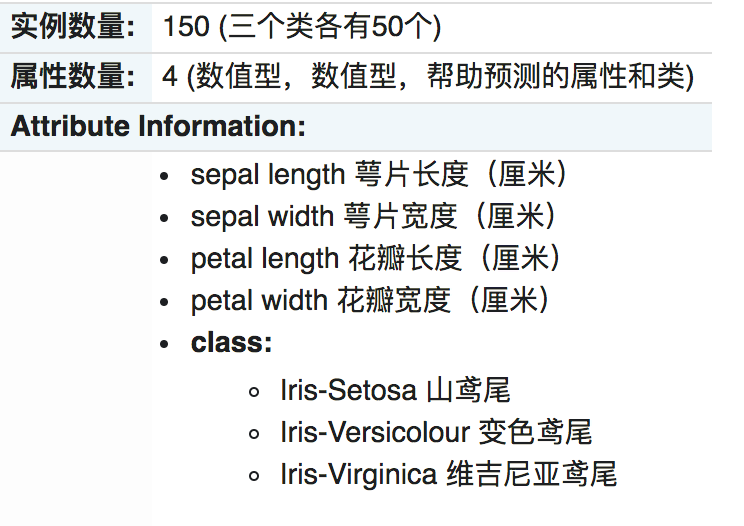
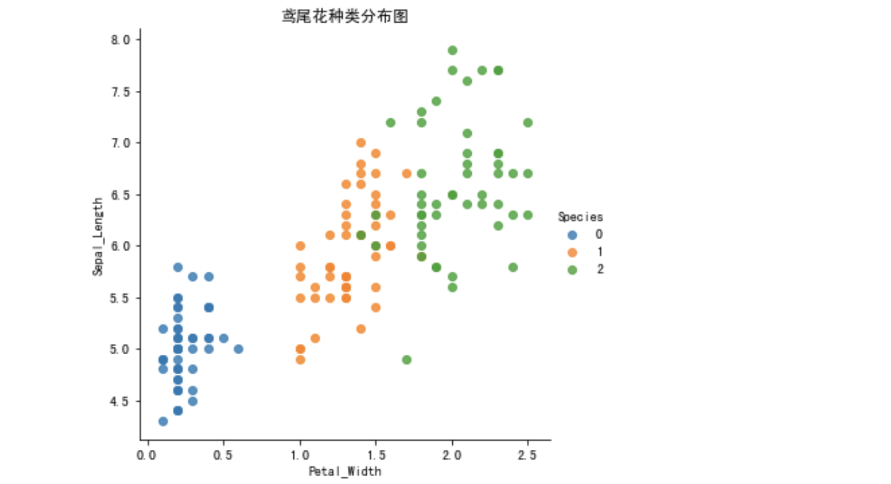

# 案例：鸢尾花种类预测

本实验介绍了使用 Python 进行机器学习的一些基本概念。 在本案例中，将使用 K-Nearest Neighbor（KNN）算法对鸢尾花的种类进行分类，并测量花的特征。

## 数据集介绍

ris 数据集是常用的分类实验数据集，由 Fisher, 1936 收集整理。Iris 也称鸢尾花卉数据集，是一类多重变量分析的数据集。关于数据集的具体介绍：






## 步骤分析

1. 获取数据集
2. 数据基本处理
3. 特征工程
4. 机器学习(模型训练)
5. 模型评估

## 代码实现

```python
# 导入数据集
from sklearn.datasets import load_iris
from sklearn.model_selection import train_test_split
from sklearn.preprocessing import StandardScaler
from sklearn.neighbors import KNeighborsClassifier

# 1.获取数据集
iris = load_iris()

# 2.数据基本处理
x_train, x_test, y_train, y_test = train_test_split(iris.data, iris.target, test_size=0.2, random_state=22)

# 3.特征工程：标准化
transfer = StandardScaler()
x_train = transfer.fit_transform(x_train)
x_test = transfer.transform(x_test)

# 4.机器学习(模型训练)
estimator = KNeighborsClassifier(n_neighbors=9)
estimator.fit(x_train, y_train)

# 5.模型评估
# 方法1：比对真实值和预测值
y_predict = estimator.predict(x_test)
print("预测结果为:\n", y_predict)
print("比对真实值和预测值：\n", y_predict == y_test)
# 方法2：直接计算准确率
score = estimator.score(x_test, y_test)
print("准确率为：\n", score)
```

某一次的输出结果：

```shell
预测结果为:
 [0 2 1 2 1 1 1 1 1 0 2 1 2 2 0 2 1 1 1 1 0 2 0 1 2 0 2 2 2 2]
比对真实值和预测值：
 [ True  True  True  True  True  True  True False  True  True  True  True
  True  True  True  True  True  True False  True  True  True  True  True
  True  True  True  True  True  True]
准确率为：
 0.9333333333333333
```
