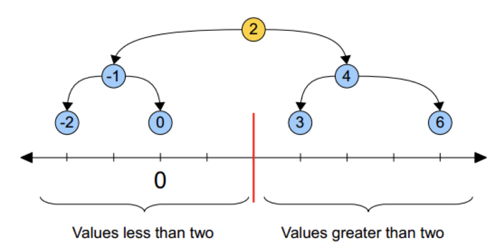
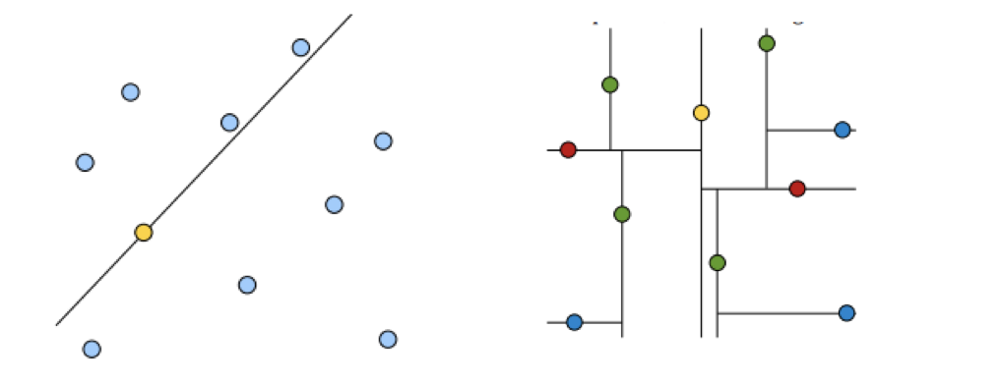
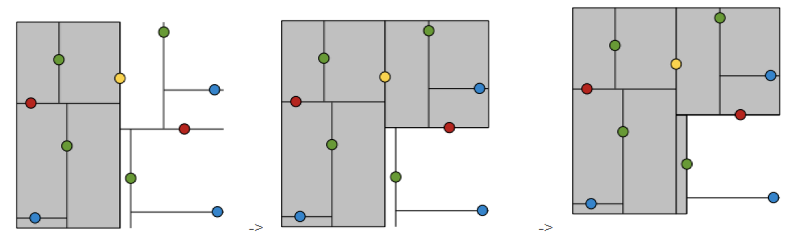
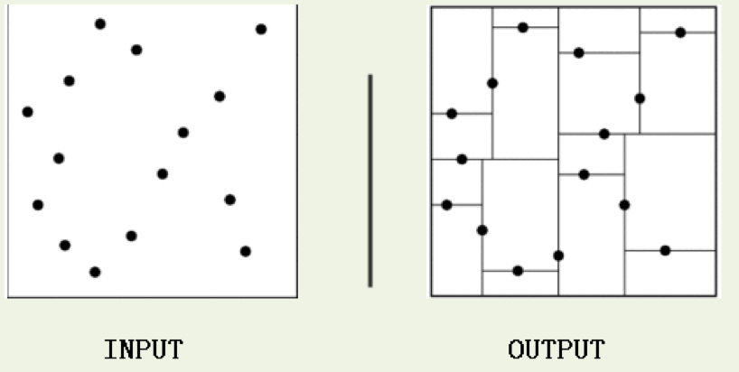

# k 值的选择

实现 k 近邻算法时，主要考虑的问题是如何对训练数据进行快速 k 近邻搜索。

这在特征空间的维数大及训练数据容量大时尤其必要。

k 近邻法最简单的实现是线性扫描（穷举搜索），即要计算输入实例与每一个训练实例的距离。计算并存储好以后，再查找 K 近邻。当训练集很大时，计算非常耗时。

为了提高 kNN 搜索的效率，可以考虑使用特殊的结构存储训练数据，以减小计算距离的次数。

## kd 树简介

### 什么是 kd 树

根据 KNN 每次需要预测一个点时，我们都需要计算训练数据集里每个点到这个点的距离，然后选出距离最近的 k 个点进行投票。当数据集很大时，这个计算成本非常高。

kd 树：为了避免每次都重新计算一遍距离，算法会把距离信息保存在一棵树里，这样在计算之前从树里查询距离信息，尽量避免重新计算。其基本原理是，如果 A 和 B 距离很远，B 和 C 距离很近，那么 A 和 C 的距离也很远。有了这个信息，就可以在合适的时候跳过距离远的点。

这样优化后的算法复杂度可降低到 O（DNlog（N））。感兴趣的读者可参阅论文：Bentley，J.L.，Communications of the ACM（1975）。

1989 年，另外一种称为 Ball Tree 的算法，在 kd Tree 的基础上对性能进一步进行了优化。感兴趣的读者可以搜索 Five balltree construction algorithms 来了解详细的算法信息。

### 原理

黄色的点作为根节点，上面的点归左子树，下面的点归右子树，接下来再不断地划分，分割的那条线叫做分割超平面（splitting hyperplane），在一维中是一个点，二维中是线，三维的是面。

黄色节点就是 Root 节点，下一层是红色，再下一层是绿色，再下一层是蓝色。

1. 树的建立；
2. 最近邻域搜索（Nearest-Neighbor Lookup）

kd 树(K-dimension tree)是一种对 k 维空间中的实例点进行存储以便对其进行快速检索的树形数据结构。kd 树是一种二叉树，表示对 k 维空间的一个划分，构造 kd 树相当于不断地用垂直于坐标轴的超平面将 K 维空间切分，构成一系列的 K 维超矩形区域。kd 树的每个结点对应于一个 k 维超矩形区域。利用 kd 树可以省去对大部分数据点的搜索，从而减少搜索的计算量。

类比“二分查找”：给出一组数据：[9 1 4 7 2 5 0 3 8]，要查找 8。如果挨个查找（线性扫描），那么将会把数据集都遍历一遍。而如果排一下序那数据集就变成了：[0 1 2 3 4 5 6 7 8 9]，按前一种方式我们进行了很多没有必要的查找，现在如果我们以 5 为分界点，那么数据集就被划分为了左右两个“簇” [0 1 2 3 4]和[6 7 8 9]。

因此，根本就没有必要进入第一个簇，可以直接进入第二个簇进行查找。把二分查找中的数据点换成 k 维数据点，这样的划分就变成了用超平面对 k 维空间的划分。空间划分就是对数据点进行分类，“挨得近”的数据点就在一个空间里面。

## 构造方法

1. 构造根结点，使根结点对应于 K 维空间中包含所有实例点的超矩形区域；
2. 通过递归的方法，不断地对 k 维空间进行切分，生成子结点。在超矩形区域上选择一个坐标轴和在此坐标轴上的一个切分点，确定一个超平面，这个超平面通过选定的切分点并垂直于选定的坐标轴，将当前超矩形区域切分为左右两个子区域（子结点）；这时，实例被分到两个子区域。
3. 上述过程直到子区域内没有实例时终止（终止时的结点为叶结点）。在此过程中，将实例保存在相应的结点上。

通常，循环的选择坐标轴对空间切分，选择训练实例点在坐标轴上的中位数为切分点，这样得到的 kd 树是平衡的（平衡二叉树：它是一棵空树，或其左子树和右子树的深度之差的绝对值不超过 1，且它的左子树和右子树都是平衡二叉树）。

KD 树中每个节点是一个向量，和二叉树按照数的大小划分不同的是，KD 树每层需要选定向量中的某一维，然后根据这一维按左小右大的方式划分数据。在构建 KD 树时，关键需要解决 2 个问题：

1. 选择向量的哪一维进行划分？
2. 如何划分数据？

第一个问题简单的解决方法可以是随机选择某一维或按顺序选择，但是更好的方法应该是在数据比较分散的那一维进行划分（分散的程度可以根据方差来衡量）。

第二个问题中，好的划分方法可以使构建的树比较平衡，可以每次选择中位数来进行划分。
