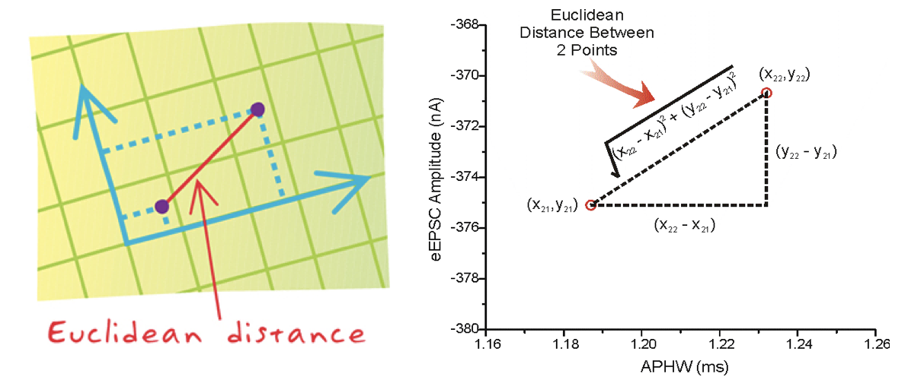
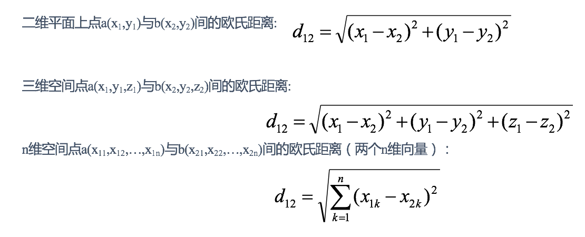

# K-近邻算法(KNN)

K-近邻算法是一种有**监督学习**、**分类**（也可用于回归）算法

## 什么是 K-近邻算法

K Nearest Neighbor 算法又叫 KNN 算法，这个算法是机器学习里面一个比较经典的算法， 总体来说 KNN 算法是相对比较容易理解的算法

如果一个样本在特征空间中的 k 个最相似(即特征空间中最邻近)的样本中的大多数属于某一个类别，则该样本也属于这个类别。

## 距离公式

两个样本的距离可以通过如下公式计算，又叫欧式距离 ，关于距离公式会在后面进行讨论：

## KNN 算法流程

1. 计算已知类别数据集中的点与当前点之间的距离
2. 按距离递增次序排序
3. 选取与当前点距离最小的 k 个点
4. 统计前 k 个点所在的类别出现的频率
5. 返回前 k 个点出现频率最高的类别作为当前点的预测分类

## k 值的选择

k 值是 KNN 算法中最重要的超参数，它决定了算法的复杂度和性能。一般来说，k 值越大，算法的复杂度越高，但也会越容易过拟合；k 值越小，算法的复杂度越低，但也会欠拟合。

### k 值的具象含义

K 值选择问题，李航博士的一书「统计学习方法」上所说：

1. 选择较小的 K 值，就相当于用较小的领域中的训练实例进行预测，“学习”近似误差会减小，只有与输入实例较近或相似的训练实例才会对预测结果起作用，与此同时带来的问题是“学习”的估计误差会增大，换句话说，K 值的减小就意味着整体模型变得复杂，容易发生过拟合；
2. 选择较大的 K 值，就相当于用较大领域中的训练实例进行预测，其优点是可以减少学习的估计误差，但缺点是学习的近似误差会增大。这时候，与输入实例较远（不相似的）训练实例也会对预测器作用，使预测发生错误，且 K 值的增大就意味着整体的模型变得简单。
3. K=N（N 为训练样本个数），则完全不足取，因为此时无论输入实例是什么，都只是简单的预测它属于在训练实例中最多的类，模型过于简单，忽略了训练实例中大量有用信息。

### 如何选择 k 值

在实际应用中，K 值一般取一个比较小的数值，例如采用交叉验证法（简单来说，就是把训练数据在分成两组:训练集和验证集）来选择最优的 K 值。
