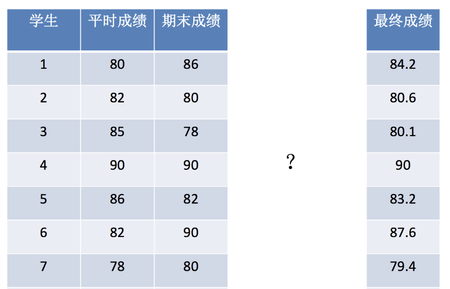

# 线性回归 api 初步使用

## 语法

```python
# 导入线性回归模型
from sklearn.linear_model import LinearRegression
# 创建模型实例
estimator = LinearRegression()
# 使用fit方法进行训练
estimator.fit(x,y)
# 使用predict方法进行预测
estimator.predict(data)
```

实际上对于 sklearn 中的大多数模型都可以按照类似的语法进行调用。

## 示例

假设我们有以下数据：



如果我们希望以此为数据集简单的建立一个模型，并预测未知数据点的 y 值，可以用以下代码：

```python
from sklearn.linear_model import LinearRegression

# 构造数据集
x = [[80, 86],
     [82, 80],
     [85, 78],
     [90, 90],
     [86, 82],
     [82, 90],
     [78, 80],
     [92, 94]]
y = [84.2, 80.6, 80.1, 90, 83.2, 87.6, 79.4, 93.4]

# 实例化线性回归模型
estimator = LinearRegression()
# 使用fit方法进行训练
estimator.fit(x, y)
print("系数：", estimator.coef_)

# 预测新数据
predict = estimator.predict([[100, 80]])
print("预测值：", predict)
```

某一次的输出结果：

```shell
系数： [0.3 0.7]
预测值： [86.]
```

这就是一个 sklearn 的线性回归模型的基本用法。通过这个例子，我们建立了一个关于 x 和 y 的简单线性回归模型。
