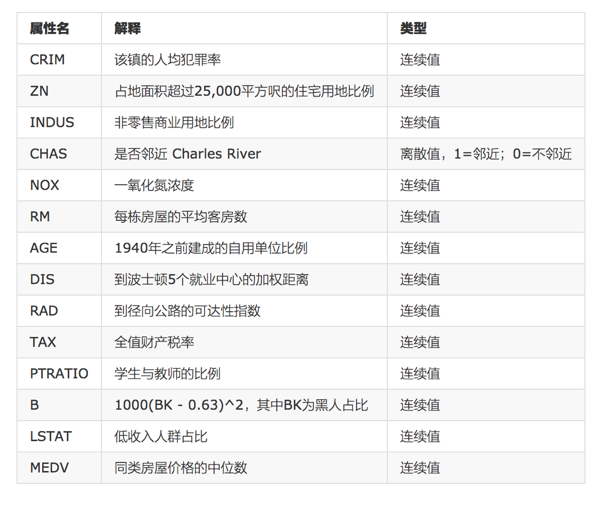

# 案例：波士顿房价预测

这个案例可谓是经典中的经典

## 背景介绍


数据集的各属性如下：



给定的这些特征，是专家们得出的影响房价的结果属性。我们此阶段不需要自己去探究特征是否有用，只需要使用这些特征。到后面量化很多特征需要我们自己去寻找

## 案例分析

回归当中的数据大小不一致，是否会导致结果影响较大。所以需要做标准化处理。

我们需要进行以下步骤：

- 数据分割与标准化处理
- 回归预测
- 线性回归的算法效果评估

对于回归性能评估，我们使用均方误差（Mean Squared Error, MSE）评价机制。

## 代码实现

在 sklearn 1.2 以上的版本中，由于内置的波士顿房价数据集已经被移除，我们这里使用加利福尼亚的数据集。

```python
from sklearn.linear_model import LinearRegression, SGDRegressor
from sklearn.datasets import fetch_california_housing
from sklearn.model_selection import train_test_split
from sklearn.preprocessing import StandardScaler
from sklearn.metrics import mean_squared_error


# 正规方程模型
def normal_equation_model():
    # 1.获取数据
    data = fetch_california_housing()

    # 2.数据集划分
    x_train, x_test, y_train, y_test = train_test_split(data.data, data.target, random_state=22)

    # 3.特征工程-标准化
    transfer = StandardScaler()
    x_train = transfer.fit_transform(x_train)
    x_test = transfer.transform(x_test)

    # 4.机器学习-线性回归(正规方程)
    estimator = LinearRegression()
    estimator.fit(x_train, y_train)

    # 5.模型评估
    # 5.1 获取系数等值
    y_predict = estimator.predict(x_test)
    print("预测值为:\n", y_predict)
    print("模型中的系数为:\n", estimator.coef_)
    print("模型中的偏置为:\n", estimator.intercept_)

    # 5.2 评价(均方误差)
    error = mean_squared_error(y_test, y_predict)
    print("误差为:\n", error)


# 梯度下降模型
def gradient_descent_model():
    # 1.获取数据
    data = fetch_california_housing()

    # 2.数据集划分
    x_train, x_test, y_train, y_test = train_test_split(data.data, data.target, random_state=22)

    # 3.特征工程-标准化
    transfer = StandardScaler()
    x_train = transfer.fit_transform(x_train)
    x_test = transfer.fit_transform(x_test)

    # 4.机器学习-线性回归(特征方程)
    estimator = SGDRegressor(max_iter=1000)
    estimator.fit(x_train, y_train)

    # 5.模型评估
    # 5.1 获取系数等值
    y_predict = estimator.predict(x_test)
    print("预测值为:\n", y_predict)
    print("模型中的系数为:\n", estimator.coef_)
    print("模型中的偏置为:\n", estimator.intercept_)

    # 5.2 评价
    # 均方误差
    error = mean_squared_error(y_test, y_predict)
    print("误差为:\n", error)


normal_equation_model()
gradient_descent_model()
```

某一次的输出结果：

```shell
[1.41601135 2.00797685 1.02613188 ... 2.1971023  1.91659415 3.03593177]
模型中的系数为:
 [ 0.82591102  0.11445311 -0.26118374  0.30345645 -0.00706501 -0.04153221
 -0.9107612  -0.88255758]
模型中的偏置为:
 2.069981627260431
误差为:
 0.4918267761529808

预测值为:
 [ 64.38262623 -51.71569374 -95.40546722 ... -83.26112401  96.57116702
   1.60134454]
模型中的系数为:
 [   7.75001272  -41.64978542  -39.58105876   15.54090981 -103.68253313
 -227.60655853   15.89486483   15.90793719]
模型中的偏置为:
 [-10.61407759]
误差为:
 65516.37266073089
```

对于准确率我们在此节无须太过关心，毕竟我们没有详细分析数据集，会调用 API 即可
