# 欠拟合与过拟合

## 定义

- **过拟合**：一个假设**在训练数据上能够获得比其他假设更好的拟合， 但是在测试数据集上却不能很好地拟合数据**，此时认为这个假设出现了过拟合的现象。(模型过于复杂)
- **欠拟合**：一个假设**在训练数据上不能获得更好的拟合，并且在测试数据集上也不能很好地拟合数据**，此时认为这个假设出现了欠拟合的现象。(模型过于简单)

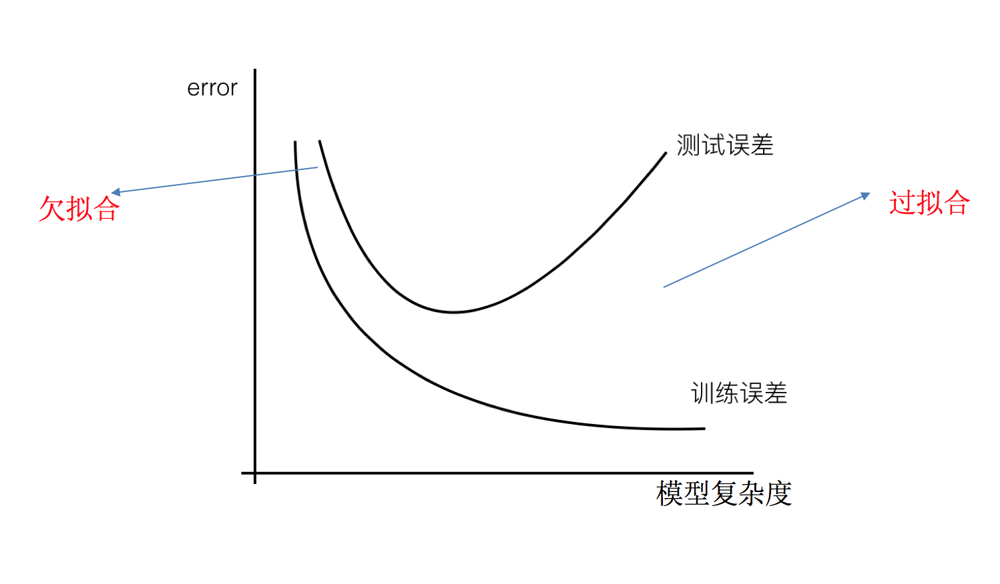

那么是什么原因导致模型复杂？线性回归进行训练学习的时候变成模型会变得复杂，这里就对应前面再说的线性回归的两种关系，非线性关系的数据，也就是存在很多无用的特征或者现实中的事物特征跟目标值的关系并不是简单的线性关系。

## 原因以及解决办法

- **欠拟合**原因以及解决办法
  - **原因**：学习到数据的特征过少
  - **解决办法**：
    1. **添加其他特征项**，有时候我们模型出现欠拟合的时候是因为特征项不够导致的，可以添加其他特征项来很好地解决。例如，“组合”、“泛化”、“相关性”三类特征是特征添加的重要手段，无论在什么场景，都可以照葫芦画瓢，总会得到意想不到的效果。除上面的特征之外，“上下文特征”、“平台特征”等等，都可以作为特征添加的首选项。
    2. **添加多项式特征**，这个在机器学习算法里面用的很普遍，例如将线性模型通过添加二次项或者三次项使模型泛化能力更强。
- **过拟合**原因以及解决办法
  - **原因**：原始特征过多，存在一些嘈杂特征， 模型过于复杂是因为模型尝试去兼顾各个测试数据点
  - **解决办法**：
    1. 重新清洗数据，导致过拟合的一个原因也有可能是数据不纯导致的，如果出现了过拟合就需要我们重新清洗数据。
    2. 增大数据的训练量，还有一个原因就是我们用于训练的数据量太小导致的，训练数据占总数据的比例过小。
    3. **正则化**
    4. 减少特征维度，防止维灾难

## 正则化

在解决回归过拟合中，我们选择正则化。但是对于其他机器学习算法如分类算法来说也会出现这样的问题，除了一些算法本身作用之外（决策树、神经网络），我们更多的也是去自己做特征选择，包括之前说的删除、合并一些特征

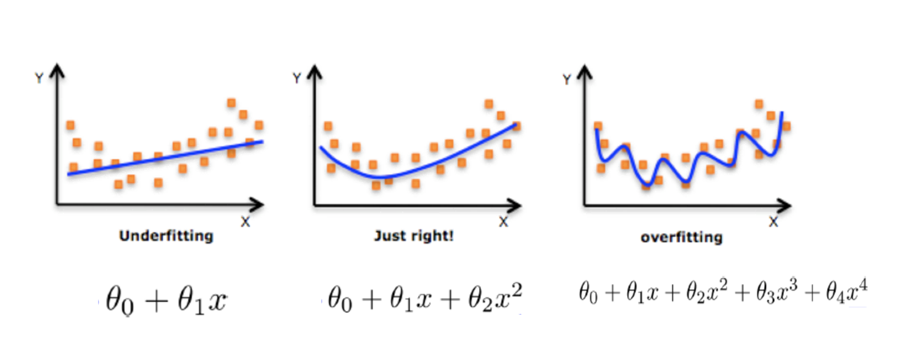

如何解决这个问题呢？

**在学习的时候，数据提供的特征有些影响模型复杂度或者这个特征的数据点异常较多，所以算法在学习的时候尽量减少这个特征的影响（甚至删除某个特征的影响），这就是正则化**

注：调整时候，算法并不知道某个特征影响，而是去调整参数得出优化的结果

正则化可以分为以下两类：

- L2 正则化
  - 作用：可以使得其中一些 W 的都很小，都接近于 0，削弱某个特征的影响
  - 优点：越小的参数说明模型越简单，越简单的模型则越不容易产生过拟合现象
  - Ridge 回归
- L1 正则化
  - 作用：可以使得其中一些 W 的值直接为 0，删除这个特征的影响
  - LASSO 回归

## \[选读\]维灾难

### 什么是维灾难

随着维度的增加，分类器性能逐步上升，到达某点之后，其性能便逐渐下降

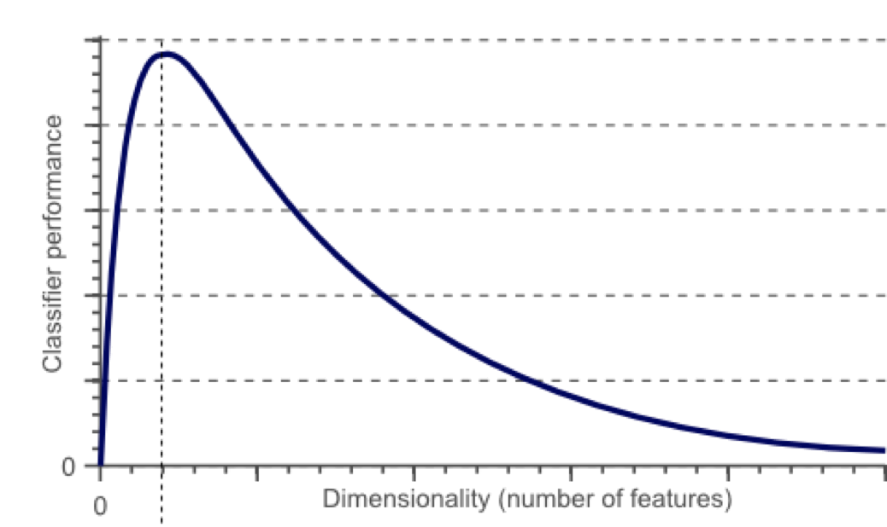

有一系列的图片，每张图片的内容可能是猫也可能是狗；我们需要构造一个分类器能够对猫、狗自动的分类。首先，要寻找到一些能够描述猫和狗的特征，这样我们的分类算法就可以利用这些特征去识别物体。猫和狗的皮毛颜色可能是一个很好的特征，考虑到红绿蓝构成图像的三基色，因此用图片三基色各自的平均值称得上方便直观。这样就有了一个简单的 Fisher 分类器：

```
If  0.5*red + 0.3*green + 0.2*blue > 0.6 : return cat;
    else return dog;
```

使用颜色特征可能无法得到一个足够准确的分类器，如果是这样的话，我们不妨加入一些诸如图像纹理(图像灰度值在其 X、Y 方向的导数 dx、dy)，就有 5 个特征(Red、Blue、Green、dx、dy)来设计我们的分类器：

也许分类器准确率依然无法达到要求，加入更多的特征，比如颜色、纹理的统计信息等等，如此下去，可能会得到上百个特征。那是不是我们的分类器性能会随着特征数量的增加而逐步提高呢？答案也许有些让人沮丧，事实上，当特征数量达到一定规模后，分类器的性能是在下降的。

也就是说，在很多情况下，**随着维度(特征数量)的增加，分类器的性能却下降了**

### 维数灾难与过拟合

我们假设猫和狗图片的数量是有限的(样本数量总是有限的)，假设有 10 张图片，接下来我们就用这仅有的 10 张图片来训练我们的分类器。


增加一个特征，比如绿色，这样特征维数扩展到了 2 维：

增加一个特征后，我们依然无法找到一条简单的直线将它们有效分类

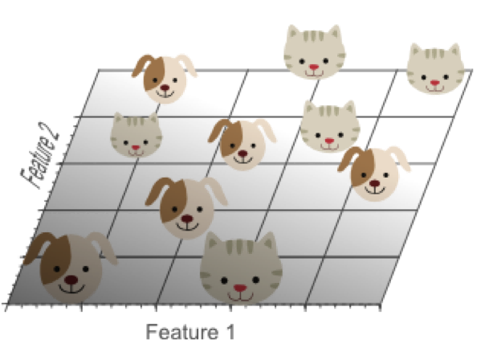

再增加一个特征，比如蓝色，扩展到 3 维特征空间：

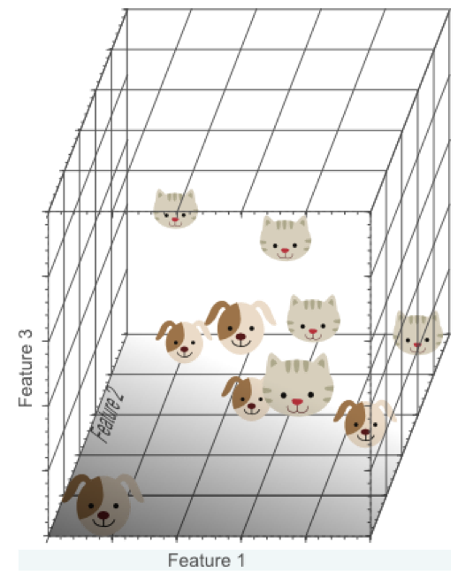

在 3 维特征空间中，我们很容易找到一个分类平面，能够在训练集上有效的将猫和狗进行分类：

在高维空间中，我们似乎能得到更优的分类器性能。

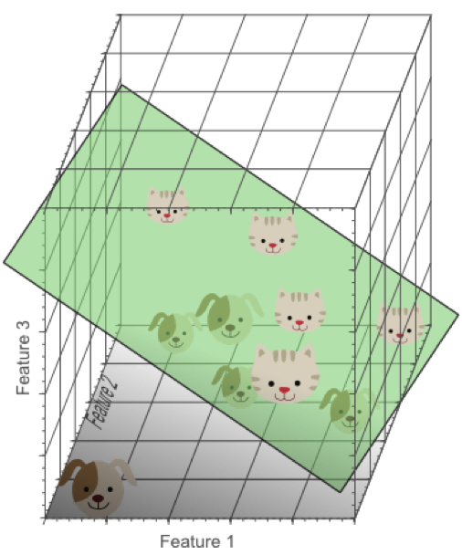

从 1 维到 3 维，给我们的感觉是：维数越高，分类性能越优。然而，维数过高将导致一定的问题：在一维特征空间下，我们假设一个维度的宽度为 5 个单位，这样样本密度为 10/5=2;在 2 维特征空间下，10 个样本所分布的空间大小 25，这样样本密度为 10/25=0.4;在 3 维特征空间下，10 个样本分布的空间大小为 125，样本密度就为 10/125=0.08.

如果继续增加特征数量，随着维度的增加，样本将变得越来越稀疏，在这种情况下，也更容易找到一个超平面将目标分开。然而，如果我们将高维空间向低维空间投影，高维空间隐藏的问题将会显现出来：

**过多的特征导致的过拟合现象**：训练集上表现良好，但是对新数据缺乏泛化能力。

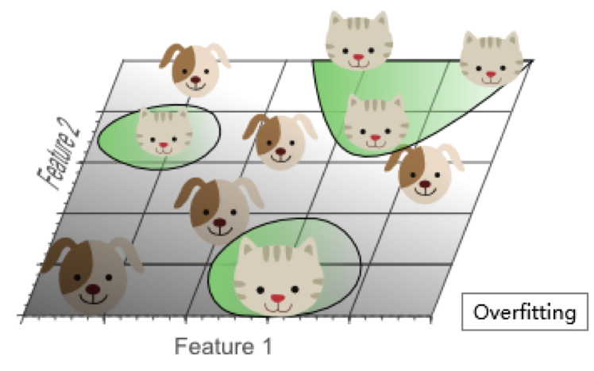

**高维空间训练形成的线性分类器，相当于在低维空间的一个复杂的非线性分类器**，这种分类器过多的强调了训练集的准确率甚至于对一些错误/异常的数据也进行了学习，而正确的数据却无法覆盖整个特征空间。为此，这样得到的分类器在对新数据进行预测时将会出现错误。这种现象称之为过拟合，同时也是维灾难的直接体现。

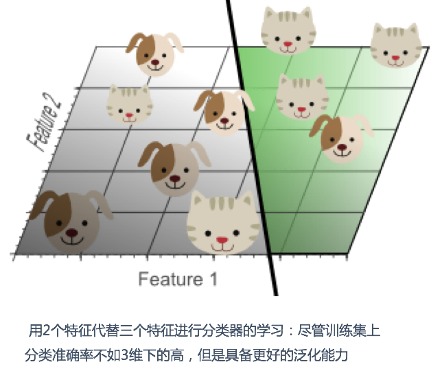

简单的线性分类器在训练数据上的表现不如非线性分类器，但由于线性分类器的学习过程中对噪声没有对非线性分类器敏感，因此对新数据具备更优的泛化能力。换句话说，通过使用更少的特征，避免了维数灾难的发生(也即避免了高维情况下的过拟合)

由于高维而带来的数据稀疏性问题：假设有一个特征，它的取值范围 D 在 0 到 1 之间均匀分布，并且对狗和猫来说其值都是唯一的，我们现在利用这个特征来设计分类器。如果我们的训练数据覆盖了取值范围的 20%(e.g 0 到 0.2)，那么所使用的训练数据就占总样本量的 20%。上升到二维情况下，覆盖二维特征空间 20%的面积，则需要在每个维度上取得 45%的取值范围。在三维情况下，要覆盖特征空间 20%的体积，则需要在每个维度上取得 58%的取值范围...在维度接近一定程度时，要取得同样的训练样本数量，则几乎要在每个维度上取得接近 100%的取值范围，或者增加总样本数量，但样本数量也总是有限的。

如果一直增加特征维数，由于样本分布越来越稀疏，如果要避免过拟合的出现，就不得不持续增加样本数量。

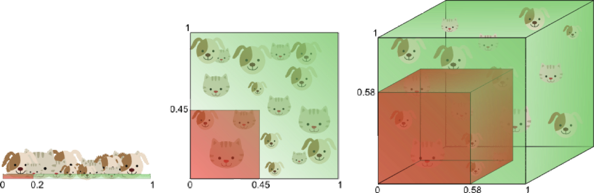

数据在高维空间的中心比在边缘区域具备更大的稀疏性，数据更倾向于分布在空间的边缘区域：

不属于单位圆的训练样本比搜索空间的中心更接近搜索空间的角点。这些样本很难分类，因为它们的特征值差别很大（例如，单位正方形的对角的样本）。

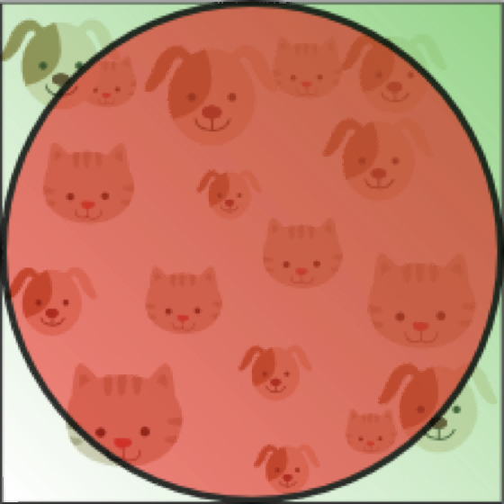

一个有趣的问题是，当我们增加特征空间的维度时，圆（超球面）的体积如何相对于正方形（超立方体）的体积发生变化。

在高维空间中，大多数训练数据驻留在定义特征空间的超立方体的角落中。如前所述，特征空间角落中的实例比围绕超球体质心的实例难以分类。

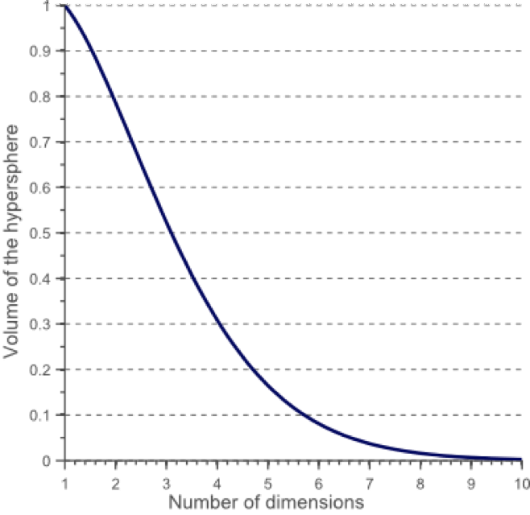

在高维空间中，大多数训练数据驻留在定义特征空间的超立方体的角落中。如前所述，特征空间角落中的实例比围绕超球体质心的实例难以分类：

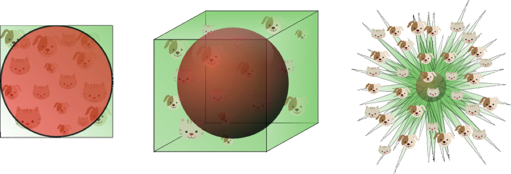

an 8D hypercube which has 2^8 = 256 corners

事实证明，许多事物在高维空间中表现得非常不同。 例如，如果你选择一个单位平方（1×1 平方）的随机点，它将只有大约 0.4％的机会位于小于 0.001 的边界（换句话说，随机点将沿任何维度“极端”这是非常不可能的）。 但是在一个 10000 维单位超立方体（1×1×1 立方体，有 1 万个 1）中，这个概率大于 99.999999％。 高维超立方体中的大部分点都非常靠近边界。更难区分的是：如果你在一个单位正方形中随机抽取两个点，这两个点之间的距离平均约为 0.52。如果在单位三维立方体中选取两个随机点，则平均距离将大致为 0.66。但是在一个 100 万维的超立方体中随机抽取两点呢？那么平均距离将是大约 408.25（大约 1,000,000 / 6）！

非常违反直觉：当两个点位于相同的单位超立方体内时，两点如何分离？这个事实意味着高维数据集有可能非常稀疏：大多数训练实例可能彼此远离。当然，这也意味着一个新实例可能离任何训练实例都很远，这使得预测的可信度表现得比在低维度数据中要来的差。**训练集的维度越多，过度拟合的风险就越大**。

理论上讲，维度灾难的一个解决方案可能是增加训练集的大小以达到足够密度的训练实例。 不幸的是，在实践中，达到给定密度所需的训练实例的数量随着维度的数量呈指数增长。 如果只有 100 个特征（比 MNIST 问题少得多），那么为了使训练实例的平均值在 0.1 以内，需要比可观察宇宙中的原子更多的训练实例，假设它们在所有维度上均匀分布。

对于 8 维超立方体，大约 98％的数据集中在其 256 个角上。结果，当特征空间的维度达到无穷大时，从采样点到质心的最小和最大欧几里得距离的差与最小距离本身只比趋于零：

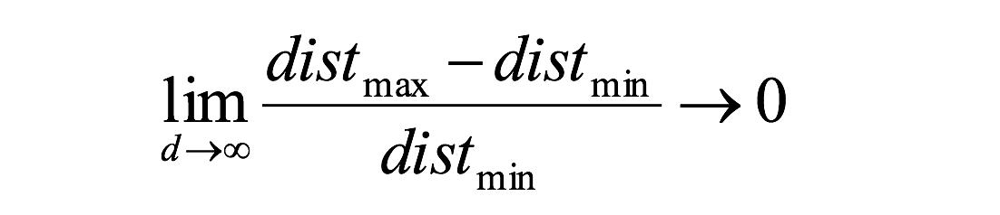

距离测量开始失去其在高维空间中测量的有效性,由于分类器取决于这些距离测量,因此在较低维空间中分类通常更容易，其中较少特征用于描述感兴趣对象。

如果理论无限数量的训练样本可用，则维度的诅咒不适用，我们可以简单地使用无数个特征来获得完美的分类。训练数据的大小越小，应使用的功能就越少。如果 N 个训练样本足以覆盖单位区间大小的 1D 特征空间，则需要 N ^ 2 个样本来覆盖具有相同密度的 2D 特征空间，并且在 3D 特征空间中需要 N ^ 3 个样本。换句话说，**所需的训练实例数量随着使用的维度数量呈指数增长**。
