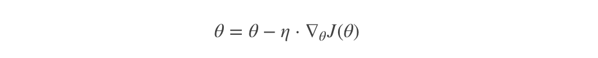
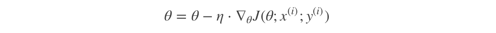
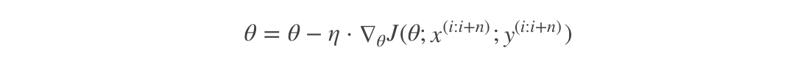

# 梯度下降法介绍

上一节中给大家介绍了最基本的梯度下降法实现流程，常见的梯度下降算法有：

- 全梯度下降算法（Full gradient descent）,
- 随机梯度下降算法（Stochastic gradient descent）,
- 小批量梯度下降算法（Mini-batch gradient descent）,
- 随机平均梯度下降算法（Stochastic average gradient descent）

它们都是为了正确地调节权重向量，通过为每个权重计算一个梯度，从而更新权值，使目标函数尽可能最小化。其差别在于样本的使用方式不同。

## 全梯度下降算法（FG）

**计算训练集所有样本误差，对其求和再取平均值作为目标函数。**

权重向量沿其梯度相反的方向移动，从而使当前目标函数减少得最多。

因为在执行每次更新时，我们需要在整个数据集上计算所有的梯度，所以批梯度下降法的速度会很慢，同时，批梯度下降法无法处理超出内存容量限制的数据集。

**批梯度下降法同样也不能在线更新模型，即在运行的过程中，不能增加新的样本。**

其是在整个训练数据集上计算损失函数关于参数 θ 的梯度：

## 随机梯度下降算法（SG）

由于 FG 每迭代更新一次权重都需要计算所有样本误差，而实际问题中经常有上亿的训练样本，故效率偏低，且容易陷入局部最优解，因此提出了随机梯度下降算法。

其每轮计算的目标函数不再是全体样本误差，而仅是单个样本误差，即**每次只代入计算一个样本目标函数的梯度来更新权重，再取下一个样本重复此过程，直到损失函数值停止下降或损失函数值小于某个可以容忍的阈值。**

此过程简单，高效，通常可以较好地避免更新迭代收敛到局部最优解。其迭代形式为：

其中，$x_{(i)}$表示一条训练样本的特征值，$y_{(i)}$表示一条训练样本的标签值

但是由于 SG 每次只使用一个样本迭代，若遇上噪声则容易陷入局部最优解。

## 小批量梯度下降算法（mini-batch）

小批量梯度下降算法是 FG 和 SG 的折中方案,在一定程度上兼顾了以上两种方法的优点。

**每次从训练样本集上随机抽取一个小样本集，在抽出来的小样本集上采用 FG 迭代更新权重。**

被抽出的小样本集所含样本点的个数称为 batch_size，通常设置为 2 的幂次方，更有利于 GPU 加速处理。

特别的，若 batch_size=1，则变成了 SG；若 batch_size=n，则变成了 FG.其迭代形式为

## 随机平均梯度下降算法（SAG）

在 SG 方法中，虽然避开了运算成本大的问题，但对于大数据训练而言，SG 效果常不尽如人意，因为每一轮梯度更新都完全与上一轮的数据和梯度无关。

**随机平均梯度算法克服了这个问题，在内存中为每一个样本都维护一个旧的梯度，随机选择第 i 个样本来更新此样本的梯度，其他样本的梯度保持不变，然后求得所有梯度的平均值，进而更新了参数。**

如此，每一轮更新仅需计算一个样本的梯度，计算成本等同于 SG，但收敛速度快得多。
