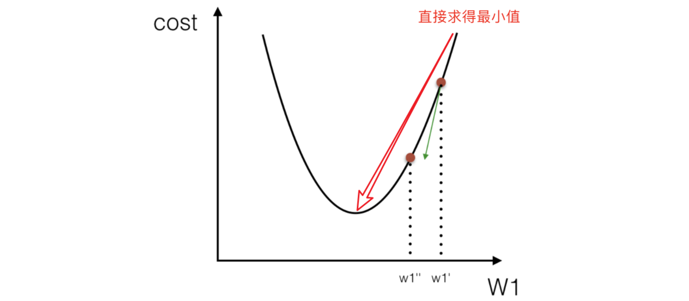

# 线性回归的损失和优化

我们在第一节举过一个房子的例子，房价与区位因素的关系假设如下：

真实房子价格 = `0.02` × 中心区域的距离 + `0.04` × 城市一氧化氮浓度 + (`-0.12` × 自住房平均房价) + `0.254` × 城镇犯罪率

现在我们把他看成真实的对应关系，但我们在起初并不知道这个关系，且我们需要找到一种方法来拟合这个关系。

我们可以随意指定一个关系（猜测）：

预测房子价格 = `0.25` × 中心区域的距离 + `0.14` × 城市一氧化氮浓度 + `0.42` × 自住房平均房价 + `0.34` × 城镇犯罪率

请问这样的话，会发生什么？真实结果与我们预测的结果之间是不是存在一定的误差呢？类似这样：

既然存在这个误差，如果我们知道这个误差，是不是可以**通过不断猜测与修正，不断逼近真实的对应关系**呢？那我们就将这个误差给衡量出来！

## 损失函数

损失函数（loss function）是衡量预测结果与真实结果之间误差的一种方法。

线性回归的损失函数一般采用均方误差（mean squared error，MSE）：

其中：

- $y_{i}$ 为第 `i` 个训练样本的真实值
- $h(x_{i})$为第 `i` 个训练样本特征值组合预测函数

本方法又称**最小二乘法**

如何去减少这个损失，使我们预测的更加准确些？既然存在了这个损失，我们一直说机器学习有自动学习的功能，在线性回归这里更是能够体现，这里可以通过一些优化方法去优化（其实是数学当中的求导功能）回归的总损失。

## 优化算法

在损失函数中，当 `J(w)`最小时，我们就拿到了“最好的”预测函数，因为我们再也找不出一个误差更小的函数了。

那么，如何去求模型当中的 `W`，使得损失最小？（目的是找到最小损失对应的 `W` 值）

线性回归经常使用的两种优化算法：

- 正规方程
- 梯度下降法

### 正规方程

正规方程（normal equation）是一种直接求解线性回归的最优化算法，他的定义如下：

其中，`X` 为特征值矩阵，`y` 为目标值矩阵。直接求到最好的结果

我们在使用正规方程时，实际上是在求解一个矩阵的逆矩阵，这个矩阵的维度是 `n+1`，`n` 为特征值个数，如下图所示：

#### 正规方程求解举例

以下表示数据为例：

即：

运用正规方程方法求解参数：

但是，我们为什么可以这样做？

#### 正规方程的推导

我们可以把该损失函数转换成矩阵写法：

其中 `y` 是真实值矩阵，`X` 是特征值矩阵，`w` 是权重矩阵

对其求解关于 `w` 的最小值，起止 `y,X` 均已知二次函数直接求导，导数为零的位置，即为最小值。

求导：

注：式(1)到式(2)推导过程中, X 是一个 m 行 n 列的矩阵，并不能保证其有逆矩阵，但是右乘 XT 把其变成一个方阵，保证其有逆矩阵。

式（5）到式（6）推导过程中，和上类似。

### 梯度下降(Gradient Descent)

梯度下降法的基本思想可以类比为一个下山的过程。

假设这样一个场景：

一个人被困在山上，需要从山上下来(i.e. 找到山的最低点，也就是山谷)。但此时山上的浓雾很大，导致可视度很低。

因此，下山的路径就无法确定，他必须利用自己周围的信息去找到下山的路径。这个时候，他就可以利用梯度下降算法来帮助自己下山。

具体来说就是，以他当前的所处的位置为基准，**寻找这个位置最陡峭的地方，然后朝着山的高度下降的地方走**，（同理，如果我们的目标是上山，也就是爬到山顶，那么此时应该是朝着最陡峭的方向往上走）。然后每走一段距离，都反复采用同一个方法，最后就能成功的抵达山谷。

梯度下降的基本过程就和下山的场景很类似。

首先，我们有一个**可微分的函数**。这个函数就代表着一座山。

我们的目标就是找到这个**函数的最小值**，也就是山底。

根据之前的场景假设，最快的下山的方式就是找到当前位置最陡峭的方向，然后沿着此方向向下走，对应到函数中，就是**找到给定点的梯度**，然后朝着梯度相反的方向，就能让函数值下降的最快！因为梯度的方向就是函数值变化最快的方向。 所以，我们重复利用这个方法，反复求取梯度，最后就能到达局部的最小值，这就类似于我们下山的过程。而求取梯度就确定了最陡峭的方向，也就是场景中测量方向的手段。

#### 梯度的概念

梯度是微积分中一个很重要的概念

​ 在单变量的函数中，梯度其实就是函数的微分，代表着函数在某个给定点的切线的斜率；

​ 在多变量函数中，梯度是一个向量，向量有方向，梯度的方向就指出了函数在给定点的上升最快的方向；

这也就说明了为什么我们需要千方百计的求取梯度！我们需要到达山底，就需要在每一步观测到此时最陡峭的地方，梯度就恰巧告诉了我们这个方向。梯度的方向是函数在给定点上升最快的方向，那么梯度的反方向就是函数在给定点下降最快的方向，这正是我们所需要的。所以我们只要沿着梯度的反方向一直走，就能走到局部的最低点。

#### 梯度下降举例

我们假设有一个目标函数：$J(θ) = θ_{1}^{2} + θ_{2}^{2}$

现在要通过梯度下降法计算这个函数的最小值。我们通过观察就能发现最小值其实就是 (0，0)点。但是接下 来，我们会从梯度下降算法开始一步步计算到这个最小值! 我们假设初始的起点为：$θ_{0}$ = (1, 3)

初始的学习率为：α = 0.1

函数的梯度为：▽J(θ) =< 2$θ_{1}$ ,2$θ_{2}$>

进行多次迭代:

我们发现，已经基本靠近函数的最小值点：

#### 梯度下降公式

我们直接上公式：

**α 是什么含义？**

`α` 在梯度下降算法中被称作为学习率或者步长，意味着我们可以通过 `α` 来控制每一步走的距离，以保证不要走太快，错过了最低点。同时也要保证不要走的太慢，导致太阳下山了，还没有走到山下。所以 `α` 的选择在梯度下降法中往往是很重要的！`α` 不能太大也不能太小，太小的话，可能导致迟迟走不到最低点，太大的话，会导致错过最低点！

**为什么梯度要乘以一个负号？**

梯度前加一个负号，就意味着朝着梯度相反的方向前进！我们在前文提到，梯度的方向实际就是函数在此点上升最快的方向！而我们需要朝着下降最快的方向走，自然就是负的梯度的方向，所以此处需要加上负号

我们可以通过一个动态图理解这个过程：

### 梯度下降和正规方程的对比

| 梯度下降                        | 正规方程                       |
| ------------------------------- | ------------------------------ |
| 适用于大规模数据集              | 适用于小规模数据集             |
| 适用于非线性模型                | 适用于线性模型                 |
| 不需要计算方程，时间复杂度 O(n) | 需要计算方程，时间复杂度 O(n3) |

一般我们可以使用场景选择合适的算法：

- 小规模数据：
  - 正规方程：**LinearRegression**(不能解决拟合问题)
  - 岭回归
- 大规模数据：梯度下降法**SGDRegressor**
