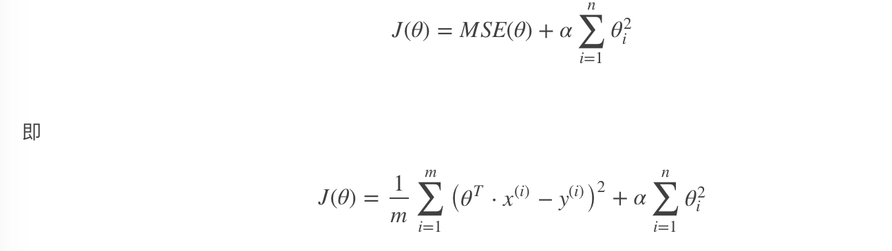

# 正则化线性模型

## Ridge Regression (岭回归，又名 Tikhonov regularization)

岭回归是线性回归的正则化版本，即在原来的线性回归的 cost function 中添加正则项（regularization term）:


以达到在拟合数据的同时，使模型权重尽可能小的目的,岭回归代价函数:



α=0：岭回归退化为线性回归

## Lasso Regression(Lasso 回归)

Lasso 回归是线性回归的另一种正则化版本，正则项为权值向量的 ℓ1 范数。

Lasso 回归的代价函数 ：


Lasso Regression 有一个很重要的性质是：倾向于完全消除不重要的权重。

例如：当 α 取值相对较大时，高阶多项式退化为二次甚至是线性：高阶多项式特征的权重被置为 0。

也就是说，Lasso Regression 能够自动进行特征选择，并输出一个稀疏模型（只有少数特征的权重是非零的）。

## Elastic Net (弹性网络)

弹性网络在岭回归和 Lasso 回归中进行了折中，通过 混合比(mix ratio) r 进行控制：

r=0：弹性网络变为岭回归
r=1：弹性网络便为 Lasso 回归
弹性网络的代价函数 ：


## 总结

一般来说，我们应避免使用朴素线性回归，而应对模型进行一定的正则化处理。

- 常用：岭回归
- 假设只有少部分特征是有用的：
  - 弹性网络
  - Lasso
  - 一般来说，弹性网络的使用更为广泛。因为在特征维度高于训练样数，或者特征是强相关的情况下，Lasso 回归的表现不太稳定。

## API

```python
from sklearn.linear_model import Ridge, ElasticNet, Lasso
```
