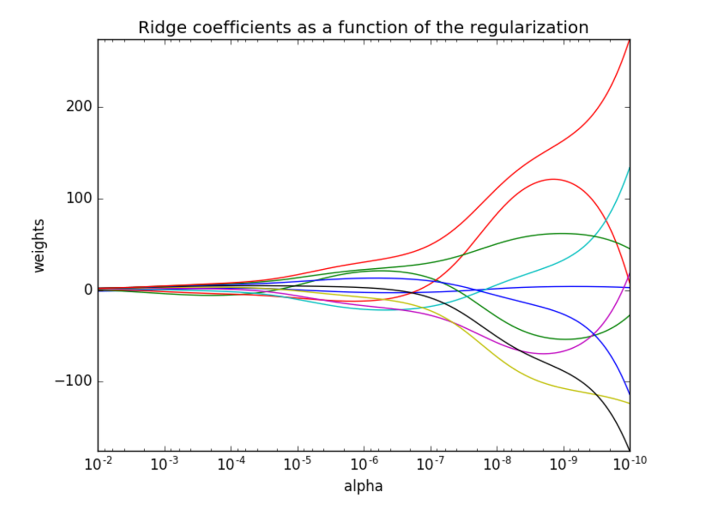

# 线性回归的改进-岭回归

正如前两节所说，岭回归是一种改进的线性回归方法，它通过引入一个正则化项来使得模型对异常值更加鲁棒。

## API

```python
sklearn.linear_model.Ridge(alpha=1.0, fit_intercept=True,solver="auto", normalize=False)
```

其中：

- `alpha`：正则化项的权重，默认为 1.0。
- `fit_intercept`：是否包含截距项，默认为 True。
- `solver`：用于求解最小二乘问题的算法，默认为"auto"，可以选择"svd"或"cholesky"。
- `normalize`：是否对特征进行标准化，默认为 False。

例如：

```python
import numpy as np
from sklearn.linear_model import Ridge

X = np.array([[-1, 1], [1, 1], [2, 1], [3, 2], [4, 3], [5, 5]])
y = np.array([1, 2, 3, 4, 5, 6])

ridge = Ridge(alpha=0.5)
ridge.fit(X, y)

print(ridge.coef_)  # [0.99999999 0.99999999]
print(ridge.intercept_)  # 0.0
```

某一次的输出结果：

```python
[0.66883117 0.27678571]
1.3396915584415585
```

Ridge 方法相当于 SGDRegressor(penalty='l2', loss="squared_loss")，只不过 SGDRegressor 实现了一个普通的随机梯度下降学习，推荐使用 Ridge(实现了 SAG)

## 正则化程度的变化对结果的影响

- 正则化力度越大，权重系数会越小
- 正则化力度越小，权重系数会越大


