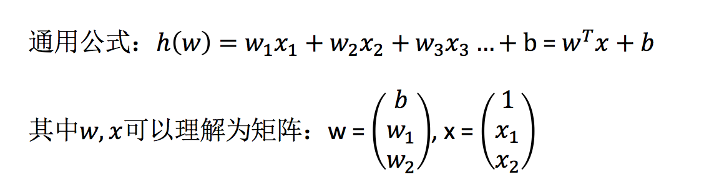
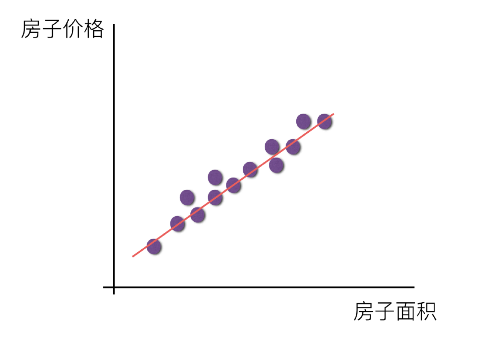
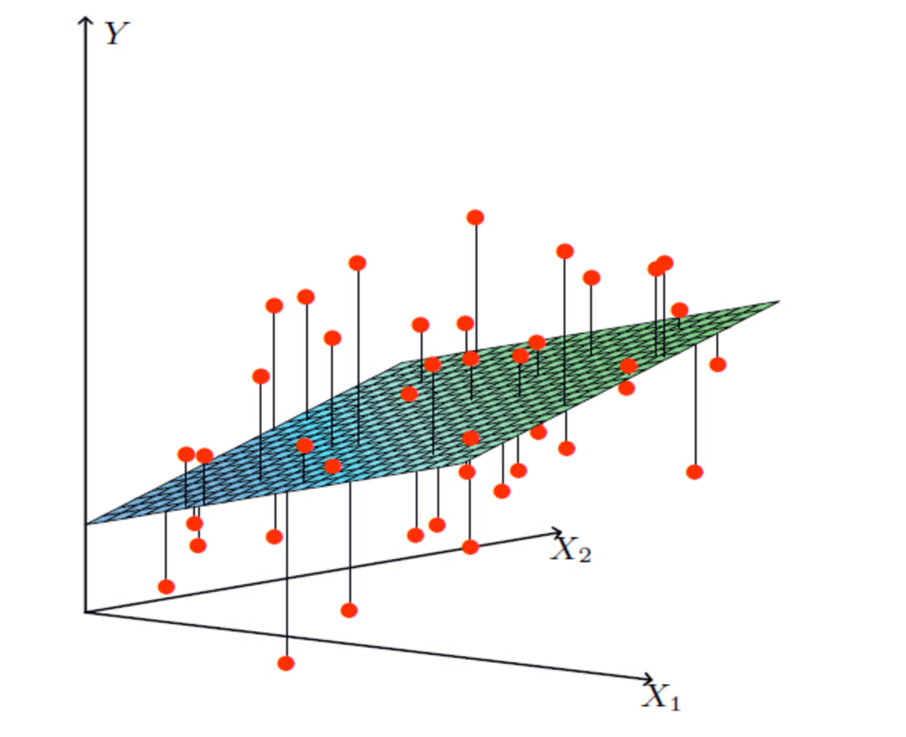
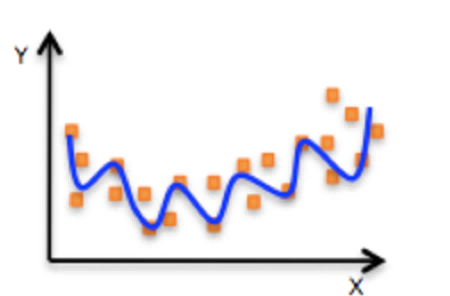

# 线性回归简介

在本章，我们从使用最广泛的线性回归模型开始，重新梳理机器学习的实践方法，并理解各个环节在机器学习中的作用。

作为含有代码的第一章，我们需要同时补充损失、正则化等大多数机器学习算法中基本都会用到的概念，因此篇幅较长，后续的章节会轻量化不少。

线性回归是一种有**监督学习**、**回归**分析的算法。

## 定义与公式

线性回归(Linear regression)是利用**回归方程(函数)**对**一个或多个自变量(特征值)和因变量(目标值)之间**关系进行建模的一种分析方式。

那么怎么理解呢？我们来看几个例子

- 期末成绩：`0.7` × `考试成绩` + `0.3` × `平时成绩`
- 房子价格 = `0.02` × `中心区域的距离` + `0.04` × `城市一氧化氮浓度` + (`-0.12` × `自住房平均房价`) + `0.254` × `城镇犯罪率`

上面两个例子，我们看到特征值与目标值之间建立了一个关系，这个关系可以理解为线性模型。

## 线性回归的特征与目标的关系分析

线性回归当中主要有两种模型，**一种是线性关系，另一种是非线性关系。**在这里我们只能画一个平面更好去理解，所以都用单个特征或两个特征举例子。

单变量线性关系：

多变量线性关系：

> 单特征与目标值的关系呈直线关系，或者两个特征与目标值呈现平面的关系。更高维度的我们不用自己去想，记住这种关系即可

非线性关系：

## 为什么要用线性回归？

线性回归可以用来预测和分析两个或多个变量之间的关系，可以用于预测、分类、聚类、回归等。

- **预测**：线性回归可以用来预测一个变量的值，比如房价预测、销售额预测等。
- **分类**：线性回归可以用来区分不同类别的对象，比如垃圾邮件分类、病人分类等。
- **聚类**：线性回归可以用来将相似的对象聚在一起，比如客户群体划分、产品推荐等。
- **回归**：线性回归可以用来分析两个变量之间的关系，比如房价与房间数的关系、销售额与销售量的关系等。

**实际上，我们用线性回归即拟合了一条线，使得误差最小，使得预测更加准确。**

### 线性回归的优点

- 简单：线性回归的模型比较简单，容易理解和实现。
- 易于理解：线性回归的模型可以很好地解释因变量和自变量之间的关系。
- 易于实现：线性回归的模型可以用简单数学公式来表示。
- 适用于多种数据类型：线性回归可以适用于各种数据类型，包括数值型、类别型、时间型等。
- 结果易于解释：线性回归的结果可以很容易地被人理解。
- 结果可信：线性回归的结果可以被验证和验证。

### 线性回归的缺点

- 忽略了非线性关系：线性回归忽略了非线性关系，因此对于非线性关系的预测效果不好。
- 忽略了多重共线性：线性回归忽略了多重共线性，因此对于多重共线性的处理效果不好。
- 容易受到噪声影响：线性回归容易受到噪声影响，因此对于噪声数据的处理效果不好。
