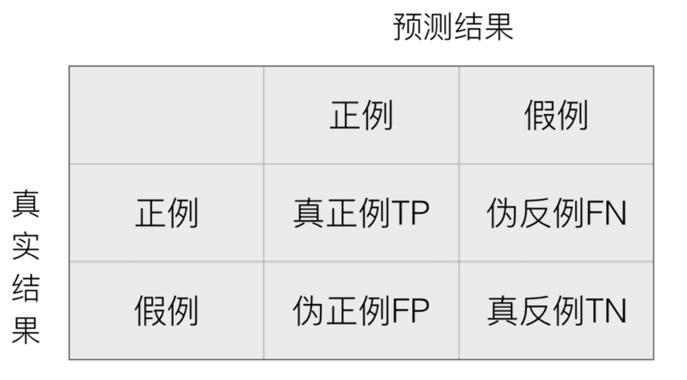
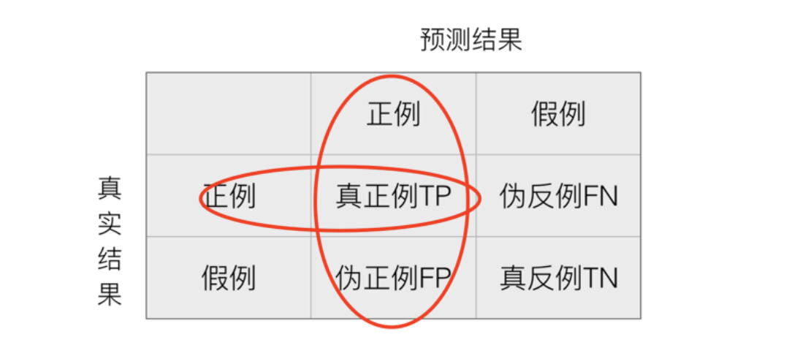
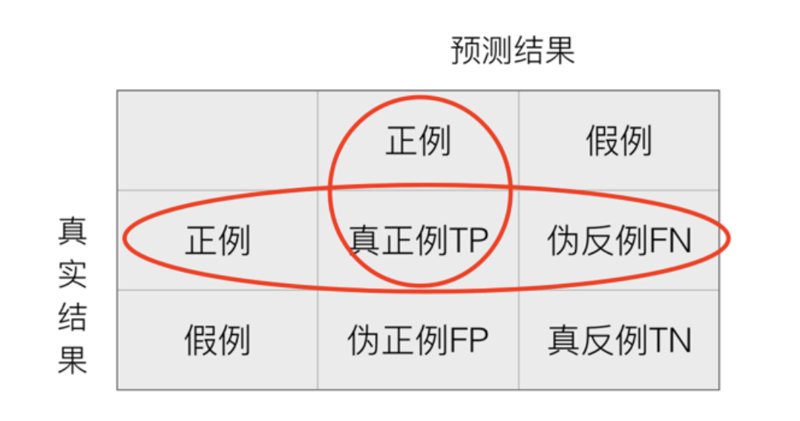
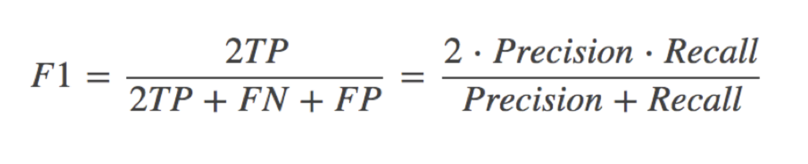
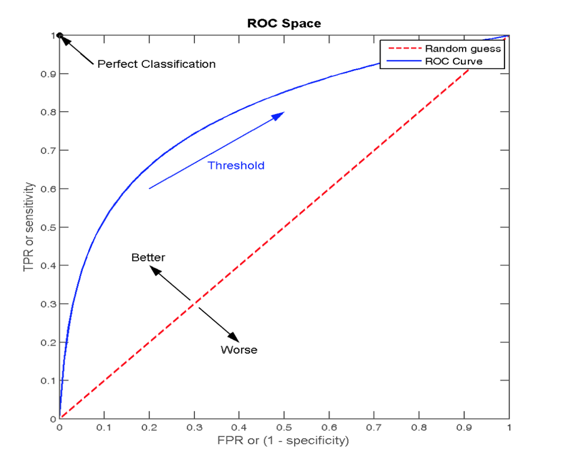

# 分类评估

## 分类评估方法

### 精确率与召回率

在分类任务下，预测结果(Predicted Condition)与正确标记(True Condition)之间存在四种不同的组合，构成混淆矩阵(适用于多分类)



通过混淆矩阵，我们可以计算精确率(Precision)和召回率(Recall)：

- 精确率：预测结果为正例样本中真实为正例的比例（了解）
  
- 召回率：真实为正例的样本中预测结果为正例的比例（查得全，对正样本的区分能力）
  

### F1-score

还有其他的评估标准，F1-score，反映了模型的稳健型，其定义如下：



### 分类评估报告 api

```python
sklearn.metrics.classification_report(y_true, y_pred, labels=[], target_names=None )
```

其中：

- `y_true`：真实标签
- `y_pred`：预测标签
- `labels`：指定需要计算的标签，默认为空，即计算所有标签的精确率、召回率和 F1-score
- `target_names`：指定标签的名称，默认为空，即标签的索引值

返回每个类别的精确率与召回率

## ROC 曲线与 AUC 指标

假设这样一个情况：如果 99 个样本癌症，1 个样本非癌症，不管怎样我全都预测正例(默认癌症为正例),准确率就为 99%但是这样效果并不好，这就是样本不均衡下的评估问题，如何衡量样本不均衡下的评估？

### TPR 与 FPR

- TPR(True Positive Rate)：真正例率，`TP/(TP+FN)`，所有真实类别为 `1` 的样本中，预测类别为 `1` 的比例
- FPR(False Positive Rate)：假正例率，`FP/(FP+TN)`，所有真实类别为 `0` 的样本中，预测类别为 `1` 的比例

### ROC 曲线

ROC 曲线的横轴就是 `FPRate`，纵轴就是 `TPRate`，当二者相等时，表示的意义则是：对于不论真实类别是 `1` 还是 `0` 的样本，分类器预测为 `1` 的概率是相等的，此时 `AUC` 为 `0.5`



### AUC 指标

AUC 的概率意义是随机取一对正负样本，正样本得分大于负样本得分的概率。AUC 的范围在`[0, 1]`之间，并且越接近 `1` 越好，越接近 `0.5` 属于乱猜

- `AUC = 1`，完美分类器，采用这个预测模型时，不管设定什么阈值都能得出完美预测。绝大多数预测的场合，不存在完美分类器。
- `0.5 < AUC < 1`，优于随机猜测。这个分类器（模型）妥善设定阈值的话，能有预测价值。

### AUC 计算 API

```python
from sklearn.metrics import roc_auc_score
```

其中：

- `y_true`：真实标签
- `y_score`：预测得分

### 总结

- AUC 只能用来评价二分类
- AUC 非常适合评价样本不平衡中的分类器性能
