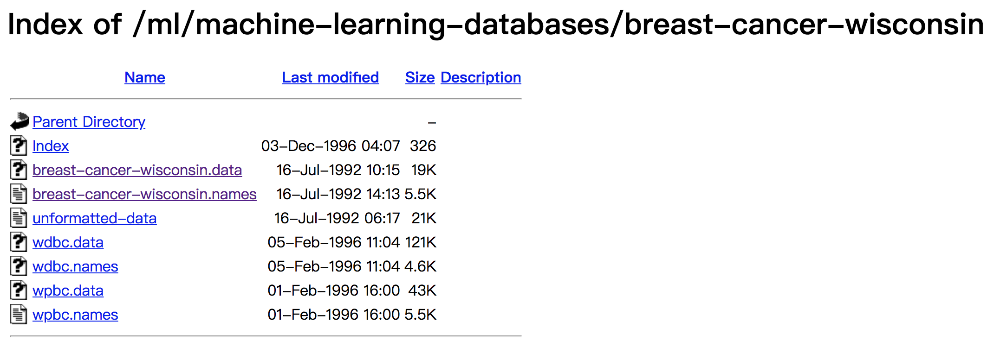

# 案例：癌症分类预测-良／恶性乳腺癌肿瘤预测

这个案例也比较经典，我们将使用逻辑回归模型来预测良／恶性乳腺癌肿瘤。

## 背景介绍



数据地址：https://archive.ics.uci.edu/ml/machine-learning-databases/breast-cancer-wisconsin/breast-cancer-wisconsin.data

数据描述：

- 699 条样本，共 11 列数据，第一列用语检索的 id，后 9 列分别是与肿瘤相关的医学特征，最后一列表示肿瘤类型的数值。
- 包含 16 个缺失值，用”?”标出。

## 案例分析

1. 获取数据
2. 基本数据处理
   1. 缺失值处理
   2. 确定特征值,目标值
   3. 分割数据
3. 特征工程(标准化)
4. 机器学习(逻辑回归)
5. 模型评估

## 代码实现

```python
import pandas as pd
import numpy as np
from sklearn.model_selection import train_test_split
from sklearn.preprocessing import StandardScaler
from sklearn.linear_model import LogisticRegression

# 忽略ssl证书验证
import ssl
ssl._create_default_https_context = ssl._create_unverified_context

# 1.获取数据
names = ['Sample code number', 'Clump Thickness', 'Uniformity of Cell Size', 'Uniformity of Cell Shape',
         'Marginal Adhesion', 'Single Epithelial Cell Size', 'Bare Nuclei', 'Bland Chromatin',
         'Normal Nucleoli', 'Mitoses', 'Class']
data = pd.read_csv("https://archive.ics.uci.edu/ml/machine-learning-databases/breast-cancer-wisconsin/breast-cancer-wisconsin.data", names=names)
print(data.head())

# 2.基本数据处理
# 2.1 缺失值处理
data = data.replace(to_replace="?", value=np.nan).dropna()
# 2.2 确定特征值,目标值
x = data.iloc[:, 1:10]  # 特征值，从第2列到第9列，即除Sample code number之外的列
print(x.head())
y = data["Class"]  # 目标值，即第10列
print(y.head())
# 2.3 分割数据
x_train, x_test, y_train, y_test = train_test_split(x, y, random_state=22)

# 3.特征工程(标准化)
transfer = StandardScaler()
x_train = transfer.fit_transform(x_train)
x_test = transfer.transform(x_test)

# 4.机器学习(逻辑回归)
estimator = LogisticRegression()
estimator.fit(x_train, y_train)

# 5.模型评估
y_predict = estimator.predict(x_test)
print(y_predict)
print(estimator.score(x_test, y_test))
```

某一次的输出结果：

```shell
   Sample code number  Clump Thickness  ...  Mitoses  Class
0             1000025                5  ...        1      2
1             1002945                5  ...        1      2
2             1015425                3  ...        1      2
3             1016277                6  ...        1      2
4             1017023                4  ...        1      2

[5 rows x 11 columns]
   Clump Thickness  Uniformity of Cell Size  ...  Normal Nucleoli  Mitoses
0                5                        1  ...                1        1
1                5                        4  ...                2        1
2                3                        1  ...                1        1
3                6                        8  ...                7        1
4                4                        1  ...                1        1

[5 rows x 9 columns]
0    2
1    2
2    2
3    2
4    2
Name: Class, dtype: int64
[2 4 4 2 2 2 2 2 2 2 2 2 2 4 2 2 4 4 4 2 4 2 4 4 4 2 4 2 2 2 2 2 4 2 2 2 4
 2 2 2 2 4 2 4 4 4 4 2 4 4 2 2 2 2 2 4 2 2 2 2 4 4 4 4 2 4 2 2 4 2 2 2 2 4
 2 2 2 2 2 2 4 4 4 2 4 4 4 4 2 2 2 4 2 4 2 2 2 2 2 2 4 2 2 4 2 2 4 2 4 4 2
 2 2 2 4 2 2 2 2 2 2 4 2 4 2 2 2 4 2 4 2 2 2 4 2 2 2 2 2 2 2 2 2 2 2 4 2 4
 2 2 4 4 4 2 2 4 4 2 4 4 2 2 2 2 2 4 4 2 2 2 4]
0.9766081871345029
```

:::tip
在很多分类场景当中我们不一定只关注预测的准确率，比如以这个癌症举例子中，我们并不关注预测的准确率，而是关注在所有的样本当中，癌症患者有没有被全部预测（检测）出来，显然在实际场景中这比准确率更重要。
:::
