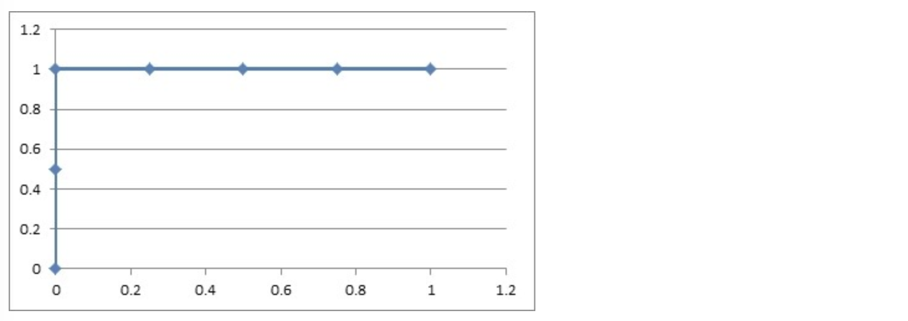
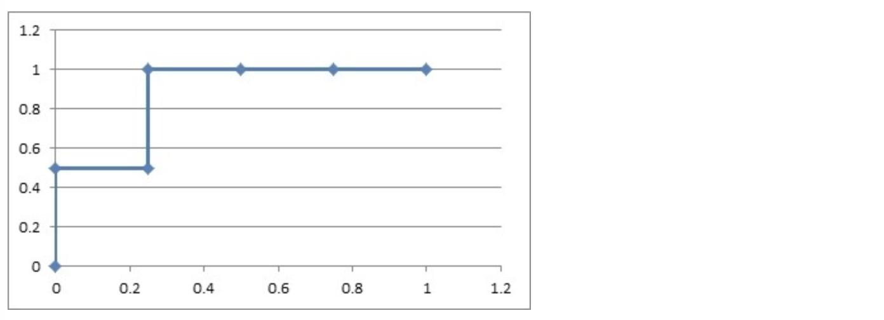
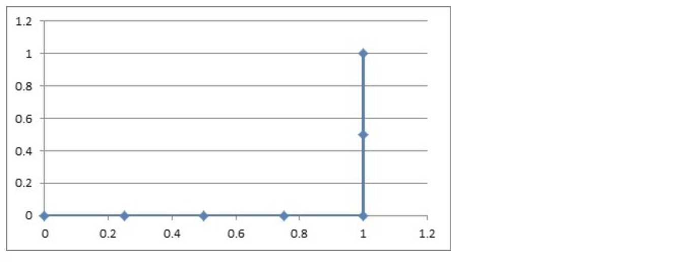

# ROC 曲线的绘制

关于 ROC 曲线的绘制过程，通过以下举例进行说明

假设有 6 次展示记录，有两次被点击了，得到一个展示序列（1:1,2:0,3:1,4:0,5:0,6:0），前面的表示序号，后面的表示点击（1）或没有点击（0）。

然后在这 6 次展示的时候都通过 model 算出了点击的概率序列。

## 曲线绘制

下面看三种情况。

### 如果概率的序列是（1:0.9,2:0.7,3:0.8,4:0.6,5:0.5,6:0.4）

与原来的序列一起，得到序列（从概率从高到低排）：

|  1  |  1  |  0  |  0  |  0  |  0  |
| :-: | :-: | :-: | :-: | :-: | :-: |
| 0.9 | 0.8 | 0.7 | 0.6 | 0.5 | 0.4 |

绘制的步骤是：

1. 把概率序列从高到低排序，得到顺序`（1:0.9,3:0.8,2:0.7,4:0.6,5:0.5,6:0.4）`；
2. 从概率最大开始取一个点作为正类，取到点 `1`，计算得到 `TPR=0.5`，`FPR=0.0`；
3. 从概率最大开始，再取一个点作为正类，取到点 `3`，计算得到 `TPR=1.0`，`FPR=0.0`；
4. 再从最大开始取一个点作为正类，取到点 `2`，计算得到 `TPR=1.0`，`FPR=0.25`;
5. 以此类推，得到 6 对 TPR 和 FPR。

然后把这 6 对数据组成 6 个点`(0,0.5)`,`(0,1.0)`,`(0.25,1)`,`(0.5,1)`,`(0.75,1)`,`(1.0,1.0)`。

这 6 个点在二维坐标系中能绘出来。

图中就是 ROC 曲线。

### 如果概率的序列是（1:0.9,2:0.8,3:0.7,4:0.6,5:0.5,6:0.4）

步骤相同，得到下图：

### 如果概率的序列是（1:0.4,2:0.6,3:0.5,4:0.7,5:0.8,6:0.9）

步骤相同，得到下图：

## 意义解释

如上图的例子，总共 `6` 个点，`2` 个正样本，`4` 个负样本，取一个正样本和一个负样本的情况总共有 `8` 种。

上面的第一种情况，从上往下取，无论怎么取，正样本的概率总在负样本之上，所以分对的概率为 `1`，`AUC=1`。再看那个 ROC 曲线，它的积分是什么？也是 `1`，ROC 曲线的积分与 AUC 相等。

上面第二种情况，如果取到了样本 `2` 和 `3`，那就分错了，其他情况都分对了；所以分对的概率是 `0.875`，`AUC=0.875`。再看那个 ROC 曲线，它的积分也是 `0.875`，ROC 曲线的积分与 AUC 相等。

上面的第三种情况，无论怎么取，都是分错的，所以分对的概率是 `0`，`AUC=0.0`。再看 ROC 曲线，它的积分也是 `0.0`，ROC 曲线的积分与 AUC 相等。

很厉害吧，其实 AUC 的意思是——Area Under roc Curve，就是 ROC 曲线的积分，也是 ROC 曲线下面的面积。

绘制 ROC 曲线的意义很明显，不断地把可能分错的情况扣除掉，从概率最高往下取的点，每有一个是负样本，就会导致分错排在它下面的所有正样本，所以要把它下面的正样本数扣除掉（1-TPR，剩下的正样本的比例）。总的 ROC 曲线绘制出来了，AUC 就定了，分对的概率也能求出来了。
