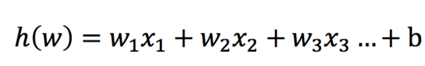
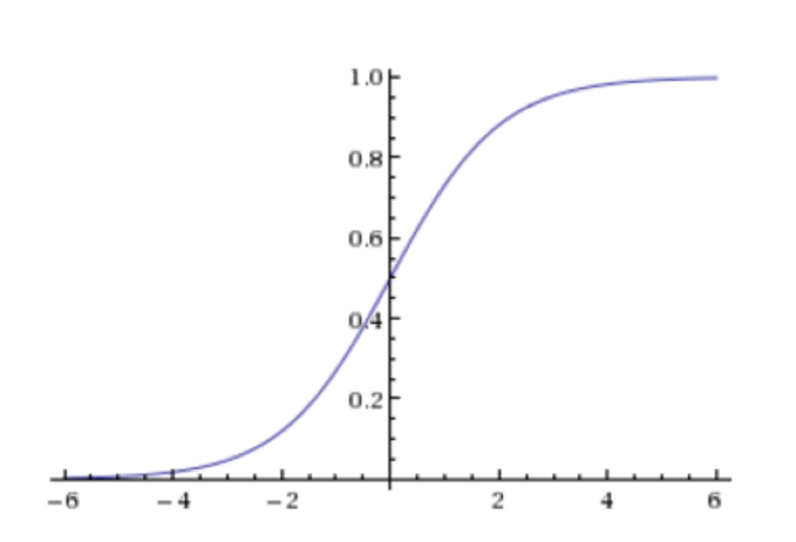
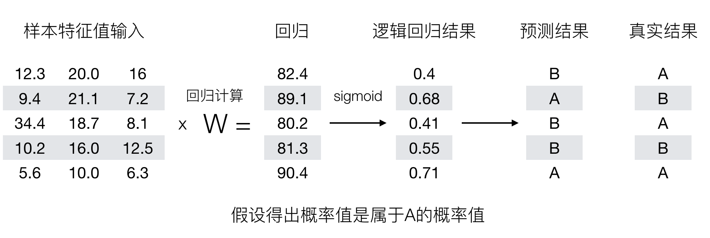
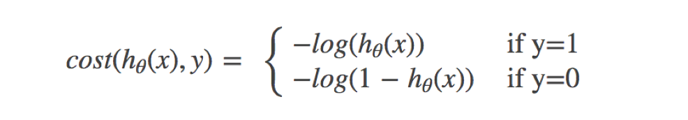
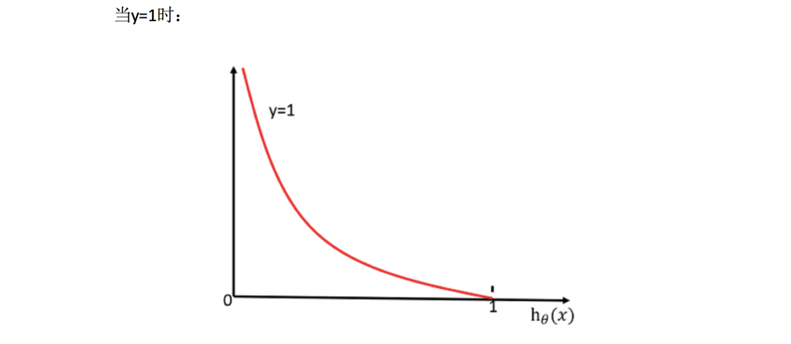
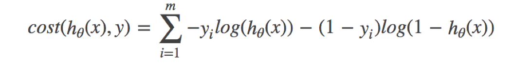
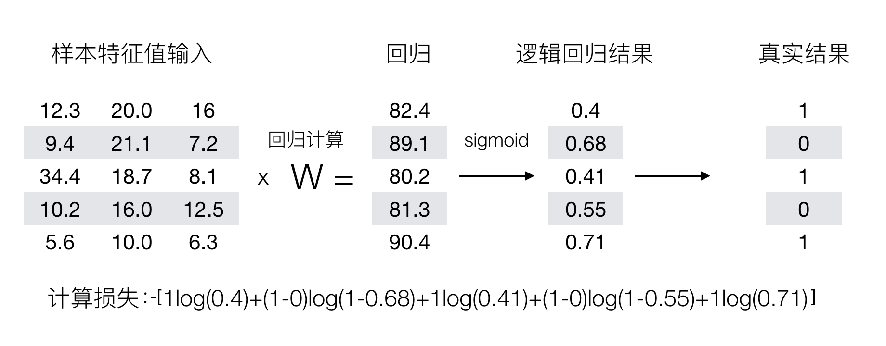

# 逻辑回归介绍

逻辑回归（Logistic Regression）是机器学习中的一种分类模型，逻辑回归是一种分类算法，虽然名字中带有回归。由于算法的简单和高效，在实际中应用非常广泛。

::: tip
实际上，所谓的“逻辑”是英文“Logistic”早期的音译加半解意译，其本意是“对数几率”的意思，与“逻辑”的关系不大，所以“Logistic Regression”翻译为“对率回归”更加合适。

不过由于大多数资料的翻译都延续了“逻辑回归”这个称呼，本文也仍然使用此称呼。
:::

逻辑回归是一种有**监督学习**、**分类**的算法。

## 逻辑回归的应用场景

- 广告点击率
- 是否为垃圾邮件
- 是否患病
- 金融诈骗
- 虚假账号

看到上面的例子，我们可以发现其中的特点，那就是都属于两个类别之间的判断。逻辑回归就是解决**二分类问题**的利器

## 逻辑回归的原理

与线性回归的思路类似，逻辑回归也是通过线性函数拟合数据，但是线性回归的输出只能是连续的，而逻辑回归的输出只能是 0 或 1。

要想掌握逻辑回归，必须掌握两点：

- 逻辑回归中，其输入值是什么
- 如何判断逻辑回归的输出

逻辑回归的输入就是一个线性回归的结果。

## 激活函数

通常，我们使用 sigmoid 函数作为激活函数。sigmoid 函数并不是某一个函数，而是符合一定特征的一类函数，一种常见的 sigmoid 函数的表达式如下：

$$ g(w^T,x) = \frac{1}{1+e^{-w^T x}} $$

其中，$w^T$ 是权重向量，$x$ 是输入向量。

一般的，当函数满足以下条件时，我们可以认为它是 sigmoid 函数：

- 函数值域为 (0, 1)
- 函数在 $x=0$ 处的导数为 0
- 函数在 $x\to\infty$ 时趋于无穷大

sigmoid 函数的特点是：

- 输出值在 0 到 1 之间，可以表示概率
- 输出值趋于 0.5 时，表示分类结果的不确定性较低
- 输出值趋于 0 或 1 时，表示分类结果的确定性较低

他们的图像一般是这样的：

当 sigmoid 函数进行判断时，我们通常把回归的结果输入到 sigmoid 函数当中，并输出[0, 1]区间中的一个概率值，默认为 0.5 为阈值

逻辑回归最终的分类是通过属于某个类别的概率值来判断是否属于某个类别，并且这个类别默认标记为 1(正例),另外的一个类别会标记为 0(反例)。（方便损失计算）

**输出结果解释**：假设有两个类别 A，B，并且假设我们的概率值为属于 A(1)这个类别的概率值。现在有一个样本的输入到逻辑回归输出结果 0.55，那么这个概率值超过 0.5，意味着我们训练或者预测的结果就是 A(1)类别。那么反之，如果得出结果为 0.3 那么，训练或者预测结果就为 B(0)类别。

关于**逻辑回归的阈值是可以进行改变的**，比如上面举例中，如果你把阈值设置为 0.6，那么输出的结果 0.55，就属于 B 类。

**在之前，我们需要先使用最小二乘法衡量线性回归的损失**

在逻辑回归中，当预测结果不对的时候，我们该怎么衡量其损失呢？

我们来看下图(下图中，设置阈值为 0.6)：

那么如何去衡量逻辑回归的预测结果与真实结果的差异呢？

## 损失以及优化

### 损失

逻辑回归的损失，称之为**对数似然损失**，公式如下：

分开类别：

其中 $y$ 为真实值，$h_θ(x)$ 为预测值。

怎么理解单个的式子呢？这个要根据 log 的函数图像来理解：

无论何时，我们都希望损失函数值越小越好

分情况讨论，对应的损失函数值：

- 当 y=1 时，我们希望$h_θ(x)$值越大越好
- 当 y=0 时，我们希望$h_θ(x)$值越小越好

在实际运用时，为了保证其良好的数学特性，我们通常使用**交叉熵损失**来代替对数似然损失：

看着很复杂，其实就是对两个类别的概率值进行交叉计算，我们带入上面那个例子来计算一遍，就能理解意义了：

我们已经知道，log(P), P 值越大，结果越小，所以我们可以对着这个损失的式子去分析

### 优化

同样使用梯度下降优化算法，去减少损失函数的值。这样去更新逻辑回归前面对应算法的权重参数，**提升原本属于 1 类别的概率，降低原本是 0 类别的概率。**

## 总结

如果我们希望对一个样本进行分类，逻辑回归的思路是：

- 首先，我们将输入值输入到线性回归模型中，得到一个预测值
- 然后，我们将这个预测值输入到 sigmoid 函数中，得到一个概率值
- 最后，我们根据这个概率值，判断这个样本属于哪个类别

逻辑回归的损失函数是对数似然损失，优化算法是梯度下降算法。
