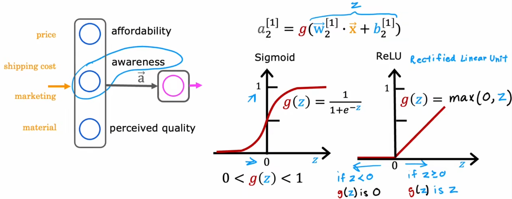
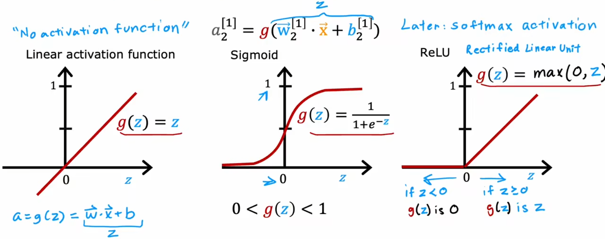
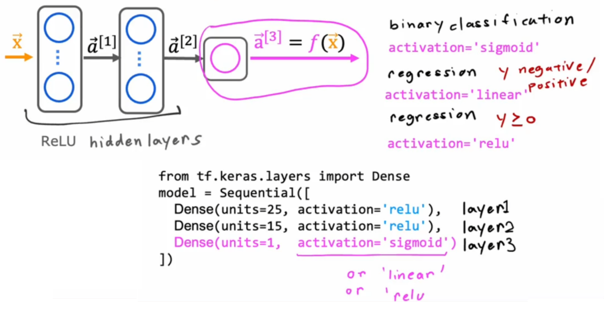

# 其他的激活函数

## Sigmoid 激活函数的替代方案

由于前面介绍了“逻辑回归”，于是我们将每个神经元都看成一个小的逻辑回归单元，所以目前一直使用 Sigmiod 函数作为隐藏层和输出层所有神经元的激活函数。但 Sigmoid 函数显然也有其局限性。比如下面的“需求预测”问题，我们最开始假设隐藏层输出的有“心理预期价格”、“认可度”、“产品质量”，但实际上这些指标并不一定都为 0~1 之间的小数字，比如“认可度”可以有“不认可”、“一般认可”、“极度认可”、“完全传播开来”等。于是我们不妨将“认可度”的范围扩展为到所有“非负数”，也就是从 0 到非常大的数字。也就是 ReLU 函数(Rectified Linear Unit, 修正线性单元)：

于是，这启示我们，激活函数的形状应该和输出范围有关，下面就是三种常见的激活函数：

合理使用上述激活函数可以进一步提升神经网络性能，进而构建各种各样的强大的神经网络。对于具体的函数解释，我们将会在深度学习部分详细介绍。

## 如何选择激活函数？

那该如何选择激活函数呢？首先我们从输出层开始。输出层的激活函数通常取决于“目标值”，比如二元分类问题就使用 Sigmoid 函数、如果预测股票涨跌的回归问题就使用线性激活函数(因为有正有负)、如果是“预测房价”这样的回归问题就使用 ReLU 函数(因为房价非负)。而对于隐藏层来说，若无特殊原因，所有隐藏层的神经元都应选择 ReLU 函数。最早人们都默认使用 Sigmoid 函数，但是现在逐渐演变成默认使用 ReLU 函数，主要有以下几个原因：

- ReLU 函数形式更简单、计算更快。
- ReLU 仅在负数域平坦，而 Sigmoid 函数在正负两侧都平坦。而平坦的区域越大，会导致代价函数平坦的区域越大，“梯度下降”等算法训练模型的速度就越慢。

总结：“输出层”按照“目标值”取值范围选取，“隐藏层”默认全部采用 ReLU 函数，如下图：

对于大多数情况、大多数应用来说，上述介绍的几个激活函数已经够用了。当然还有其他激活函数，比如 Tanh 函数、Leaky ReLU 函数、Swish 函数等。每隔几年，研究人员都会提出新的激活函数，这些激活函数在某些方面的性能确实会更好。想了解的话可以自行查阅。

## 为什么需要激活函数？

既然 ReLU 函数比 Sigmoid 函数计算更快，那能不能默认使用更简洁的“线性激活函数”呢？换句话说，能不能不使用激活函数呢？显然是不行的。由于“线性函数的线性组合还是线性函数”，若只使用线性激活函数，整个神经网络就会退化成“线性回归”，所以 尽量不在隐藏层使用线性激活函数。使用其他的非线性函数，比如 ReLU 函数，只要有足够多的神经元，通过调整参数就可以拟合出任意的曲线，进而实现神经网络想要的拟合效果。
