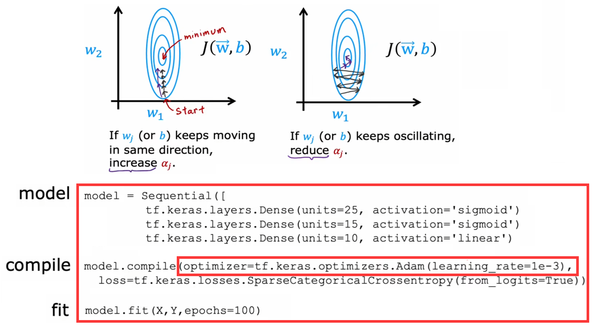
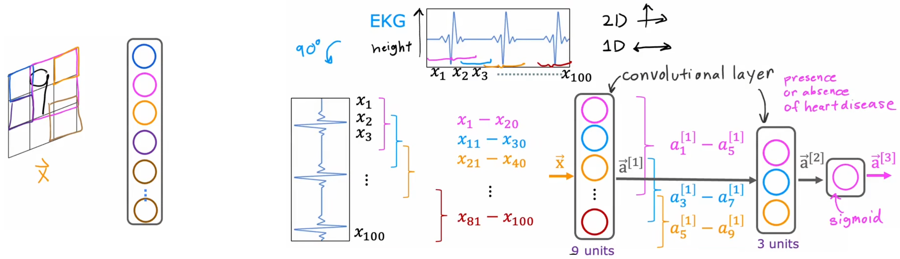
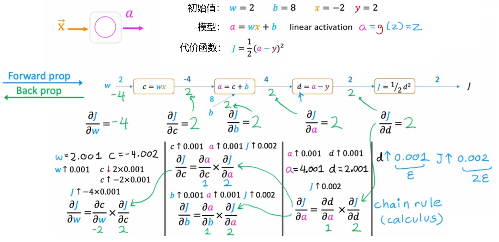
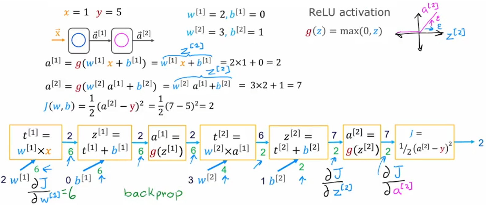

# 更加高级的神经网络概念

## 梯度下降法的改进：Adam 算法

“梯度下降”广泛应用于机器学习算法中，如线性回归、逻辑回归、神经网络早期实现等，但是还有其他性能更好的最下滑代价函数的算法。比如“Adam 算法(Adaptive Moment estimation, 自适应矩估计)”就可以自动调整“梯度下降”学习率 α 的大小，从而加快“梯度下降”的收敛速度。下面是其算法逻辑和代码示例：

有兴趣可以试着调大全局学习率 learning_rate，看看 Adam 算法能否学的更快。

## 其他类型的神经网络层

目前为止学习到的所有神经网络都是“密集层类型(dense layer type)”，也就是层内的每一个神经元都会得到上一层的所有输入特征。虽然“密集层类型”的神经网络功能很强大，但是其计算量很大。于是，Yann LeCun 最早提出“卷积层(convolution layer)”，并将其应用到计算机视觉领域。“卷积层”中，每个神经元只关心输入图像的某个区域。如下左图中，对于输入图像，每个神经元只关心某个小区域(按照颜色对应)。“卷积层”的优点如下：

- 加快计算。
- 需要的训练集可以更小，并且也不容易“过拟合”。

如果神经网络有很多“卷积层”，就会称之为“卷积神经网络”(如上右图)。上右图便给出了“心电图监测”问题(本小节开始的说明)的卷积神经网络示意图。显然，改变每个神经元查看的窗口大小，每一个有多少神经元，有效的选择这些参数，可以构建比“密集层类型”更加有效的神经网络。

除了“卷积层”之外，当然还有其他的神经网络层类型，将不同类型的“层”结合在一起，组成更加强大的神经网络：

- 全连接层（Fully Connected Layer）：全连接层是最简单的神经网络层，其中每个神经元与上一层的所有神经元相连接。
- 卷积层（Convolutional Layer）：卷积层用于处理图像和其他二维数据，通过卷积操作提取图像的局部特征。
- 池化层（Pooling Layer）：池化层通常与卷积层结合使用，用于减小特征图的空间尺寸，提高计算效率，并减少参数量。
- 循环神经网络层（Recurrent Neural Network Layer）：RNN 层用于处理序列数据，具有记忆性，能够捕捉时间上的依赖关系。
- 长短时记忆网络层（Long Short-Term Memory Layer，LSTM）：LSTM 是一种特殊的循环神经网络层，具有更强大的记忆性，适用于处理长序列依赖关系。
- ......

## 反向传播

“反向传播”是“自动微分(auto-diff)算法”的一种。本节介绍 TensorFlow 如何使用“反向传播”，计算神经网络的代价函数对所有参数的偏导。

### 计算图和导数

显然，由于神经网络可以创建的相当庞大，所以很难显式的写出偏导表达式。此时，我们求解代价函数偏导的思路就转成，求解代价函数在该点切线的斜率，也就是使用很小的步长来近似当前点的切线斜率。但是神经网络通常又有很多层，于是对于每个神经元的每个参数都通过这种方式，直接迭代一次神经网络求解对一个参数的偏导，显然也不现实。于是，我们先通过“计算图(Computation Graph)”来研究一下神经网络的计算流程，找找灵感，比如下面对于单神经元网络的代价函数计算：

### 神经网络中的反向传播

本节就来将上一节的想法应用到大型神经网络中。显然可以如下图所示，先“前向传播”计算神经网络中所有神经元的取值，然后一次“反向传播”遍历走完所有节点，即可计算出神经网络的代价函数对每个神经元的每个参数的偏导。显然，此时“计算图”实际上就相当于神经网络：

