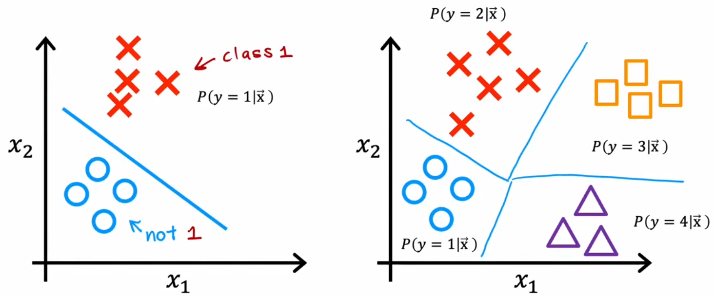
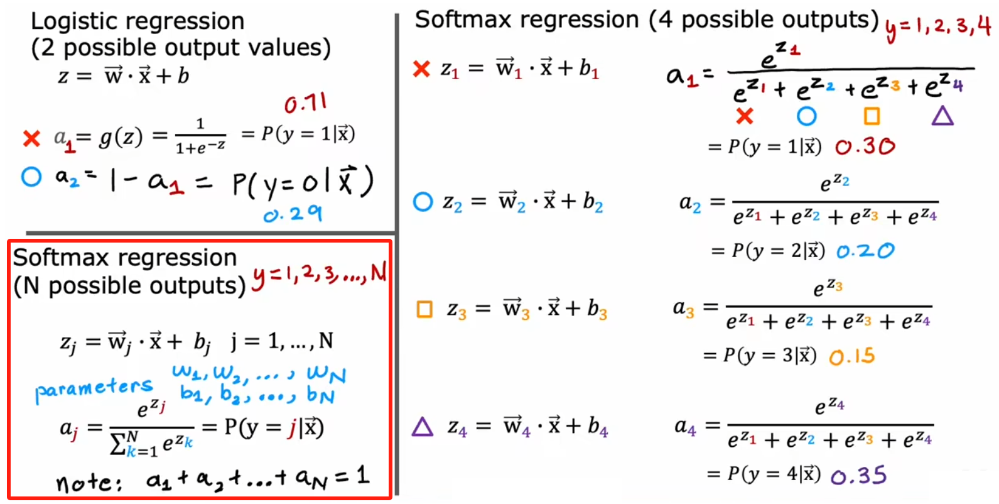
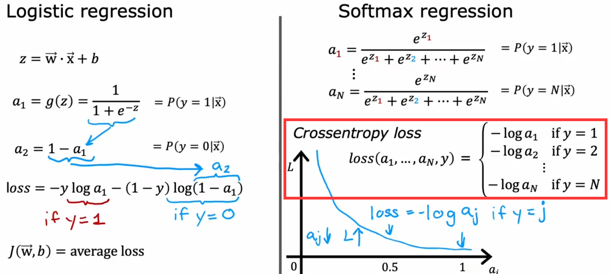

# 多分类问题和 Softmax 函数

## 多分类问题

显然，要识别全部的数字 0~数字 9，就需要将二元分类问题进行推广。于是，分类输出的目标值有多个可能的问题，便称为“多分类问题(multiclass classfication problem)”。比如“手写数字识别”要分类 10 个数字、“肿瘤检测”要分类多种恶化类型、流水线产品检测不同类型的缺陷等。

> 注：聚类是无监督学习，神经网络自行分类；多分类问题是有监督学习，只不过是类别多了。

对于多分类问题，显然希望决策边界如上右图所示。于是下节介绍由二元分类的“逻辑回归算法”推广得到的“Softmax 回归算法”，可以解决上述“多分类问题”，并将其应用到神经网络中。

## 逻辑回归的推广：Softmax 回归

下面是 Softmax 函数的定义，也就是 g(z) 的定义：

于是类似于“逻辑回归”的“二元交叉熵(Binary Crossen tropy)损失函数”，“Softmax 回归”的损失函数为“稀疏分类交叉熵(Sparse Categorical Crossen tropy)”。同样也是，推理结果越接近真实结果，损失越小：

