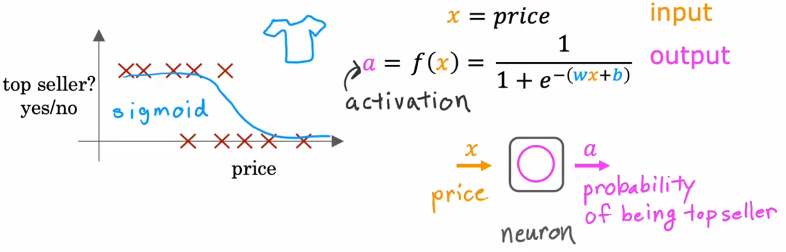

# 神经网络

神经网络在 1950 年被提出，经过多次冷落与重新发现，至今仍然是机器学习领域的热门话题。

在本章，我们将对神经网络进行初步的认识，了解最基础的结构与机制。

::: tip
在本章，我们并不会涉及到太过深入的神经网络，时至今日神经网络已经足以以“深度学习”作为一个庞大的机器学习独立分支存在，且 sklearn 并没有对神经网络有足够的支持，我们将在 DL&Pytorch 中进行详细的讲解。
:::

## 神经网络起源

在几十年前，当“神经网络(neural networks)”被首次提出时，其最初的动机模仿(mimic)人脑或生物大脑学习和思考的方式，编写一个可以自动运行的软件。虽然如今的“神经网络”，也被称为“人工神经网络(artifical neural network)”，其原理已经和我们大脑实际上的工作方式相去甚远，但是我们还是会看到一些最初的“生物学动机(biological motivations)”。首先来看看“神经网络”的发展历程：

- 1950’s 年代：由于人脑或者说生物大脑的比任何“智能”都有着更高的水平，于是“神经网络”最初是想建立模仿大脑的软件。1950’s 年代开始这项工作，但是后来就没落了(估计是因为算力不够+也不了解神经元)。
- 1980’s~1990’s 早期：由于被应用于手写数字识别等应用中，“神经网络”再度被重视。比如识别邮政编码从而分拣信件、识别手写支票中的美元数字等。但是在 1990’s 晚期再度失宠。
- 大约 2005 年~至今：开始复苏，并被重新命名成“深度学习”。从那以后，“神经网络”在一个有一个领域取得了空前进展。

- 第一个由于“神经网络”而取得巨大进步的领域是“语音识别(speech recognition)”，邓力 和 杰弗里·辛顿 等人将现代深度学习算法应用到该领域。
- 然后就是“计算机视觉(cpmputer vision)”，2012 年是 ImageNet 的推出对计算机视觉产生了重要的影响。
  接下来几年进入了“文本处理”或“自然语言处理(NLP)”。
- 如今：神经网络被应用于方方面面，比如气候变化、医学成像、在线广告推广等。基本上很多推荐机制都是使用神经网络来完成。

> 注：“神经网络”被重新命名成“深度学习”，一方面是因为听起来更高大上，另一方面是因为人类根本不了解“神经元”的工作方式，现代的深度学习也不想再深究以前的生物学动机，只想从工程的角度构建更有效的算法，所以逐渐舍弃“神经网络”这种叫法。

## 神经元简化结构

人脑由几百亿个神经元组成，现在我们来看看神经元的简化结构。如下左图，单个神经元有很多“树突(dendrite)”作为输入端，通过“轴突(axon)”输出，该输出可以继续连接一个或多个神经元。于是，单个神经元可以看成“多个输入到单个输出的映射”。在下右图中，使用“蓝色小圈”表示单个神经元，于是“神经网络”就是由多个神经元组成的，能够将输入映射到输出的系统。

注意这里的介绍只是一个简单的类比，实际上人脑的工作方式更加复杂和精妙，人类目前并不能完全了解人脑的工作方式。基本上每隔几年，神经科学家都会在人脑工作方式领域有根本性的突破。但即使是这些及其简化的神经元模型，也可以训练出很强大的深度学习模型。事实上，从事神经网络研究的人已经从寻找生物学动机渐渐远离，大家只是想从“工程原理”的角度来构建更有效的算法，所以不要太把自己局限在这些生物学动机当中。当然，时不时的想想神经元真正的工作方式也很有趣。

## 神经网络兴起的真正原因

既然神经网络已经在几十年前就提出了，为什么最近几年才开始真正的发展呢？简单来说，是因为存储和算力的发展。在下图中，横轴表示对某问题所拥有的数据量，纵轴表示应用于该问题的“学习算法”的性能或精度。过去几十年间，随着互联网的发展，横轴上的数据在不断增长，若使用传统的机器学习算法，比如“线性回归”或“逻辑回归”，算法性能已经趋于上限。也就是说，传统的 AI 算法不能有效的利用现在庞大的数据。而得益于算力的发展，主要是 GPU 的发展，可以部署越来越大规模的神经网络模型，算法精度也相应的取得了质的提升。也就是说，得益于现在的存储和算力，神经网络才取得长足的发展。

## 引入神经网络-需求预测

为了说明神经网络的形成原理，本节先从一个小例子——“需求预测”问题开始：

“需求预测(Demand Predication)”问题：预测某产品是否为畅销产品。

- 输入特征：价格、运费、市场营销、材质等。
- 输出：二元输出，是否为畅销产品(0/1)。

我们先只考虑“价格”这一个特征，对于这种二元分类问题，仿照“逻辑回归”，我们仍然可以使用 Sigmoid 函数来拟合单个神经元的模型函数，这个小逻辑回归算法可以认为是非常简化的单个神经元模型，如下图所示：

下面进一步改进模型，首先是将输入特征扩展为四个(价格、运费、市场营销、材质)，但若将这几个特征直接和最后一个神经元相连，这就回到之前的“逻辑回归”了，我们不能这么做。所以我们我们不妨添加一层“消费者因素”，我们定义消费者是否购买一件产品可能取决于三个因素(“心理预期价格”、“认可度”、“产品质量”)，这三种因素又取决于不同的输入特征(如下图黄色连线所示)。于是，将“输入特征”、“消费者因素”、“输出概率”这三者使用不同层的神经元连接在一起，每个神经元都是一个小型的逻辑回归算法，便将“单神经元模型”扩展为“神经网络模型”：

上述就是整个神经网络的形成原理。但注意到上述我们手动规定了“隐藏层”的神经元数量、每个神经元与输入特征的关系。要是遇到庞大且复杂的神经网络，显然都靠手动规定几乎不可能！所以实际构建神经网络时，只需要设定隐藏层数量、以及每个隐藏层的神经元数量，其他的对应关系等无需规定，神经网络模型都可以自行学习（Week2 介绍）。这也解释了，之所以称之为“隐藏层”，是因为我们一般只知道数据集，而不会像上述一样预先设置好“消费者因素”，也就是说，我们一开始并不知道“隐藏层”间的神经元之间的对应关系。

最后要说的一点是，上述只是具有单个隐藏层的神经网络模型，下面是具有多个隐藏层的，某些文献中也被称为“多层感知器(multilayer perceptron)”：

.png>)

## 神经网络的其他示例-图像感知

那“隐藏层”具体都在做什么事情呢？我们使用计算机视觉中的“人脸识别”来举例，现在有一个已经训练好的神经网络模型，下面来看看隐藏层在做什么工作（注意不同的神经网络可能不同）：

“人脸识别”(face recognition)问题：识别图片中的人脸是谁。

- 输入特征：100x100 的图片。
- 输出：图片中的人脸，是某个人的概率。

- 隐藏层 1：识别一些很小的边缘或线，比如不同的神经元识别不同方向的小边缘或线。
- 隐藏层 2：将小边缘组合在一起，识别面部的某个区域，比如鼻子、眼睛、嘴等。
- 隐藏层 3：将上述面部区域再组合，检测到整张人脸，然后再根据脸型对比和目标人脸的相似程度。

可以看到，神经网络如此强大！我们预先并没有告诉这些隐藏层需要做什么，但仅仅通过学习输入的数据，神经网络便可以自动生成这些不同隐藏层的特征检测器。
