# Matplotlib 入门

## Matplotlib

### 简介

matplotlib 是一个 Python 2D 绘图库，可用于创建各种 2D 图表，包括直方图、散点图、折线图、条形图、饼图等。Matplotlib 可与 NumPy 以及 Pandas 等数据分析库配合使用。

实际上，我们如果希望使用 python 进行数据可视化一般会选择使用 matplotlib。

### \[选读\]为什么要使用 Matplotlib？

可视化是在整个数据挖掘的关键辅助工具，可以清晰的理解数据，从而调整我们的分析方法。

- 能将数据进行可视化,更直观的呈现
- 使数据更加客观、更具说服力

例如下面两个图为数字展示和图形展示：

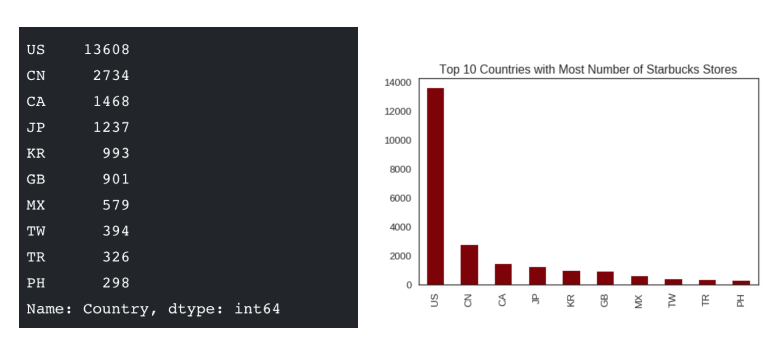

### 绘图流程

绝大多数的绘图任务都可以分为以下几个步骤：

1. 创建画布
2. 绘制图形
3. 显示图像

例如，我们要绘制一个折线图，可以按照以下流程进行：

1. 创建画布：使用 `matplotlib.pyplot.figure()` 创建一个空白的画布。
2. 绘制图形：使用 `matplotlib.pyplot.plot()` 绘制折线图。
3. 显示图像：使用 `matplotlib.pyplot.show()` 显示图像。

完整代码如下：

```python
import matplotlib.pyplot as plt

# 1.创建画布
plt.figure(figsize=(10, 10), dpi=100)

# 2.绘制折线图
plt.plot([1, 2, 3, 4, 5, 6 ,7], [17,17,18,15,11,11,13])

# 3.显示图像
plt.show()
```

结果如下：

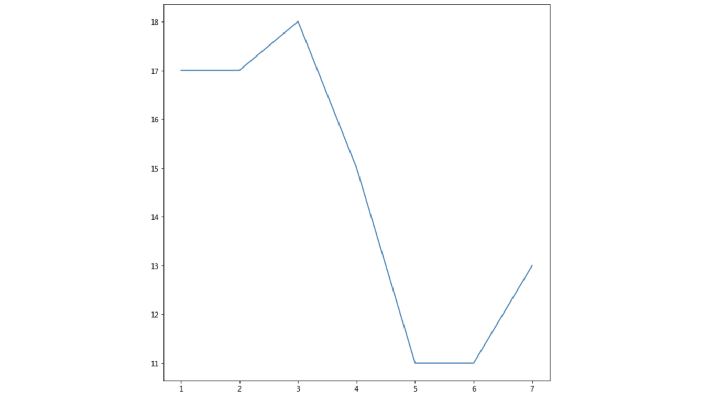

### Matplotlib 图像结构

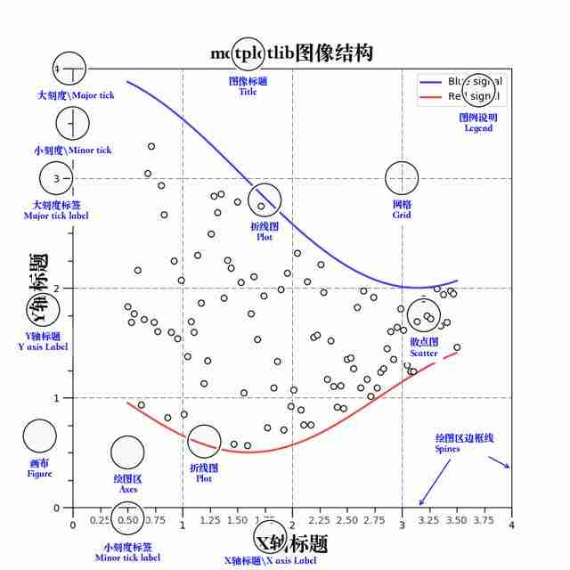

## 绘图详解

> 本部分以折线图为例

### 完善原始折线图 — 给图形添加辅助功能

为了更好地理解所有基础绘图功能，我们通过天气温度变化的绘图来融合所有的基础 API 使用

需求：画出某城市 11 点到 12 点 1 小时内每分钟的温度变化折线图，温度范围在 15 度~18 度

效果：

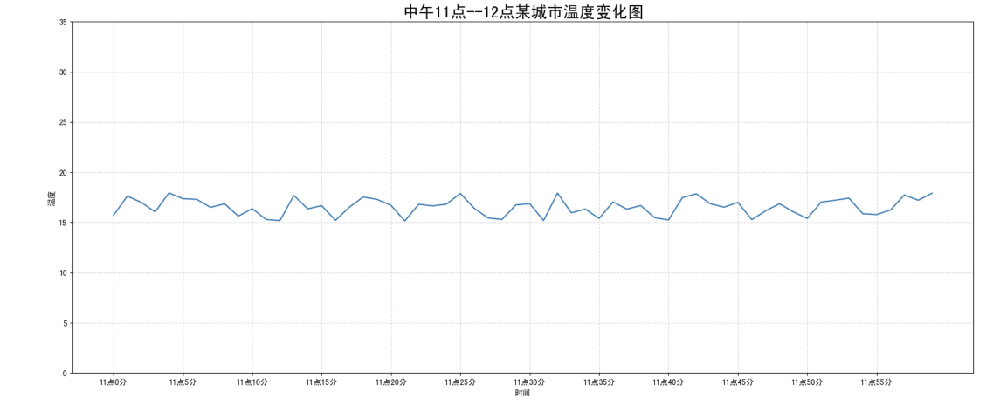

下面我们将一步步完善这个图形。

#### 初始折线图

我们先用基本流程绘制一个简单的折线图：

```python
import matplotlib.pyplot as plt
import random

# 0.准备x, y坐标的数据
x = range(60)  # 60个数字
y = [random.uniform(15, 18) for i in x]  # 随机生成60个介于15和18之间的数

# 1.创建画布
plt.figure(figsize=(20, 8), dpi=80)  # 设置画布大小和分辨率

# 2.绘制折线图
plt.plot(x, y)  # 绘制折线图

# 3.显示图像
plt.show()
```

某一次的结果如下：

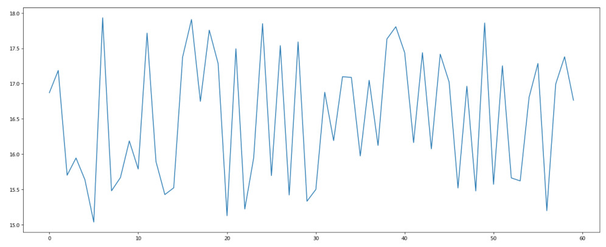

#### 添加自定义 x,y 刻度

我们可以使用如下函数定义刻度：

```python
plt.xticks(x, **kwargs)
plt.yticks(y, **kwargs)
```

在`plot`后补充代码：

```python
# 2.1构造x,y轴刻度标签
x_ticks_label = ["11:{}".format(i) for i in x]  # 构造x轴刻度标签
y_ticks = range(15, 19)  # 构造y轴刻度
# 2.2刻度显示
plt.xticks(x[::5], x_ticks_label[::5])
plt.yticks(y_ticks[::1])
```

某一次的结果如下：

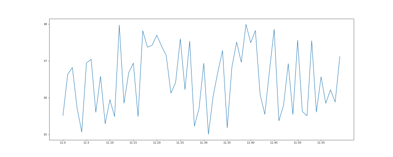

#### 添加网格显示

为了更加清楚地观察图形对应的值，我们可以使用 `grid` 函数添加网格显示：

```python
# 2.3网格显示
plt.grid(True, linestyle='--', alpha=0.5)
```

某一次的结果如下：

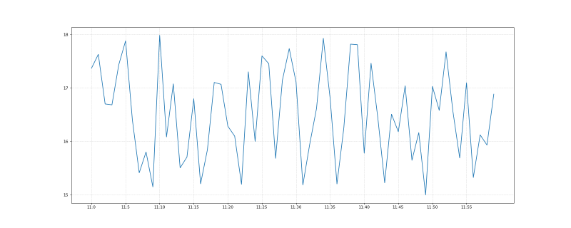

#### 添加描述信息

为了让图形更加易懂，我们可以添加描述信息：

```python
# 2.4添加描述信息
plt.xlabel("time")
plt.ylabel("temperature")
plt.title("Temperature Curve", fontsize=20)
```

某一次的结果如下：

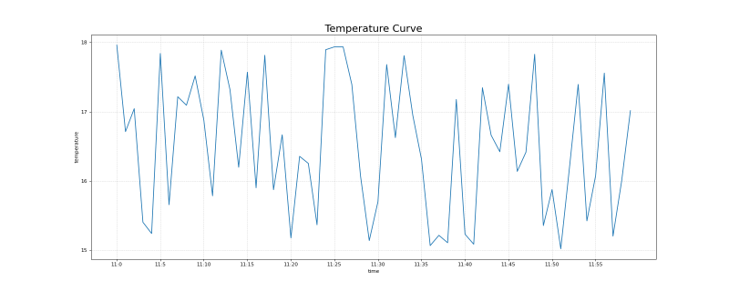

如果你希望添加中文信息，可以使用 `matplotlib.rcParams` 来设置字体
。

#### 图像保存

我们把生成出的图像自动保存到本地：

```python
# 3.显示图像
plt.savefig("temperature_curve.png")
plt.show()
```

**注意：`plt.show()`会释放 `figure` 资源，如果在显示图像之后保存图片将只能保存空图片。**

#### 完整代码

```python
import matplotlib.pyplot as plt
import random

# 0.准备x, y坐标的数据
x = range(60)  # 60个数字
y = [random.uniform(15, 18) for i in x]  # 随机生成60个介于15和18之间的数

# 1.创建画布
plt.figure(figsize=(20, 8), dpi=80)  # 设置画布大小和分辨率

# 2.绘制折线图
plt.plot(x, y)  # 绘制折线图
# 2.1构造x,y轴刻度标签
x_ticks_label = ["11:{}".format(i) for i in x]  # 构造x轴刻度标签
y_ticks = range(15, 19)  # 构造y轴刻度
# 2.2刻度显示
plt.xticks(x[::5], x_ticks_label[::5])
plt.yticks(y_ticks[::1])
# 2.3网格显示
plt.grid(True, linestyle='--', alpha=0.5)
# 2.4添加描述信息
plt.xlabel("time")
plt.ylabel("temperature")
plt.title("Temperature Curve", fontsize=20)

# 3.显示图像
plt.savefig("temperature_curve.png")
plt.show()
```

### 在一个坐标系中绘制多个图像

需求：再添加一个城市的温度变化

实际上做起来非常简单，只需要再次 plot 即可，但我们希望有所区分：

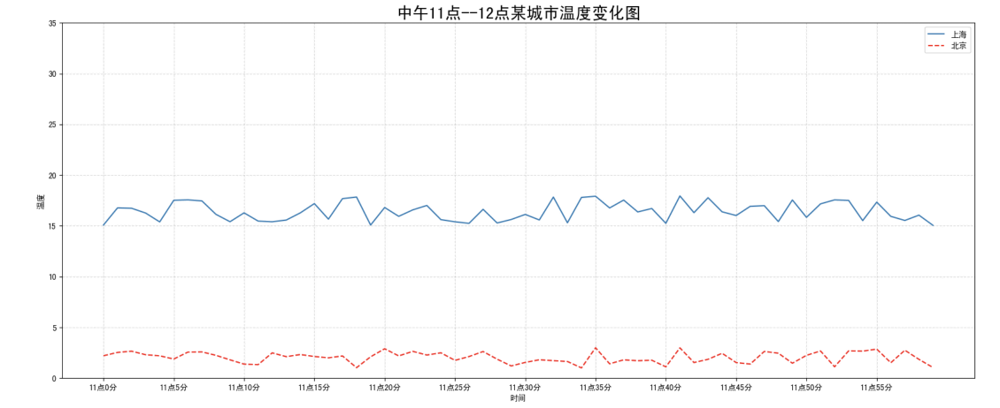

#### 准备数据

```python
# 3.增加一个图像
# 3.1温度数据
new_y = [random.uniform(1, 3) for i in x]
plt.plot(x, new_y, color='r', linestyle='--')  # 绘制折线图

# 4.显示图像
# plt.savefig("temperature_curve.png")
plt.show()
```

某一次的结果如下：

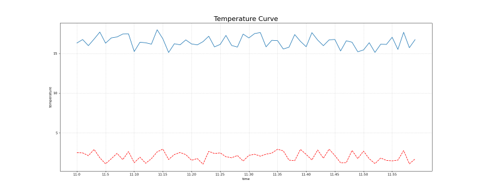

#### plot 参数

我们可以在 `plot` 时设置图形风格，如颜色、线型等，常用的字符包括：

| 颜色字符 | 风格字符 |
| :------: | :------: |
|    r     |    -     |
|    g     |   - -    |
|    b     |    .     |
|    w     |    :     |
|    c     |   ' '    |
|    m     |
|    y     |
|    k     |

此外，我们还可以在 `plt.plot()` 中设置 `label`，并通过 `plt.legend()` 将图例显示出来，常用的图例位置与代码对应如下：

| Location String | Location Code |
| :-------------: | :-----------: |
|     'best'      |       0       |
|  'upper right'  |       1       |
|  'upper left'   |       2       |
|  'lower left'   |       3       |
|  'lower right'  |       4       |
|     'right'     |       5       |
|  'center left'  |       6       |
| 'center right'  |       7       |
| 'lower center'  |       8       |
| 'upper center'  |       9       |
|    'center'     |      10       |

更改代码：

```python
# 2.绘制折线图
plt.plot(x, y, label="city1")  # 绘制折线图

# ...

# 3.1温度数据
new_y = [random.uniform(1, 3) for i in x]
plt.plot(x, new_y, color='r', linestyle='--', label="city2")  # 绘制折线图

# 4.显示图像
# plt.savefig("temperature_curve.png")
plt.legend(loc="best")
plt.show()
```

某一次的结果如下：

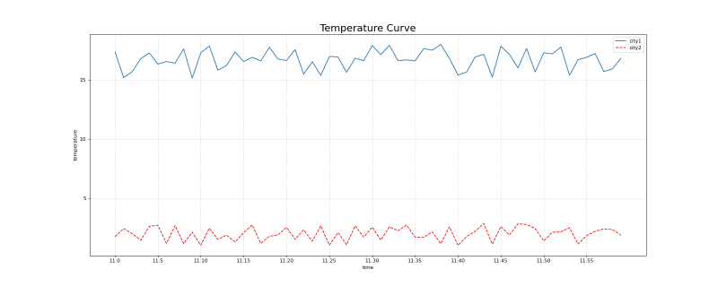

#### 完整代码

```python
import matplotlib.pyplot as plt
import random

# 0.准备x, y坐标的数据
x = range(60)  # 60个数字
y = [random.uniform(15, 18) for i in x]  # 随机生成60个介于15和18之间的数

# 1.创建画布
plt.figure(figsize=(20, 8), dpi=80)  # 设置画布大小和分辨率

# 2.绘制折线图
plt.plot(x, y, label="city1")  # 绘制折线图
# 2.1构造x,y轴刻度标签
x_ticks_label = ["11:{}".format(i) for i in x]  # 构造x轴刻度标签
y_ticks = range(40)  # 构造y轴刻度
# 2.2刻度显示
plt.xticks(x[::5], x_ticks_label[::5])
plt.yticks(y_ticks[::5])
# 2.3网格显示
plt.grid(True, linestyle='--', alpha=0.5)
# 2.4添加描述信息
plt.xlabel("time")
plt.ylabel("temperature")
plt.title("Temperature Curve", fontsize=20)

# 3.增加一个图像
# 3.1温度数据
new_y = [random.uniform(1, 3) for i in x]
plt.plot(x, new_y, color='r', linestyle='--', label="city2")  # 绘制折线图

# 4.显示图像
# plt.savefig("temperature_curve.png")
plt.legend(loc="best")
plt.show()
```

### 多个坐标系显示— plt.subplots(面向对象的画图方法)

如果我们想要将两个城市的天气图显示在同一个图的不同坐标系当中，效果如下：

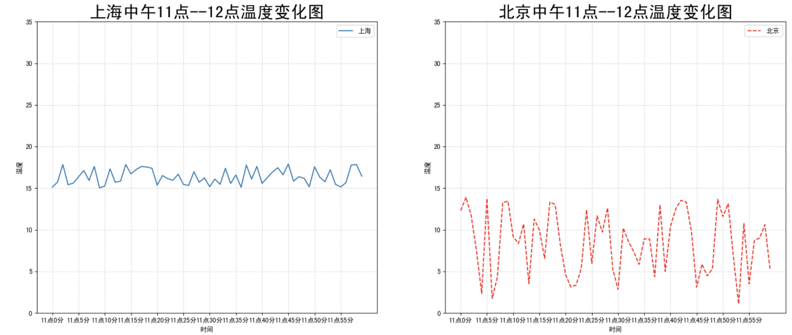

可以通过 `subplots` 函数实现(旧的版本中有 `subplot`，使用起来不方便)

`matplotlib.pyplot.subplots(nrows=1, ncols=1, **fig_kw)`创建一个带有多个 axes(坐标系/绘图区)的图，与多次 plot 类似，不再演示了。

## 常用图形

Matplotlib 能够绘制折线图、散点图、柱状图、直方图、饼图等多种图形，我们需要知道不同的统计图的意义，以此来决定选择哪种统计图来呈现我们的数据。

### 折线图

以折线的上升或下降来表示统计数量的增减变化的统计图，能够显示数据的变化趋势，反映事物的变化情况。(变化)

api：`plt.plot(x, y)`

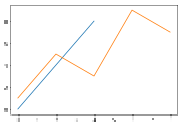

### 散点图

用两组数据构成多个坐标点，考察坐标点的分布，判断两变量之间是否存在某种关联或总结坐标点的分布模式。(分布规律)

api：`plt.scatter(x, y)`

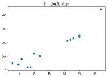

### 柱状图

排列在工作表的列或行中的数据可以绘制到柱状图中，绘制连离散的数据，能够一眼看出各个数据的大小，比较数据之间的差别。(统计/对比)

api：`plt.bar(x, width, align='center', **kwargs)`

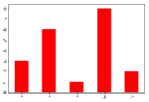

### 直方图

由一系列高度不等的纵向条纹或线段表示数据分布的情况。 一般用横轴表示数据范围，纵轴表示分布情况。(统计)、

api：`matplotlib.pyplot.hist(x, bins=None)`


### 饼图

用于表示不同分类的占比情况，通过弧度大小来对比各种分类。(占比)

api：`plt.pie(x, labels=,autopct=,colors)`

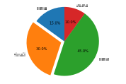

## 结语

以上就是 matplotlib 的一些基本用法，希望对你有所帮助！
