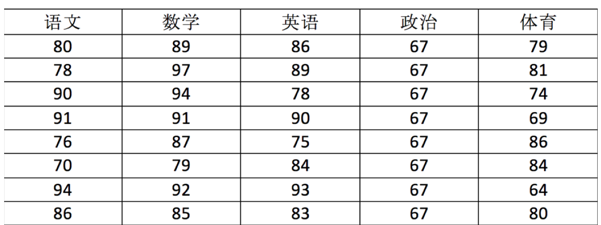
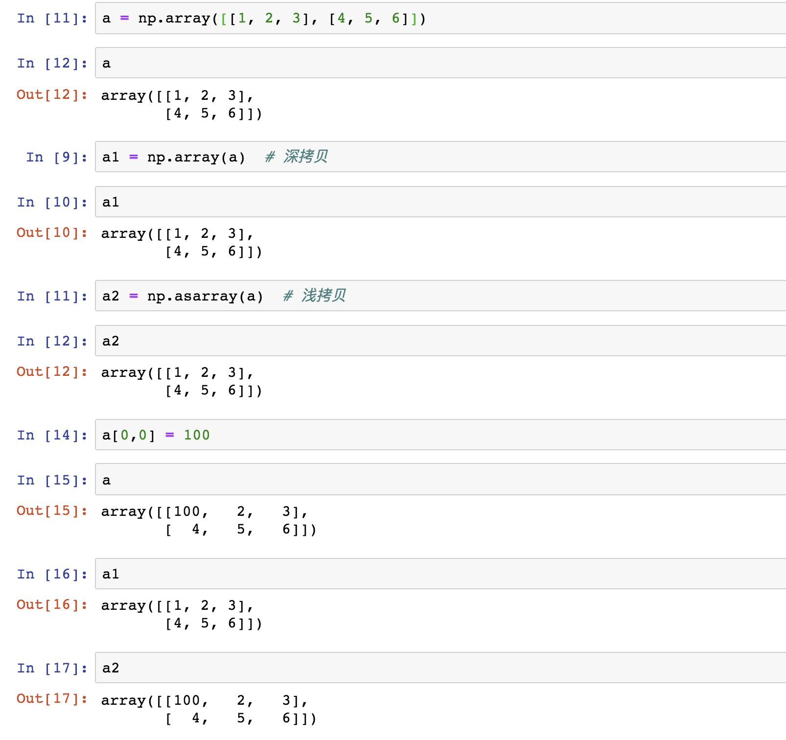

# NumPy 入门

## NumPy

### 什么是 numpy？

Numpy（Numerical Python）是一个开源的 Python 科学计算库，**用于快速处理任意维度的数组**。

Numpy**支持常见的数组和矩阵操作**。对于同样的数值计算任务，使用 Numpy 比直接使用 Python 要简洁的多。

Numpy**使用 ndarray 对象来处理多维数组**，该对象是一个快速而灵活的大数据容器。

### ndarray

NumPy 提供了一个 **N 维数组类型 ndarray**，它描述了**相同类型**的“items”的集合。

假如我们有如下表格：



我们可以用 ndarray 进行存储：

```python
import numpy as np

# 创建ndarray
score = np.array(
[[80, 89, 86, 67, 79],
[78, 97, 89, 67, 81],
[90, 94, 78, 67, 74],
[91, 91, 90, 67, 69],
[76, 87, 75, 67, 86],
[70, 79, 84, 67, 84],
[94, 92, 93, 67, 64],
[86, 85, 83, 67, 80]])

print(score)
```

输出结果：

```shell
[[80 89 86 67 79]
 [78 97 89 67 81]
 [90 94 78 67 74]
 [91 91 90 67 69]
 [76 87 75 67 86]
 [70 79 84 67 84]
 [94 92 93 67 64]
 [86 85 83 67 80]]
```

这就是使用 numpy 定义矩阵的基础语法。

### \[选读\]为什么要使用 numpy？

我们使用 Python 的列表就可以存储一维数组，通过列表的嵌套可以实现多维数组，那么为什么还需要使用 Numpy 的 `ndarray` 呢？

在这里我们通过一段代码运行来体会到 ndarray 的好处:

```python
import random
import time
import numpy as np
a = []
for i in range(100000000):
    a.append(random.random())

# 通过%time魔法方法, 查看当前行的代码运行一次所花费的时间
%time sum1=sum(a)

b=np.array(a)

%time sum2=np.sum(b)
```

其中第一个时间显示的是使用原生 Python 计算时间,第二个内容是使用 numpy 计算时间:

```shell
CPU times: user 852 ms, sys: 262 ms, total: 1.11 s
Wall time: 1.13 s
CPU times: user 133 ms, sys: 653 µs, total: 133 ms
Wall time: 134 ms
```

**从中我们看到 ndarray 的计算速度要快很多**，节约了时间。

机器学习的最大特点就是大量的数据运算，那么如果没有一个快速的解决方案，那可能现在 python 也在机器学习领域达不到好的效果。

所以，为什么 ndarray 可以做到如此高效的计算呢？

在直观上，numpy 可以并行的计算大量数据，他在某一刻的工作状态看起来可能是这样的：


Numpy 专门针对 ndarray 的操作和运算进行了设计，所以数组的存储效率和输入输出性能远优于 Python 中的嵌套列表，数组越大，Numpy 的优势就越明显。ndarray 到底跟原生 python 列表有什么不同呢？请看一张图：


从图中我们可以看出 ndarray 在存储数据的时候，数据与数据的地址都是连续的，这样就给使得批量操作数组元素时速度更快。

这是因为 ndarray 中的所有元素的类型都是相同的，而 Python 列表中的元素类型是任意的，所以 ndarray 在存储元素时内存可以连续，而 python 原生 list 就只能通过寻址方式找到下一个元素，这虽然也导致了在通用性能方面 Numpy 的 ndarray 不及 Python 原生 list，但在科学计算中，Numpy 的 ndarray 就可以省掉很多循环语句，代码使用方面比 Python 原生 list 简单的多。

此外，numpy 内置了并行运算功能，当系统有多个核心时，做某种计算时，numpy 会自动做并行计算。

实际上，之所以 numpy 可以突破 Python 的模式，是因为 Numpy 底层使用 C 语言编写，内部解除了 GIL（全局解释器锁），其对数组的操作速度不受 Python 解释器的限制，所以，其效率远高于纯 Python 代码。（所以 C 永远的神）

## N 维数组-ndarray

### ndarray 的属性

数组属性反映了数组本身固有的信息。

| 属性名字         | 属性解释                   |
| ---------------- | -------------------------- |
| ndarray.shape    | 数组维度的元组             |
| ndarray.ndim     | 数组维数                   |
| ndarray.size     | 数组中的元素数量           |
| ndarray.itemsize | 一个数组元素的长度（字节） |
| ndarray.dtype    | 数组元素的类型             |

### ndarray 的形状

首先创建一些数组进行打印：

```python
import numpy as np

# 创建数组
a = np.array([[1,2,3],[4,5,6]])
b = np.array([1,2,3,4])
c = np.array([[[1,2,3],[4,5,6]],[[1,2,3],[4,5,6]]])

print(a.shape)
print(b.shape)
print(c.shape)
```

输出结果：

```shell
(2, 3)
(4,)
(2, 2, 3)
```

可以看到，数组的维度分别为 (2,3), (4,), (2,2,3)，相当于是二维数组、一维数组与三维数组。

如何理解数组的形状？

二维数组：


三维数组：


实际上就是一个立方体，维度更多就只能凭想象了

### ndarray 的类型

```python
print(type(score.dtype))
```

输出结果：

```shell
<type 'numpy.dtype'>
```

dtype 是 numpy.dtype 类型，先看看对于数组来说都有哪些类型：

| 名称          | 描述                                                     | 简写  |
| ------------- | -------------------------------------------------------- | ----- |
| np.bool       | 用一个字节存储的布尔类型（True 或 False）                | 'b'   |
| np.int8       | 一个字节大小，-128 至 127                                | 'i1'  |
| np.int16      | 整数，-32768 至 32767                                    | 'i2'  |
| np.int32      | 整数，-2^31​ 至 2^32 -1                                  | 'i4'  |
| np.int64      | 整数，-2^63 至 2^63 - 1                                  | 'i8'  |
| np.uint8      | 无符号整数，0 至 255                                     | 'u1'  |
| np.uint16     | 无符号整数，0 至 65535                                   | 'u2'  |
| np.uint32     | 无符号整数，0 至 2^32 - 1                                | 'u4'  |
| np.uint64     | 无符号整数，0 至 2^64 - 1                                | 'u8'  |
| np.float16    | 半精度浮点数：16 位，正负号 1 位，指数 5 位，精度 10 位  | 'f2'  |
| np.float32    | 单精度浮点数：32 位，正负号 1 位，指数 8 位，精度 23 位  | 'f4'  |
| np.float64    | 双精度浮点数：64 位，正负号 1 位，指数 11 位，精度 52 位 | 'f8'  |
| np.complex64  | 复数，分别用两个 32 位浮点数表示实部和虚部               | 'c8'  |
| np.complex128 | 复数，分别用两个 64 位浮点数表示实部和虚部               | 'c16' |
| np.object\_   | python 对象                                              | 'O'   |
| np.string\_   | 字符串                                                   | 'S'   |
| np.unicode\_  | unicode 类型                                             | 'U'   |

> [!IMPORTANT]
> 注意：不同版本的 numpy 类型的表示可能不同，比如字符串类型在不同版本的 numpy 中可能是 'S12' 或者 'U12'。

我们在创建数组时可以指定 dtype，也可以不指定，默认是 np.float64：

```python
import numpy as np

a = np.array([[1, 2, 3], [4, 5, 6]], dtype=np.float32)
print(a.dtype)

arr = np.array(['python', 'tensorflow', 'scikit-learn', 'numpy'], dtype='|S12')
print(arr)
```

输出结果：

```shell
float32
[b'python' b'tensorflow' b'scikit-learn' b'numpy']
```

## 基本操作

### 创建数组

numpy 提供了多种创建数组的方法。

#### 0 或 1 数组

通过`.ones(shape, dtype)`、`.zeros(shape, dtype)`可以创建统一化的 0 或 1 数组：

```python
import numpy as np

uni = np.ones([4, 8])
print(uni)

uni = np.zeros([4, 8])
print(uni)
```

输出结果：

```shell
[[1. 1. 1. 1. 1. 1. 1. 1.]
 [1. 1. 1. 1. 1. 1. 1. 1.]
 [1. 1. 1. 1. 1. 1. 1. 1.]
 [1. 1. 1. 1. 1. 1. 1. 1.]]

[[0. 0. 0. 0. 0. 0. 0. 0.]
 [0. 0. 0. 0. 0. 0. 0. 0.]
 [0. 0. 0. 0. 0. 0. 0. 0.]
 [0. 0. 0. 0. 0. 0. 0. 0.]]
```

#### 根据已有数据生成数组

也可以通过现有数组生成，我们之前已经使用过类似的方法：

```
import numpy as np

a = np.array([[1, 2, 3], [4, 5, 6]])

a1 = np.array(a)  # 从现有的数组当中创建
print(a1)

a2 = np.asarray(a)  # 相当于索引的形式，并没有真正的创建一个新的
print(a2)
```

输出结果：

```shell
[[1 2 3]
 [4 5 6]]

[[1 2 3]
 [4 5 6]]
```

其区别如下：



#### 均分等差数组

```python
np.linspace (start, stop, num, endpoint)
```

其中：

- `start`:序列的**起始值**
- `stop`:序列的**终止值**
- `num`:要生成的等间隔样例数量，默认为 `50`
- `endpoint`:序列中是否包含 `stop` 值，默认为 `ture`

例如：

```python
import numpy as np

a = np.linspace(0, 100, 11)
print(a)
```

输出结果：

```shell
[  0.  10.  20.  30.  40.  50.  60.  70.  80.  90. 100.]
```

#### 定长等差数组

```python
np.arange(start, stop, step, dtype)
```

其中：

- `start`:序列的**起始值**
- `stop`:序列的**终止值**，**不包括**在序列中
- `step`:序列的**步长**
- `dtype`:数组元素的类型，默认为 `None`

例如：

```python
import numpy as np

a = np.arange(1, 10, 2)
print(a)
```

输出结果：

```shell
[1 3 5 7 9]
```

#### 等比数组

```python
np.logspace(start, stop, num, endpoint, base)
```

其中：

- `start`:序列的**起始值**
- `stop`:序列的**终止值**
- `num`:要生成的等间隔样例数量，默认为 `50`
- `endpoint`:序列中是否包含 `stop` 值，默认为 `ture`
- `base`:序列的**底数**，默认为 `10`

例如：

```python
import numpy as np

a = np.logspace(0, 2, 3)
print(a)
```

输出结果：

```shell
[  1.  10. 100.]
```

#### 随机生成数组

numpy 提供了许多“随机”的模式，最常用的是**正态分布随机**与**均匀分布随机**。

```python
np.random.normal(loc, scale, size)
np.random.uniform(low, high, size)
```

其中：

1. `loc`: 均值，默认为 `0`
2. `scale`: 标准差，默认为 `1`
3. `size`: 输出数组的形状，默认为 `None`

例如：

```python
import numpy as np

# 正态分布随机
a = np.random.normal(0, 1, [3, 4])
print(a)

# 均匀分布随机
b = np.random.uniform(0, 1, [3, 4])
print(b)
```

某次的输出结果：

```shell
[[-0.93221265 -0.67635989  0.46675785  0.9485074 ]
 [ 0.41596084 -0.5660286  -0.45686209 -0.70542995]
 [ 0.98862117  0.23921517 -1.14934301  0.94451928]]

[[0.2734833  0.30231068 0.27333733 0.5394391 ]
 [0.9147523  0.62975983 0.0350036  0.47296369]
 [0.14975517 0.00505338 0.64530276 0.09225579]]
```

### 数组的索引与切片

在引用数组时，我们可以单独引用某个元素，也可以通过切片的方式引用一部分元素，切片的语法如下：

1. `start:stop:step`
2. `start:stop`
3. `start:`
4. `:stop`
5. `:`

例如：

```python
import numpy as np

a = np.array([[1, 2, 3], [4, 5, 6], [7, 8, 9]])
print(a)

# 单独引用某个元素，索引从 0 开始
print(a[1, 2])  # 6

# 切片，索引从 0 开始，至 end 之前一位结束
print(a[1:3, 1:3])  # [[5 6] [8 9]]
```

输出结果：

```shell
[[1 2 3]
 [4 5 6]
 [7 8 9]]

6

[[5 6]
 [8 9]]
```

### 形状修改

形状修改可以改变数组的形状，但不能改变元素的数量。

#### reshape

- 返回一个具有相同数据域，但 `shape` 不一样的视图
- 行、列不进行互换

```python
ndarray.reshape(shape, order)
```

其中：

- `shape`: 目标形状
- `order`: 排列顺序，默认为 `C`（行优先）

例如：

```python
import numpy as np

a = np.array([[1, 2, 3], [4, 5, 6], [7, 8, 9]])
print(a.shape)  # (3, 3)
print(a)

b = a.reshape([9, 1])
print(b.shape)  # (9, 1)
print(b)
```

输出结果：

```shell
(3, 3)
[[1 2 3]
 [4 5 6]
 [7 8 9]]

(9, 1)

[[1]
 [2]
 [3]
 [4]
 [5]
 [6]
 [7]
 [8]
 [9]]
```

#### resize

- 修改数组本身的形状（需要保持元素个数前后相同）
- 行、列不进行互换

```python
ndarray.resize(shape, refcheck)
```

其中：

- `shape`: 目标形状
- `refcheck`: 是否检查数组是否为视图，默认为 `True`

例如：

```python
import numpy as np

a = np.array([[1, 2, 3], [4, 5, 6], [7, 8, 9]])
print(a.shape)  # (3, 3)
print(a)

a.resize([9, 1])
print(a.shape)  # (9, 1)
print(a)
```

输出结果：

```shell
(3, 3)
[[1 2 3]
 [4 5 6]
 [7 8 9]]

(9, 1)

[[1]
 [2]
 [3]
 [4]
 [5]
 [6]
 [7]
 [8]
 [9]]
```

#### T 转置

- 数组的转置
- 将数组的行、列进行互换

```python
ndarray.T
```

例如：

```python
import numpy as np

a = np.array([[1, 2, 3], [4, 5, 6], [7, 8, 9]])
print(a.shape)  # (3, 3)
print(a)

b = a.T
print(b.shape)  # (3, 3)
print(b)
```

输出结果：

```shell
(3, 3)
[[1 2 3]
 [4 5 6]
 [7 8 9]]

(3, 3)

[[1 4 7]
 [2 5 8]
 [3 6 9]]
```

### 类型修改

#### astype

- 返回修改了类型之后的数组

```python
ndarray.astype(dtype, order, casting, subok, copy)
```

其中：

- `dtype`: 目标类型
- `order`: 排列顺序，默认为 `K`（保持原有顺序）
- `casting`: 类型转换的规则，默认为 `unsafe`
- `subok`: 是否允许子类，默认为 `True`
- `copy`: 是否复制，默认为 `True`

例如：

```python
import numpy as np

a = np.array([[1, 2, 3], [4, 5, 6], [7, 8, 9]])
print(a.dtype)  # int64

b = a.astype(np.float32)
print(b.dtype)  # float32
```

输出结果：

```shell
int64
float32
```

#### tostring

- 构造包含数组中原始数据字节的 Python 字节

```python
ndarray.tostring(order, sep, dtype)
```

其中：

- `order`: 排列顺序，默认为 `C`（行优先）
- `sep`: 分隔符，默认为 `None`
- `dtype`: 目标类型，默认为 `None`

例如：

```python
import numpy as np

a = np.array([[1, 2, 3], [4, 5, 6], [7, 8, 9]])
print(a.tostring())
```

输出结果：

```shell
b'\x01\x00\x00\x00\x02\x00\x00\x00\x03\x00\x00\x00\x04\x00\x00\x00\x05\x00\x00\x00\x06\x00\x00\x00\x07\x00\x00\x00\x08\x00\x00\x00\t\x00\x00\x00'
```

### 数组的去重

```python
np.unique(ar, return_index, return_inverse, return_counts)
```

其中：

- `ar`: 输入数组
- `return_index`: 是否返回下标，默认为 `False`
- `return_inverse`: 是否返回逆序索引，默认为 `False`
- `return_counts`: 是否返回计数，默认为 `False`

例如：

```python
import numpy as np

a = np.array([1, 2, 3, 2, 4, 1, 5])
print(a)

b = np.unique(a)
print(b)

c, d = np.unique(a, return_index=True)
print(c)
print(d)

e, f = np.unique(a, return_inverse=True)
print(e)
print(f)

g, h = np.unique(a, return_counts=True)
print(g)
print(h)
```

输出结果：

```shell
[1 2 3 2 4 1 5]
[1 2 3 4 5]
[1 2 3 2 4 1 5]
[0 1 2 3 4 5 6]
[0 1 2 0 3 4 5]
[1 2 3 4 5]
[1 1 1 1 1 1 1]
```

## ndarray 运算

如果想要操作符合某一条件的数据，应该怎么做？

### 逻辑运算

我们可以通过如下的方法进行逻辑运算：

```python
import numpy as np

# 生成10名同学，5门功课的数据
score = np.random.randint(40, 100, (10, 5))
print(score)

# 取出最后4名同学的成绩，用于逻辑判断
test_score = score[6:, ]
print(test_score)

# 逻辑判断, 如果成绩大于60就标记为True 否则为False
test_bool = test_score > 60
print(test_bool)

# 将不及格的同学分数替换为0
test_score[test_score < 60] = 0
print(test_score)
```

某一次的输出结果：

```shell
[[64 72 52 94 45]
 [60 63 67 66 49]
 [56 46 42 65 50]
 [86 46 50 81 43]
 [77 68 86 91 48]
 [43 71 95 79 77]
 [74 80 65 47 42]
 [42 68 80 65 59]
 [65 75 96 96 86]
 [86 69 40 43 47]]

[[74 80 65 47 42]
 [42 68 80 65 59]
 [65 75 96 96 86]
 [86 69 40 43 47]]

[[ True  True  True False False]
 [False  True  True  True False]
 [ True  True  True  True  True]
 [ True  True False False False]]

[[74 80 65  0  0]
 [ 0 68 80 65  0]
 [65 75 96 96 86]
 [86 69  0  0  0]]
```

### 通用判断函数

经常使用的函数有：

1. `np.all(a, axis=None, out=None, keepdims=False)`：判断数组 `a` 中所有元素是否都为 `True`，如果 `axis` 为 `None`，则判断所有元素；如果 `axis` 为整数，则判断指定轴上的所有元素；如果 `axis` 为元组，则判断指定轴上的所有元素；如果 `out` 为 `None`，则返回布尔值；如果 `out` 为数组，则将布尔值存入 `out` 数组；如果 `keepdims` 为 `True`，则保持维度。
2. `np.any(a, axis=None, out=None, keepdims=False)`：判断数组 `a` 中是否有元素为 `True`，如果 `axis` 为 `None`，则判断所有元素；如果 `axis` 为整数，则判断指定轴上的所有元素；如果 `axis` 为元组，则判断指定轴上的所有元素；如果 `out` 为 `None`，则返回布尔值；如果 `out` 为数组，则将布尔值存入 `out` 数组；如果 `keepdims` 为 `True`，则保持维度。

例如：

```python
import numpy as np

# 生成10名同学，5门功课的数据
score = np.random.randint(40, 100, (10, 5))
print(score)

# 判断前两名同学的成绩是否全及格
print(np.all(score[0:2, ] >= 60))

# 判断前两名同学的成绩是否有大于90分的
print(np.any(score[0:2, :] > 80))
```

某一次的输出结果：

```shell
[[49 90 97 47 84]
 [98 59 62 96 81]
 [76 68 61 47 83]
 [88 58 92 74 79]
 [42 50 59 79 45]
 [93 72 87 65 76]
 [55 59 74 76 43]
 [99 86 69 66 92]
 [90 98 87 42 51]
 [43 52 56 82 89]]
False
True
```

### 三元运算符

通过使用`np.where`能够进行更加复杂的运算，复合逻辑需要结合`np.logical_and`与`np.logical_or`使用，例如：

```python
import numpy as np

# 生成10名同学，5门功课的数据
score = np.random.randint(40, 100, (10, 5))
print(score)

# 判断前四名学生前四门课程中，成绩中大于60的置为1，否则为0
test_score = score[:4, :4]
print(test_score)
print(np.where(test_score > 60, 1, 0))

# 判断前四名学生,前四门课程中，成绩中大于60且小于90的换为1，否则为0
print(np.where(np.logical_and(test_score > 60, test_score < 90), 1, 0))

# 判断前四名学生,前四门课程中，成绩中大于90或小于60的换为1，否则为0
print(np.where(np.logical_or(test_score > 90, test_score < 60), 1, 0))
```

某一次的输出结果：

```shell
[[95 89 55 63 73]
 [57 60 79 81 51]
 [67 56 47 67 50]
 [86 45 61 44 71]
 [63 44 75 66 65]
 [96 79 66 90 95]
 [50 40 75 44 40]
 [80 67 42 92 59]
 [43 45 46 48 91]
 [96 56 84 45 81]]

[[95 89 55 63]
 [57 60 79 81]
 [67 56 47 67]
 [86 45 61 44]]

[[1 1 0 1]
 [0 0 1 1]
 [1 0 0 1]
 [1 0 1 0]]

[[0 1 0 1]
 [0 0 1 1]
 [1 0 0 1]
 [1 0 1 0]]

[[1 0 1 0]
 [1 0 0 0]
 [0 1 1 0]
 [0 1 0 1]]
```

### 统计运算

如果想要知道学生成绩最大的分数，或者做小分数应该怎么做？

numpy 提供了以下统计函数：

1. `np.max(a, axis=None, out=None, keepdims=False)`：返回数组 `a` 中元素的最大值，如果 `axis` 为 `None`，则返回所有元素的最大值；如果 `axis` 为整数，则返回指定轴上的元素的最大值；如果 `axis` 为元组，则返回指定轴上的元素的最大值；如果 `out` 为 `None`，则返回最大值；如果 `out` 为数组，则将最大值存入 `out` 数组；如果 `keepdims` 为 `True`，则保持维度。
2. `np.min(a, axis=None, out=None, keepdims=False)`：返回数组 `a` 中元素的最小值，如果 `axis` 为 `None`，则返回所有元素的最小值；如果 `axis` 为整数，则返回指定轴上的元素的最小值；如果 `axis` 为元组，则返回指定轴上的元素的最小值；如果 `out` 为 `None`，则返回最小值；如果 `out` 为数组，则将最小值存入 `out` 数组；如果 `keepdims` 为 `True`，则保持维度。
3. `np.mean(a, axis=None, dtype=None, out=None, keepdims=False)`：返回数组 `a` 中元素的平均值，如果 `axis` 为 `None`，则返回所有元素的平均值；如果 `axis` 为整数，则返回指定轴上的元素的平均值；如果 `axis` 为元组，则返回指定轴上的元素的平均值；如果 `dtype` 为 `None`，则返回浮点数；如果 `dtype` 为其他类型，则返回指定类型；如果 `out` 为 `None`，则返回平均值；如果 `out` 为数组，则将平均值存入 `out` 数组；如果 `keepdims` 为 `True`，则保持维度。
4. `np.median(a, axis=None, out=None, overwrite_input=False, keepdims=False)`：返回数组 `a` 中元素的中位数，如果 `axis` 为 `None`，则返回所有元素的中位数；如果 `axis` 为整数，则返回指定轴上的元素的中位数；如果 `axis` 为元组，则返回指定轴上的元素的中位数；如果 `out` 为 `None`，则返回中位数；如果 `out` 为数组，则将中位数存入 `out` 数组；如果 `overwrite_input` 为 `True`，则修改输入数组；如果 `keepdims` 为 `True`，则保持维度。
5. `np.std(a, axis=None, dtype=None, out=None, ddof=0, keepdims=False)`：返回数组 `a` 中元素的标准差，如果 `axis` 为 `None`，则返回所有元素的标准差；如果 `axis` 为整数，则返回指定轴上的元素的标准差；如果 `axis` 为元组，则返回指定轴上的元素的标准差；如果 `dtype` 为 `None`，则返回浮点数；如果 `dtype` 为其他类型，则返回指定类型；如果 `out` 为 `None`，则返回标准差；如果 `out` 为数组，则将标准差存入 `out` 数组；如果 `ddof` 为 `0`，则计算样本标准差；如果 `ddof` 为 `1`，则计算总体标准差；如果 `keepdims` 为 `True`，则保持维度。
6. `np.var(a, axis=None, dtype=None, out=None, ddof=0, keepdims=False)`：返回数组 `a` 中元素的方差，如果 `axis` 为 `None`，则返回所有元素的方差；如果 `axis` 为整数，则返回指定轴上的元素的方差；如果 `axis` 为元组，则返回指定轴上的元素的方差；如果 `dtype` 为 `None`，则返回浮点数；如果 `dtype` 为其他类型，则返回指定类型；如果 `out` 为 `None`，则返回方差；如果 `out` 为数组，则将方差存入 `out` 数组；如果 `ddof` 为 `0`，则计算样本方差；如果 `ddof` 为 `1`，则计算总体方差；如果 `keepdims` 为 `True`，则保持维度。

例如：

```python
import numpy as np

# 生成10名同学，5门功课的数据
score = np.random.randint(40, 100, (10, 5))
print(score)

# 找出学生成绩最高的学生
max_score = np.max(score, axis=0)
print(max_score)

# 找出学生成绩最低的学生
min_score = np.min(score, axis=0)
print(min_score)

# 找出学生成绩平均分
mean_score = np.mean(score, axis=0)
print(mean_score)

# 找出学生成绩中位数
median_score = np.median(score, axis=0)
print(median_score)

# 找出学生成绩标准差
std_score = np.std(score, axis=0)
print(std_score)

# 找出学生成绩方差
var_score = np.var(score, axis=0)
print(var_score)
```

某一次的输出结果：

```shell
[[45 70 44 86 69]
 [60 75 41 96 81]
 [73 71 45 57 54]
 [50 71 40 63 84]
 [46 86 80 89 77]
 [98 93 83 76 81]
 [42 90 83 62 78]
 [78 57 47 96 48]
 [98 92 61 65 82]
 [44 69 76 59 41]]

[98 93 83 96 84]
[42 57 40 57 41]
[63.4 77.4 60.  74.9 69.5]
[55.  73.  54.  70.5 77.5]
[20.89593262 11.48216008 17.68049773 14.80844354 15.08144555]
[436.64 131.84 312.6  219.29 227.45]
```

## 数组运算

如果将数组看作一个整体，数组运算类似于把数组看作一个矩阵进行相关处理。

### 数组与数的运算

```python
import numpy as np

arr = np.array([[1, 2, 3, 2, 1, 4], [5, 6, 1, 2, 3, 1]])
print(arr)

arr = arr + 1
print(arr)

arr = arr / 2
print(arr)
```

输出结果：

```shell
[[1 2 3 2 1 4]
 [5 6 1 2 3 1]]

[[2 3 4 3 2 5]
 [6 7 2 3 4 2]]

[[1.  1.5 2.  1.5 1.  2.5]
 [3.  3.5 1.  1.5 2.  1. ]]
```

**需要注意的是，numpy 并不支持类似`+=`的自运算操作**

### 数组与数组的运算

```python
arr1 = np.array([[1, 2, 3, 2, 1, 4], [5, 6, 1, 2, 3, 1]])
arr2 = np.array([[1, 2, 3, 4], [3, 4, 5, 6]])
```

上面这个能进行运算吗，结果是不行的！

#### 广播机制

数组在进行矢量化运算时，**要求数组的形状是相等的**。当形状不相等的数组执行算术运算的时候，就会出现广播机制，该机制会对数组进行扩展，使数组的 `shape` 属性值一样，这样，就可以进行矢量化运算了。

实际上就是线代里面的广播矩阵，如下图所示：


在 numpy 中，广播机制实现了时两个或两个以上数组的运算，即使这些数组的 `shape` 不是完全相同的，只需要满足如下任意一个条件即可。

1. 数组的某一维度等长。
2. 其中一个数组的某一维度为 `1` 。

广播机制需要**扩展维度小的数组**，使得它与维度最大的数组的 `shape` 值相同，以便使用元素级函数或者运算符进行运算。

**需要注意的是，广播机制不意味着矩阵运算，而是数组运算。**

例如，这样的数组就可以进行数组间的运算：

```python
import numpy as np

arr1 = np.array([[0], [1], [2], [3]])
print(arr1.shape)
print(arr1)

arr2 = np.array([1, 2, 3])
print(arr2.shape)
print(arr2)

arr3 = arr1 + arr2
print(arr3.shape)
print(arr3)
```

输出结果：

```shell
(4, 1)
[[0]
 [1]
 [2]
 [3]]

(3,)
[1 2 3]

(4, 3)
[[1 2 3]
 [2 3 4]
 [3 4 5]
 [4 5 6]]

(4, 3)
[[0 0 0]
 [1 2 3]
 [2 4 6]
 [3 6 9]]
```

## 矩阵（向量）运算

矩阵操作需要使用 numpy 提供的运算函数，如`dot()`、`cross()`、`linalg.inv()`等，例如：

```python
import numpy as np

# 矩阵点乘
arr1 = np.array([[1, 2, 3], [4, 5, 6]])
arr2 = np.array([[7, 8], [9, 10], [11, 12]])
print(np.dot(arr1, arr2))

# 向量叉乘
arr4 = np.array([1, 2, 3])
arr5 = np.array([4, 5, 6])
print(np.cross(arr4, arr5))

# 矩阵求逆
arr3 = np.array([[1, 2], [3, 4]])
print(np.linalg.inv(arr3))
```

输出结果：

```shell
[[ 58  64]
 [139 154]]

[-3  6 -3]

[[-2.   1. ]
 [ 1.5 -0.5]]
```

## 结语

以上就是 numpy 在机器学习中常用的一些方法，希望对你有所帮助！
