# Pandas 入门

## Pandas

### 简介

五句话快速了解 pandas：

1. 2008 年 WesMcKinney 开发出的库
2. 专门用于数据挖掘的开源 python 库
3. 以 Numpy 为基础，借力 Numpy 模块在计算方面性能高的优势
4. 基于 matplotlib，能够简便的画图
5. 独特的数据结构

### \[选读\]为什么使用 Pandas？

Numpy 已经能够帮助我们处理数据，能够结合 matplotlib 解决部分数据展示等问题，那么 pandas 学习的目的在什么地方呢？

#### 增强图表可读性

回忆我们在 numpy 当中创建学生成绩表样式：

```python
array([[92, 55, 78, 50, 50],
       [71, 76, 50, 48, 96],
       [45, 84, 78, 51, 68],
       [81, 91, 56, 54, 76],
       [86, 66, 77, 67, 95],
       [46, 86, 56, 61, 99],
       [46, 95, 44, 46, 56],
       [80, 50, 45, 65, 57],
       [41, 93, 90, 41, 97],
       [65, 83, 57, 57, 40]])
```

虽然也能看，但如果数据展示为这样，可读性就会更友好：

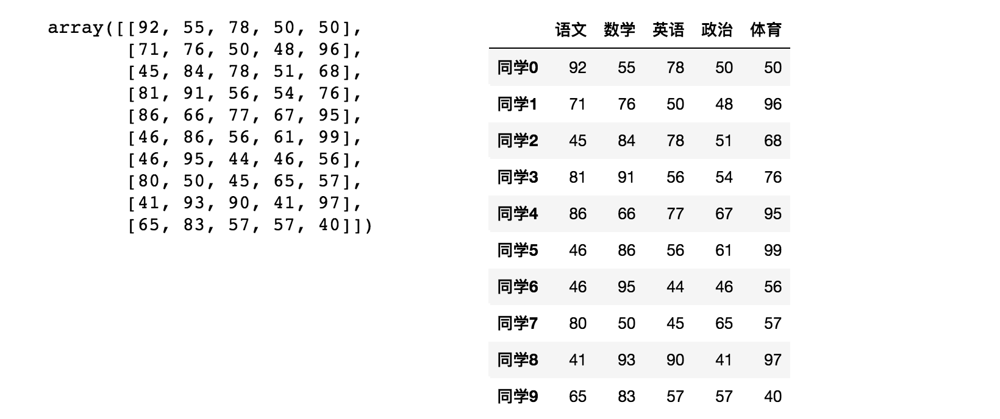

#### 便捷的数据处理能力

对于数据处理，pandas 具有以下优势：

- 读取文件方便
- 封装了 Matplotlib、Numpy 的画图和计算

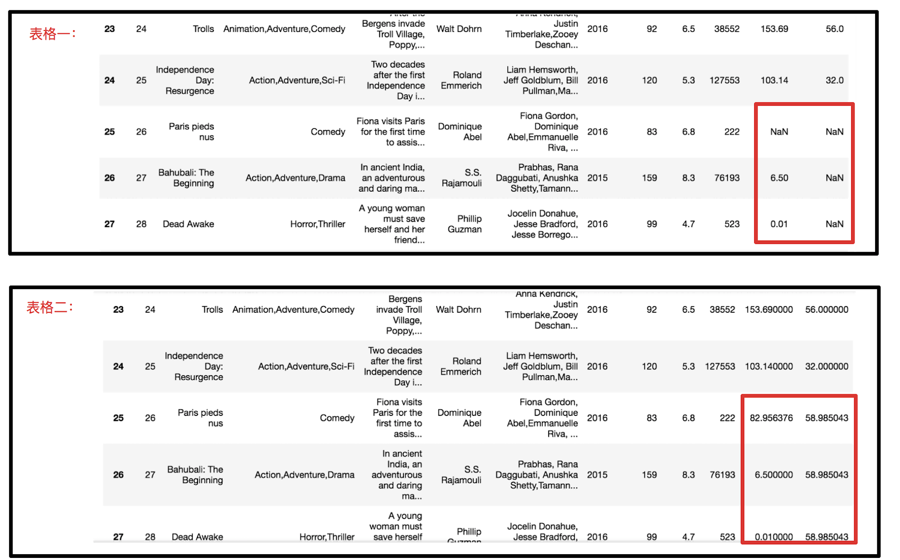

我们在后面的学习当中会看到更多 pandas 的优势。

## Pandas 数据结构

Pandas 中一共有三种数据结构，分别为：`Series`、`DataFrame` 和 `MultiIndex`（老版本中叫 `Panel` ）。

其中 `Series` 是一维数据结构，`DataFrame` 是二维的表格型数据结构，`MultiIndex` 是三维的数据结构。

下面我们以此进行介绍。

### Series

Series 是一个类似于一维数组的数据结构，它能够保存任何类型的数据，比如整数、字符串、浮点数等，**主要由一组数据和与之相关的索引两部分构成**。

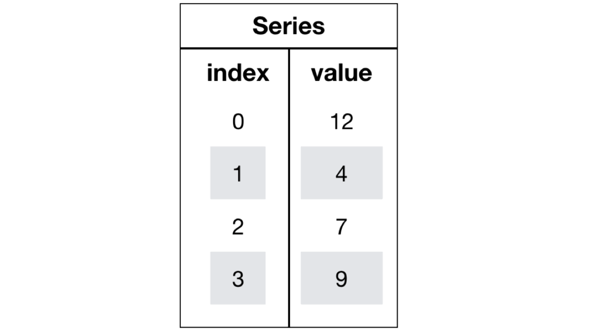

#### 创建 Series

与 numpy 类似，我们可以通过 `pd.Series()` 来创建 Series。

```python
import pandas as pd

pd.Series(data=None, index=None, dtype=None)
```

其中：

- `data`：数据，可以是列表、字典、Numpy 数组等。
- `index`：索引，可以是列表、字典、Numpy 数组等。
- `dtype`：数据类型。

我们可以通过已有数据快速创建：

```python
import pandas as pd
import numpy as np

series = pd.Series(np.arange(10))
print(series)
```

输出结果：

```shell
0    0
1    1
2    2
3    3
4    4
5    5
6    6
7    7
8    8
9    9
dtype: int64
```

在指定内容的情况下，我们可以指定索引：

```python
import pandas as pd

series = pd.Series([6.7, 5.6, 3, 10, 2], index=[1, 2, 3, 4, 5])
print(series)
```

输出结果：

```shell
1     6.7
2     5.6
3     3.0
4    10.0
5     2.0
dtype: float64
```

字典结构可以同时指定索引和内容：

```python
import pandas as pd

series = pd.Series({'red': 100, 'blue': 200, 'green': 500, 'yellow': 1000})
print(series)
```

输出结果：

```shell
red        100
blue       200
green      500
yellow    1000
dtype: int64
```

#### Series 的常用属性

为了更方便地操作 Series 对象中的索引和数据，Series 中提供了两个属性 `index` 和 `values`，当然也可以通过基础的索引方式进行访问：

```python
import pandas as pd

series = pd.Series({'red': 100, 'blue': 200, 'green': 500, 'yellow': 1000})
print(series.index)
print(series.values)
print(series[2])
print(series['red'])
```

输出结果：

```shell
Index(['red', 'blue', 'green', 'yellow'], dtype='object')
[ 100  200  500 1000]
500
100
```

### DataFrame

`DataFrame` 是一个类似于二维数组或表格(如 excel)的对象，既有行索引，又有列索引

- 行索引，表明不同行，横向索引，叫 index，0 轴，axis=0
- 列索引，表名不同列，纵向索引，叫 columns，1 轴，axis=1

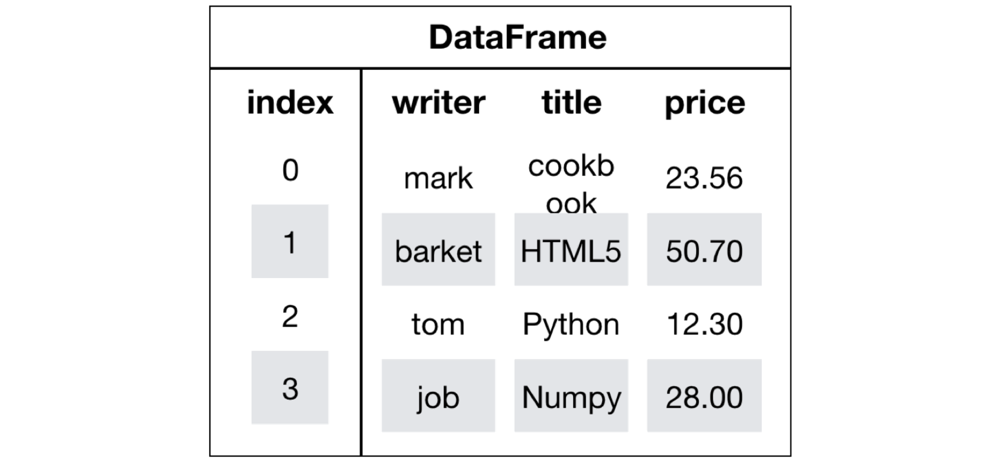

#### 创建 DataFrame

与 `Series` 类似，我们可以通过 `pd.DataFrame()` 来创建 `DataFrame`：

```python
pd.DataFrame(data=None, index=None, columns=None)
```

其中：

- `data`：数据，可以是列表、字典、Numpy 数组等。
- `index`：行索引，可以是列表、字典、Numpy 数组等。
- `columns`：列索引，可以是列表、字典、Numpy 数组等。

我们可以通过已有数据快速创建：

```python
import pandas as pd
import numpy as np

df = pd.DataFrame(np.random.randn(2, 3))
print(df)
```

某一次的输出结果：

```shell
          0         1         2
0 -0.408348 -0.603925 -0.345729
1  0.207835 -0.735247  0.207661
```

这好像与 numpy 的区别不大，但实际上 `DataFrame` 与 `Series` 不同，它有行索引和列索引，可以更方便地进行数据展示：

```python
import pandas as pd
import numpy as np

score = np.random.randint(40, 100, (10, 5))

subjects = ["语文", "数学", "英语", "政治", "体育"]  # 构造行索引序列
stu = ['同学' + str(i) for i in range(score.shape[0])]  # 添加行索引

df = pd.DataFrame(score, columns=subjects, index=stu)  # 构造DataFrame
print(df)
```

某一次的输出结果：

```shell
     语文  数学  英语  政治  体育
同学0  95  60  40  81  51
同学1  75  84  56  86  80
同学2  96  98  80  41  50
同学3  76  46  84  67  92
同学4  41  91  91  45  54
同学5  78  52  43  52  66
同学6  91  61  75  58  62
同学7  76  81  67  59  50
同学8  40  66  42  41  96
同学9  92  60  62  44  51
```

如果需要重新设置，我们可以使用`reset_index(drop=False)`函数进行重设。

#### DataFrame 的属性

常用的属性有：

- `shape`：返回 DataFrame 的大小，即行数和列数。
- `index`：返回行索引。
- `columns`：返回列索引。
- `values`：返回 DataFrame 的数据。
- `T`：转置 DataFrame。
- `head()`：返回前几行数据。
- `tail()`：返回后几行数据。

使用方法与 Series 类似。

### MultiIndex

`MultiIndex` 是三维的数据结构;

多级索引（也称层次化索引）是 pandas 的重要功能，可以在 `Series`、`DataFrame` 对象上拥有 2 个以及 2 个以上的索引。

#### multiIndex 的特性

- 多级索引的层次结构：可以创建多级索引，使数据更加容易被分析和处理。
- 多级索引的灵活性：可以轻松处理复杂的数据集，同时保持数据的完整性。
- 多级索引的便捷性：可以快速定位数据，并对数据进行分组。

#### 创建 MultiIndex

创建 `MultiIndex` 最简单的方法是使用 `pd.MultiIndex.from_tuples()` 方法，它接受一个由元组组成的序列作为输入，每个元组对应于多级索引的各个级别。

```python
pd.MultiIndex.from_tuples(tuples, names=None)
```

其中：

- `tuples`：元组序列。
- `names`：索引名称。

```python
import pandas as pd

index = pd.MultiIndex.from_tuples([('a', 'x'), ('a', 'y'), ('b', 'z')])
print(index)
```

输出结果：

```shell
MultiIndex([('a', 'x'),
            ('a', 'y'),
            ('b', 'z')],
           )
```

如果需要指定索引名称，可以使用 `names` 参数：

```python
import pandas as pd

index = pd.MultiIndex.from_tuples([('a', 'x'), ('a', 'y'), ('b', 'z')], names=['level1', 'level2'])
print(index)
```

输出结果：

```shell
MultiIndex([('a', 'x'),
            ('a', 'y'),
            ('b', 'z')],
           names=['level1', 'level2'])
```

#### MultiIndex 的属性

- `levels`：返回多级索引的各个级别。
- `labels`：返回每个元素的索引标签。
- `names`：返回索引名称。

```python
import pandas as pd

index = pd.MultiIndex.from_tuples([('a', 'x'), ('a', 'y'), ('b', 'z')], names=['level1', 'level2'])
print(index.levels)
print(index.labels)
print(index.names)
```

输出结果：

```shell
[('a', 'b'), ('x', 'y', 'z')]
[0 1 2]
['level1', 'level2']
```

## 基本数据操作

为了更好的理解这些基本操作，我们将读取一个真实的股票数据。关于文件操作，后面在介绍，这里只先用一下 API

```python
import pandas as pd

# 读取文件，删除一些列，让数据更简单些，再去做后面的操作
data = pd.read_csv('./stock_day.csv').drop(["ma5", "ma10", "ma20", "v_ma5", "v_ma10", "v_ma20"], axis=1)
```

读取的数据如下：

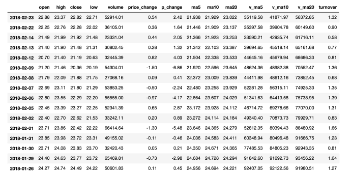

### 索引操作

Numpy 当中我们已经讲过使用索引选取序列和切片选择，pandas 也支持类似的操作，也可以直接使用列名、行名，甚至组合使用。

#### 直接使用行列索引

可以使用先列后行的顺序进行索引，例如：

```python
print(data['open']['2018-02-27'])
```

输出结果：

```shell
23.53
```

#### 结合 loc 或者 iloc 使用索引

如果我们想使用行列索引，可以使用 `loc` 或 `iloc` 方法，例如获取从'2018-02-27':'2018-02-22'，'open'的结果：

```python
print(data.loc['2018-02-27':'2018-02-22', 'open'])
print(data.iloc[:3, :5])  # 获取前3天数据,前5列的结果
```

输出结果：

```shell
2018-02-27    23.53
2018-02-26    22.80
2018-02-23    22.88
2018-02-22    22.25
Name: open, dtype: float64

             open   high  close    low    volume
2018-02-27  23.53  25.88  24.16  23.53  95578.03
2018-02-26  22.80  23.78  23.53  22.80  60985.11
2018-02-23  22.88  23.37  22.82  22.71  52914.01
```

### 赋值操作

对 DataFrame 当中的 close 列进行重新赋值为 1:

```python
# 直接修改原来的值
data['close'] = 1
# 或者
data.close = 1
```

### 排序操作

排序有两种形式，一种对于索引进行排序，一种对于内容进行排序

#### DataFrame 排序

使用`df.sort_values(by=, ascending=)`可以对单个键或者多个键进行排序，其中：

- `by`：排序的键，可以是列名或者列名的列表。
- `ascending`：是否升序排序，默认是 True。

```python
# 按照开盘价大小进行排序 , 使用ascending指定按照大小排序
data.sort_values(by="open", ascending=True).head()
```

排序后的表单：

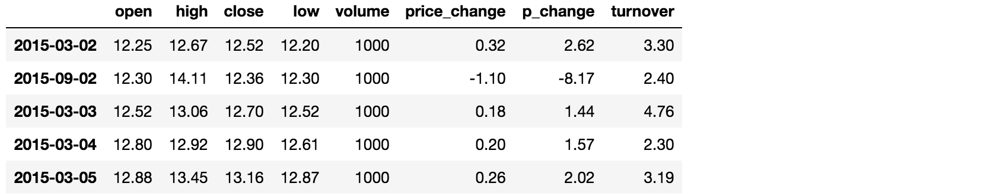

也可以按照多个键进行排序，例如按照开盘价和最高价进行排序：

```python
# 按照开盘价和最高价进行排序
data.sort_values(by=["open", "high"], ascending=True).head()
```

排序后的表单：

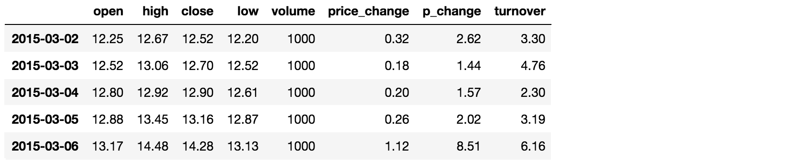

#### Series 排序

使用`series.sort_values(ascending=)`可以对 Series 进行排序，其中：

- `ascending`：是否升序排序，默认是 True。

```python
# 对 close 列进行排序
data['close'].sort_values(ascending=True).head()
```

部分输出结果：

```shell
2018-02-27    1.0
2018-02-26    1.0
2018-02-23    1.0
2018-02-22    1.0
2018-02-21    1.0
Name: close, dtype: float64
```

## DataFrame 运算

在机器学习中，我们大多数时间实际上都在处理二维数组数据。

### 算术运算

`add(other)`

比如进行数学运算加上具体的一个数字：

```python
data['open'].add(1)

print(data)
```

部分输出结果：

```shell
2018-02-27    24.53
2018-02-26    23.80
2018-02-23    23.88
2018-02-22    23.25
2018-02-14    22.49
```

当然也可以使用`sub(other)`，效果近似

### 逻辑运算

类似 numpy 的逻辑运算，可以对布尔值进行逻辑运算

#### 逻辑运算符

例如筛选 `data["open"] > 23` 的日期数据：

```python
print(data["open"] > 23)
```

部分输出结果：

```shell
2018-02-27     True
2018-02-26    False
2018-02-23    False
2018-02-22    False
2018-02-14    False
```

逻辑判断的结果也可以作为筛选的依据：

```python
print(data[(data["open"] > 23) & (data["open"] < 24)].head())
```

输出结果如图：

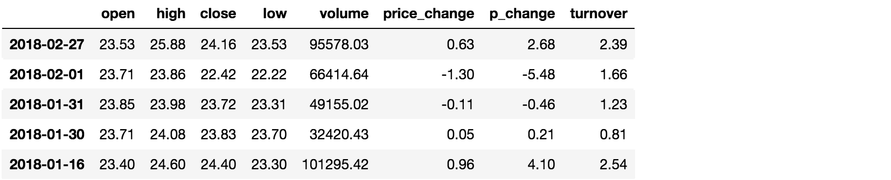

#### 逻辑运算函数

可以使用`query(expr)`函数进行逻辑运算，其中：

- `expr`：表达式，可以是字符串或者布尔值。

通过 query 使得刚才的过程更加方便简单：

```python
print(data.query("open<24 & open>23").head())
```

pandas 也提供了`isin(values)`函数，可以筛选出指定的值：

```python
print(data[data["open"].isin([23.53, 23.85])])
```

输出结果如图：

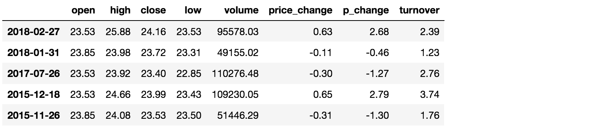

### 统计运算

对于 DataFrame 进行统计运算，可以使用`mean()`，`std()`，`min()`，`max()`等函数。

当然一个`describe()`综合分析函数能够直接得出很多统计结果：

```python
print(data.describe())
```

部分输出结果如图：

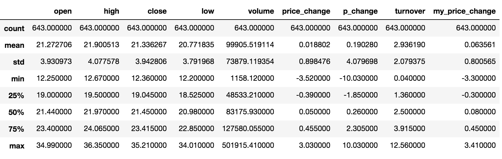

单独的统计指标如下表所示：

|  count  |       Number of non-NA observations        |     解释     |
| :-----: | :----------------------------------------: | :----------: |
|   sum   |               Sum of values                |  所有值的和  |
|  mean   |               Mean of values               |    平均值    |
| median  |        Arithmetic median of values         |    中位数    |
|   min   |                  Minimum                   |    最小值    |
|   max   |                  Maximum                   |    最大值    |
|  mode   |                    Mode                    |     众数     |
|   abs   |               Absolute Value               |    绝对值    |
|  prod   |             Product of values              |  所有值的积  |
|   std   | Bessel-corrected sample standard deviation |    标准差    |
|   var   |             Unbiased variance              |     方差     |
| idxmax  | compute the index labels with the maximum  | 最大值的索引 |
| idxmin  | compute the index labels with the minimum  | 最小值的索引 |
| cumsum  |          Cumulative sum of values          |   累计和值   |
| cummax  |        Cumulative maximum of values        |  累计最大值  |
| cummin  |        Cumulative minimum of values        |  累计最小值  |
| cumprod |        Cumulative product of values        |   累计积值   |

**对于单个函数去进行统计的时候，坐标轴还是按照默认列` columns` `(axis=0, default)`，如果要对行`index` 需要指定`(axis=1)`**

此外，pandas 提供了自定义运算函数：

```python
data[['open', 'close']].apply(lambda x: x.max() - x.min(), axis=0)
```

配合 lambda 函数，可以自定义运算规则，结果输出：

```shell
open     22.74
close    22.85
dtype: float64
```

## Pandas 画图

pandas 把 `matplotlib` 封装成了 `plot` 方法，可以直接调用。

```python
DataFrame.plot(kind='line')
```

其中：

- `kind`：图表类型，可以是 `line`、`bar`、`barh`、`hist`、`box`、`kde`、`density`、`area`、`pie`、`scatter`、`hexbin` 等常用图形。

例如：

```python
import pandas as pd
import matplotlib.pyplot as plt

# 读取文件，删除一些列，让数据更简单些，再去做后面的操作
data = pd.read_csv(r"D:\_Projects\机器学习\教学助理\doc\test\stock_day.csv").drop(["ma5", "ma10", "ma20", "v_ma5", "v_ma10", "v_ma20"], axis=1)

# 绘制图形
data.plot(kind="line")

# 显示图形
plt.show()
```

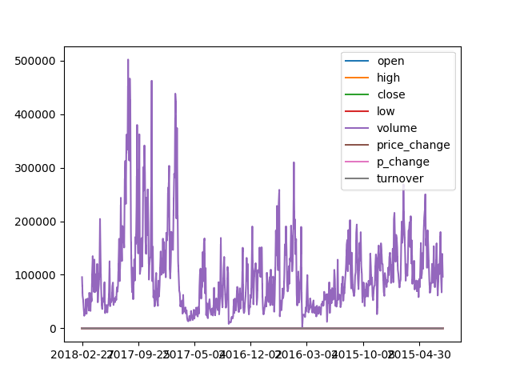

## 文件读取与存储

我们的数据大部分存在于文件当中，所以 pandas 会支持复杂的 IO 操作，pandas 的 API 支持众多的文件格式，如 `CSV`、`SQL`、`XLS`、`JSON`、`HDF5`等。

下面列举一些常用的用法：

### CSV

```python
# 读取 CSV 文件
pandas.read_csv(filepath_or_buffer, sep =',', usecols )

# 写入 CSV 文件
DataFrame.to_csv(path_or_buf=None, sep=', ’, columns=None, header=True, index=True, mode='w', encoding=None)
```

其中：

- `filepath_or_buffer`：文件路径或者文件对象。
- `sep`：分隔符，默认是 `,`。
- `usecols`：读取的列名，默认是全部列。
- `path_or_buf`：文件路径或者文件对象。
- `sep`：分隔符，默认是 `,`。
- `columns`：写入的列名，默认是全部列。
- `header`：是否写入列名，默认是 `True`。
- `index`：是否写入行名，默认是 `True`。
- `mode`：写入模式，默认是 `w`。
- `encoding`：编码格式，默认是 `None`。

例如：

```python
# 读取文件,并且指定只获取'open', 'close'指标
data = pd.read_csv("./data/stock_day.csv", usecols=['open', 'close'])

# 选取10行数据保存,便于观察数据
data[:10].to_csv("./data/test.csv", columns=['open'])

# 读取，查看结果
pd.read_csv("./data/test.csv")
```

会发现将索引存入到文件当中，变成单独的一列数据。如果需要删除，可以指定 `index` 参数,删除原来的文件，重新保存一次。

在实际使用时，`Excel` 文件与 `CSV` 文件区别不大，只需要将函数名替换为 `read_excel` 和 `to_excel` 即可。

### HDF5

```python
# 读取 HDF5 文件
pandas.read_hdf(path_or_buf, key=None, mode='r')

# 写入 HDF5 文件
DataFrame.to_hdf(path_or_buf, key, mode='a', complevel=None, complib=None, fletcher32=False, **kwargs)
```

其中：

- `path_or_buf`：文件路径或者文件对象。
- `key`：HDF5 键值，默认是 `None`。
- `mode`：读取模式，默认是 `r`。
- `complevel`：压缩等级，默认是 `None`。
- `complib`：压缩库，默认是 `None`。
- `fletcher32`：是否使用 Fletcher32 校验，默认是 `False`。
- `**kwargs`：其他参数。

例如：

```python
# 读取文件
data = pd.read_hdf("./data/stock_day.h5", "data")

# 写入文件
data.to_hdf("./data/stock_day.h5", "data", mode='a', complevel=9, complib='blosc:lz4', fletcher32=True)
```

### JSON

```python
# 读取 JSON 文件
pandas.read_json(path_or_buf, orient=None, typ='frame', dtype=True, convert_axes=True, convert_dates=True, keep_default_dates=True, numpy=False, precise_float=False, date_unit=None, encoding=None, lines=False, chunksize=None, compression='infer')

# 写入 JSON 文件
DataFrame.to_json(path_or_buf, orient=None, date_format=None, double_precision=10, force_ascii=True, date_unit='ms', default_handler=None, lines=False, compression=None)
```

其中：

- `path_or_buf`：文件路径或者文件对象。
- `orient`：输出格式，默认是 `None`。
- `typ`：输出类型，默认是 `frame`。
- `dtype`：是否输出数据类型，默认是 `True`。
- `convert_axes`：是否转换坐标轴，默认是 `True`。
- `convert_dates`：是否转换日期，默认是 `True`。
- `keep_default_dates`：是否保留默认日期，默认是 `True`。
- `numpy`：是否输出为 numpy 数组，默认是 `False`。
- `precise_float`：是否输出精确浮点数，默认是 `False`。
- `date_unit`：日期单位，默认是 `None`。
- `encoding`：编码格式，默认是 `None`。
- `lines`：是否输出为多行，默认是 `False`。
- `chunksize`：分块大小，默认是 `None`。
- `compression`：压缩格式，默认是 `infer`。

例如：

```python
# 读取文件
data = pd.read_json("./data/stock_day.json")

# 写入文件
data.to_json("./data/stock_day.json", orient='records', date_format='iso', double_precision=10, force_ascii=False, date_unit='ms', default_handler=None, lines=True, compression='gzip')
```

### SQL

```python
# 读取 SQL 文件
pandas.read_sql(sql, con, index_col=None, coerce_float=True, params=None, parse_dates=None, columns=None, chunksize=None)

# 写入 SQL 文件
DataFrame.to_sql(name, con, schema=None, if_exists='fail', index=True, index_label=None, chunksize=None, dtype=None)
```

其中：

- `sql`：SQL 语句。
- `con`：数据库连接。
- `index_col`：索引列，默认是 `None`。
- `coerce_float`：是否强制转换浮点数，默认是 `True`。
- `params`：参数，默认是 `None`。
- `parse_dates`：日期列，默认是 `None`。
- `columns`：读取的列名，默认是 `None`。
- `chunksize`：分块大小，默认是 `None`。
- `name`：表名。
- `con`：数据库连接。
- `schema`：数据库 schema，默认是 `None`。
- `if_exists`：写入模式，默认是 `fail`。
- `index`：是否写入索引，默认是 `True`。
- `index_label`：索引标签，默认是 `None`。
- `chunksize`：分块大小，默认是 `None`。
- `dtype`：数据类型，默认是 `None`。

例如：

```python
# 读取文件
import sqlite3

con = sqlite3.connect("./data/stock_day.db")
data = pd.read_sql("SELECT * FROM stock_day", con)

# 写入文件
data.to_sql("stock_day", con, if_exists='replace', index=False)
```

## 进阶数据处理

### 缺失值处理

在实际场景中，我们经常会遇到缺失值，pandas 提供了丰富的缺失值处理方法。

#### 判断缺失值是否存在

```python
# 判断是否存在缺失值
pd.notnull()

# 判断是否全部缺失值
pd.isnull()
```

#### 存在缺失值 nan,并且是 np.nan

1. 使用 `fillna(value)` 方法填充缺失值，其中 `value` 可以是数值或者字符串。
2. 使用 `dropna()` 方法删除缺失值。

#### 不是缺失值 nan，有默认标记的

```python
# 把一些其它值标记的缺失值，替换成np.nan
df = df.replace(to_replace='?', value=np.nan)
# 删除
df = df.dropna()
```

### 数据离散化

连续属性离散化的目的是为了简化数据结构，**数据离散化技术可以用来减少给定连续属性值的个数**。离散化方法经常作为数据挖掘的工具。

#### 什么是数据的离散化

**连续属性的离散化就是在连续属性的值域上，将值域划分为若干个离散的区间，最后用不同的符号或整数 值代表落在每个子区间中的属性值。**

离散化有很多种方法，这是一种最简单的方式去操作:

1. 原始人的身高数据：165，174，160，180，159，163，192，184
2. 假设按照身高分几个区间段：150~165, 165~180,180~195

这样我们将数据分到了三个区间段，我可以对应的标记为矮、中、高三个类别，最终要处理成一个"哑变量"矩阵

#### 离散化方法

常见的离散化方法有：

- `pd.qcut(data, q)`：等频分箱，将数据分为 `q` 个等距的箱，箱的宽度由数据分布决定。
- `pd.cut(data, bins)`：等距分箱，将数据分为 `bins` 个等距的箱，箱的宽度由数据分布决定。
- `pd.cut(data, bins, labels)`：自定义分箱，将数据分为 `bins` 个离散的箱，并给每个箱赋予不同的标签。

例如：

```python
# 等频分箱
data['height_bin'] = pd.qcut(data['open'], q=3)

# 等距分箱
data['height_bin'] = pd.cut(data['open'], bins=[150, 165, 180, 195])

# 自定义分箱
data['height_bin'] = pd.cut(data['open'], bins=[150, 165, 180, 195], labels=['矮', '中', '高'])
```

### 合并表

如果你的数据由多张表组成，那么有时候需要将不同的内容合并在一起分析

#### pd.concat

```python
pd.concat([data1, data2], axis=1)
```

按照行或列进行合并,`axis=0` 为列索引，`axis=1` 为行索引

#### pd.merge

```python
pd.merge(left, right, how='inner', on=None)
```

可以指定按照两组数据的共同键值对合并或者左右各自

其中：

- `left`：左边的数据集。
- `right`：右边的数据集。
- `how`：合并方式，可以是 `inner`、`outer`、`left`、`right`。
- `on`：合并的键值。

例如：

```python
import pandas as pd

data1 = pd.DataFrame({'key': ['K0', 'K1', 'K2', 'K3'], 'A': ['A0', 'A1', 'A2', 'A3']})
data2 = pd.DataFrame({'key': ['K0', 'K1', 'K2', 'K3'], 'B': ['B0', 'B1', 'B2', 'B3']})

print(pd.merge(data1, data2, on='key'))
```

输出结果：

```shell
  key   A   B
0  K0  A0  B0
1  K1  A1  B1
2  K2  A2  B2
3  K3  A3  B3
```

### 交叉表与透视表

- **交叉表**：交叉表用于计算一列数据对于另外一列数据的分组个数(用于统计分组频率的特殊透视表)，可以使用`pd.crosstab(value1, value2)`
- **透视表**：透视表是将原有的 `DataFrame` 的列分别作为行索引和列索引，然后对指定的列应用聚集函数，可以使用`data.pivot_table()`

例如：

```python
import pandas as pd

data = pd.DataFrame({'key': ['K0', 'K1', 'K2', 'K3'], 'A': ['A0', 'A1', 'A2', 'A3'], 'B': ['B0', 'B1', 'B2', 'B3']})

# 交叉表
print(pd.crosstab(data['key'], data['A']))

# 透视表
print(data.pivot_table(values='B', index='key', columns='A'))
```

输出结果：

```shell
A  A0  A1  A2  A3
key
K0  1   0   0   0   0
K1  0   1   0   0   0
K2  0   0   1   0   0
K3  0   0   0   1   0

key  A0  A1  A2  A3
K0  1   0   0   0   0
K1  0   1   0   0   0
K2  0   0   1   0   0
K3  0   0   0   1   0
```

### 分组与聚合

分组与聚合通常是分析数据的一种方式，通常与一些统计函数一起使用，查看数据的分组情况

实际上做了如下操作：

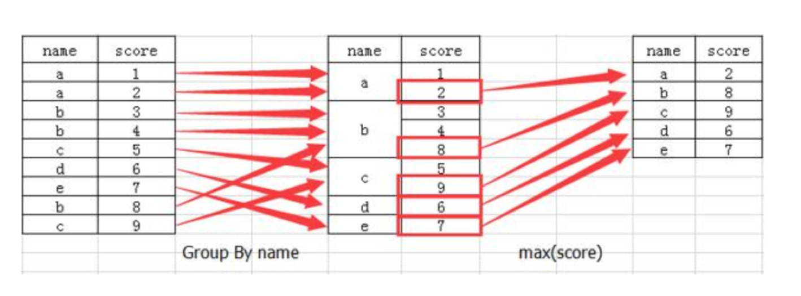

1. 分组：将数据按照某种规则分成若干组，每组包含相同的属性。
2. 聚合：对每组数据进行计算，得到一组统计数据。
3. 合并：将每组统计数据合并到一起。

```python
# 分组
df.groupby(by=None, axis=0, level=None, as_index=True, sort=True, group_keys=True, squeeze=False, observed=False)

# 聚合
df.agg(func, axis=0, skipna=True, level=None, *args, **kwargs)

# 合并
df.apply(func, axis=0, raw=False, result_type=None, args=(), **kwds)
```

其中：

- `by`：分组的列名，可以是列名、列表、字典等。
- `axis`：分组的方向，0 为行，1 为列。
- `level`：多级分组。
- `as_index`：是否保留分组列，默认是 `True`。
- `sort`：是否对分组进行排序，默认是 `True`。
- `group_keys`：是否保留分组列，默认是 `True`。
- `squeeze`：是否将结果展平，默认是 `False`。
- `observed`：是否计算频数，默认是 `False`。
- `func`：聚合函数，可以是字符串、列表、字典等。
- `raw`：是否返回原始数据，默认是 `False`。
- `result_type`：结果类型，默认是 `None`。
- `args`：聚合函数参数。
- `kwds`：聚合函数关键字参数。

例如：

```python
import pandas as pd

data = pd.DataFrame({'key': ['K0', 'K1', 'K2', 'K3'], 'A': ['A0', 'A1', 'A2', 'A3'], 'B': [0, 1, 2, 3]})

# 分组
grouped = data.groupby('key')

# 聚合
print(grouped.agg({'B': ['sum','mean', 'count']}))

# 合并
print(grouped.apply(lambda x: x['B'].sum()))
```

输出结果：

```shell
B  sum  mean  count
key
K0   0    0.0    0.0      1
K1   1    1.0    1.0      1
K2   2    2.0    2.0      1
K3   3    3.0    3.0      1

key
K0    0
K1    1
K2    2
K3    3
dtype: int64
```

## 结语

以上就是 pandas 在机器学习中常用的一些方法，希望对你有所帮助！
