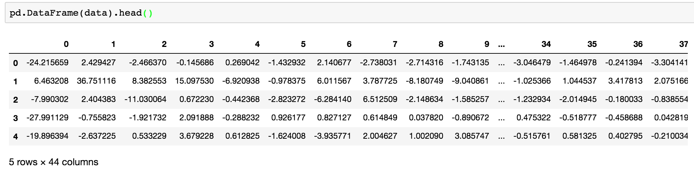

# 案例：探究用户对物品类别的喜好细分

降维算法往往在项目中起到辅助作用，本节我们就用 K-means 与 PCA 来做题个案例。

## 案例背景


数据如下：

- order_products\_\_prior.csv：订单与商品信息
  - 字段：order_id, product_id, add_to_cart_order, reordered
- products.csv：商品信息
  - 字段：product_id, product_name, aisle_id, department_id
- orders.csv：用户的订单信息
  - 字段：order_id,user_id,eval_set,order_number,….
- aisles.csv：商品所属具体物品类别
  - 字段： aisle_id, aisle

需求：




## 分析

1. 获取数据
2. 数据基本处理
   1. 合并表格
   2. 交叉表合并
   3. 数据截取
3. 特征工程 — pca
4. 机器学习（k-means）
5. 模型评估

## 代码实现

```python
import pandas as pd
from sklearn.decomposition import PCA
from sklearn.cluster import KMeans
from sklearn.metrics import silhouette_score

# 1.获取数据
order_product = pd.read_csv("./data/instacart/order_products__prior.csv")
products = pd.read_csv("./data/instacart/products.csv")
orders = pd.read_csv("./data/instacart/orders.csv")
aisles = pd.read_csv("./data/instacart/aisles.csv")

# 2.数据基本处理
# 2.1 合并表格
table1 = pd.merge(order_product, products, on=["product_id", "product_id"])
table2 = pd.merge(table1, orders, on=["order_id", "order_id"])
table = pd.merge(table2, aisles, on=["aisle_id", "aisle_id"])
# 2.2 交叉表合并
table = pd.crosstab(table["user_id"], table["aisle"])
# 2.3 数据截取
table = table[:1000]

# 3.特征工程 — pca
transfer = PCA(n_components=0.9)
data = transfer.fit_transform(table)

# 4.机器学习（k-means）
estimator = KMeans(n_clusters=8, random_state=22)
estimator.fit_predict(data)

# 5.模型评估
silhouette_score(data, y_predict)
```
