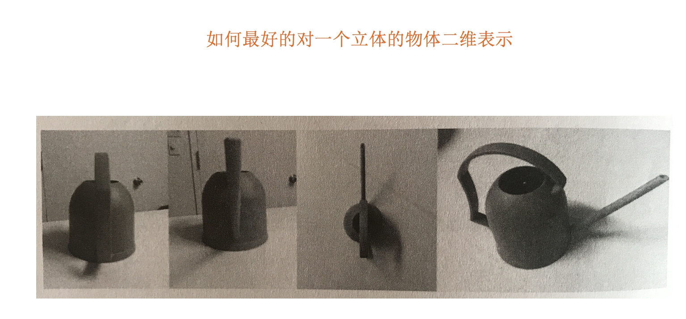
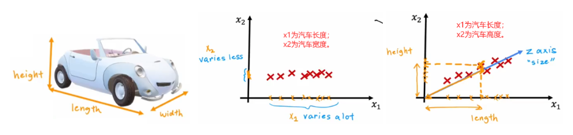
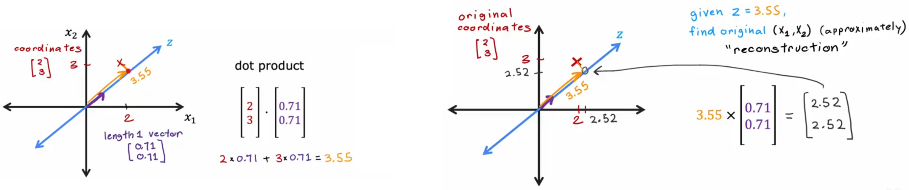
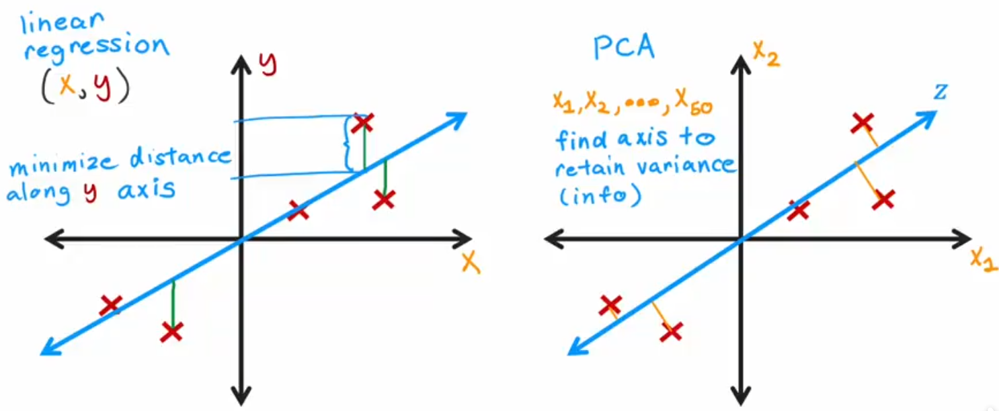

# PCA 主成分分析

PCA 是一种**无监督学习**、**降维**算法

## 什么是主成分分析？

定义：**高维数据转化为低维数据的过程，在此过程中可能会舍弃原有数据、创造新的变量**

作用：是数据维数压缩，尽可能降低原数据的维数（复杂度），损失少量信息。

那么更好的理解这个过程呢？我们来看一张图：



实际上，PCA 就是在高维空间中寻找一条直线，使得这条直线尽可能贴近数据点，同时使得这条直线的方差最大。

## PCA 算法原理



PCA 算法的思想是找到一组新轴，来最大可能的表示出样本间的差异。如上图所示，就展示了两个压缩二维汽车数据的示例。那该如何寻找这个具有代表性的“z 轴”呢？答案是最大化方差。

方差我们并不陌生，在最开始的线性回归我们就利用了方差来计算损失函数。在 PCA 中，方差的利用如下：

1. 均值归一化
2. 选取“主成分轴
3. 选取剩余轴
4. 计算样本新坐标



很像线性回归对吧。他们确实计算方式类似，但目的与计算过程不尽相同：



## API

```python
sklearn.decomposition.PCA(n_components=None, copy=True, whiten=False, svd_solver='auto', tol=0.0, iterated_power='auto', random_state=None)
```

其中：

- `n_components`：指定降维后的维度，默认为 None，即保留所有特征。
- `copy`：是否复制数据，默认为 True。
- `whiten`：是否白化数据，默认为 False。
- `svd_solver`：指定奇异值分解的算法，默认为 'auto'，即自动选择。
- `tol`：奇异值分解的容忍度，默认为 0.0。
- `iterated_power`：奇异值分解的迭代次数，默认为 'auto'，即自动选择。
- `random_state`：随机数种子，默认为 None。

常用方法：

- `fit(X)`：拟合数据，计算主成分。
- `transform(X)`：将数据转换到新空间。
- `inverse_transform(X)`：将数据转换回原空间。
- `fit_transform(X)`：拟合数据并转换到新空间。
