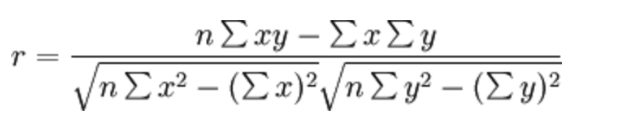

# 特征选择

## 定义

数据中包含冗余或无关变量（或称特征、属性、指标等），旨在从原有特征中找出主要特征。


## 方法

- **Filter**(过滤式)：主要探究特征本身特点、特征与特征和目标值之间关联
  - 方差选择法：低方差特征过滤
  - 相关系数
- **Embedded** (嵌入式)：算法自动选择特征（特征与目标值之间的关联）
  - 决策树:信息熵、信息增益
  - 正则化：L1、L2
  - 深度学习：卷积等

## 低方差特征过滤

删除低方差的一些特征，前面讲过方差的意义。再结合方差的大小来考虑这个方式的角度。

- 特征方差小：某个特征大多样本的值比较相近
- 特征方差大：某个特征很多样本的值都有差别

### API

```python
sklearn.feature_selection.VarianceThreshold(threshold=0.0)
```

其中：

- `threshold`：方差的阈值，默认为 0，即删除所有方差为 0 的特征。

常用方法：

- `fit_transform(X, y=None)`：返回选择后的特征矩阵
- `get_support()`：返回选择后的特征的索引
- `inverse_transform(X)`：将选择后的特征还原到原来的特征矩阵

## 相关系数

### 皮尔逊相关系数(Pearson Correlation Coefficient)

反映变量之间相关关系密切程度的统计指标



相关系数的值介于–1 与+1 之间，即–1≤ r ≤+1。其性质如下：

- 当 r>0 时，表示两变量正相关，r<0 时，两变量为负相关
- 当|r|=1 时，表示两变量为完全相关，当 r=0 时，表示两变量间无相关关系
- 当 0<|r|<1 时，表示两变量存在一定程度的相关。且|r|越接近 1，两变量间线性关系越密切；|r|越接近于 0，表示两变量的线性相关越弱

一般可按三级划分：|r|<0.4 为低度相关；0.4≤|r|<0.7 为显著性相关；0.7≤|r|<1 为高度线性相关

### 斯皮尔曼相关系数(Rank IC)

反映变量之间相关关系密切程度的统计指标


斯皮尔曼相关系数表明 X (自变量) 和 Y (因变量)的相关方向。 如果当 X 增加时， Y 趋向于增加, 斯皮尔曼相关系数则为正

与之前的皮尔逊相关系数大小性质一样，取值 [-1, 1]之间
