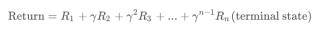
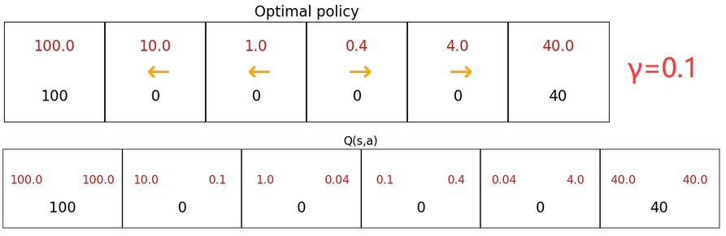
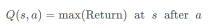
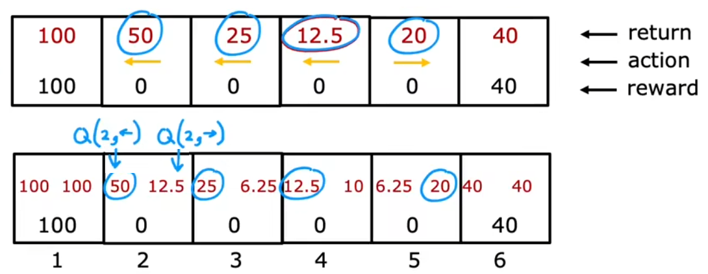
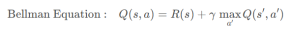

# 离散状态空间的强化学习

本节通过一个简单的案例——“火星探测器”，来介绍“强化学习”中的核心数学公式和关键思想。

## 回报

本小节来介绍强化学习的“回报”。强化学习的“回报(return)”是每一步所获得的 “奖励(reward)”的加权和，权重就是步数幂次的“折扣因子 γ”，“奖励”显然取决于每一次的“动作(action)”。比如下面从“状态 1”不断执行动作，最终到达任务终点“状态 n”，回报为：

若系统中出现“负奖励”，算法会尽可能的推迟该“负奖励”。折扣因子 γ 越大，表示有“耐心”走向更远的“大奖励”。下图给出了折扣因子对最佳策略(黄色箭头)的影响，可以发现 γ 较大时，状态 5 的最佳策略会是更远处的“大奖励”。

## 策略

本节介绍强化学习如何选择“动作”，也就是强化学习算法的“策略”。“策略 π (policy/controler)”是一个“状态”到“动作”的映射函数，表示在“状态 s”下，为了“最大化回报”所应该执行的“最佳动作 a”：

$$\pi(s)=a$$

上述决策过程被称为“马尔可夫决策过程(Markov Decision Process, MDP)”。“马尔可夫决策过程”是指未来只取决于当前状态，而不取决于任何之前的状态。

## 状态-动作价值函数

整个强化学习最关键的一点就是计算“状态-动作价值函数(state-action value function)”，也称为 Q 函数、Q∗、最优 Q 函数(optimal Q function)。“状态-动作价值函数”就是在 “当前状态 s” 下，执行 “某动作 a” 后所能获得的“最大回报”。也就是说，“某动作 a”不一定是当前状态的最佳动作，但执行 a 之后会一直执行最佳动作(γ = 0.5)：

显然，在计算出所有状态下所有动作的 Q 取值后，在每个状态只需选取 Q 取值较大的“动作”，就是“最佳动作 π(s)=a ”。比如上述在“状态 4”，因为 Q(4, ←) > Q(4, →)，所以在“状态 4”应该执行最佳动作 “向左 ←”。

## 贝尔曼方程

将前几个小节的内容总结一下，就可以给出 Q(s, a) 的计算公式——“贝尔曼方程(Bellman Equation)”，也就是在 状态 s 执行 动作 a 的最大回报=“即时奖励(immediate reward)”+下一状态的最大回报：

在算法实现的角度上， “贝尔曼方程” 实际上就是动态规划+递归。
