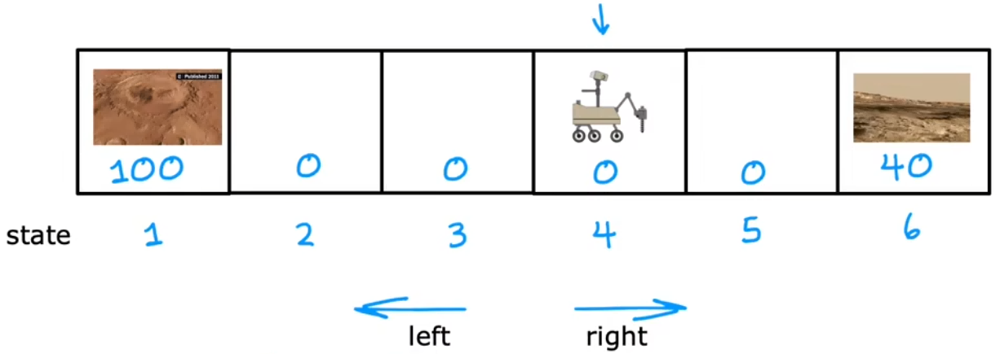

# 强化学习

:::tip
强化学习是机器学习的一种方法，它可以让机器自动学习如何在一个环境中做出最好的决策。

在本章，我们并不会深入讨论强化学习的数学原理，而是从实际应用的角度，介绍强化学习的基本概念和算法。
:::

## 什么是强化学习

.gif>)

“强化学习(reinforcement learning)”已经被应用于直升机控制，可以让其做“倒飞”等各种特技动作(aerobatic maneuvers)，如上图。显然我们不可能使用“有监督学习”来控制直升机，因为整个飞行空间是连续的，标签数据空间会非常庞大进而制造困难大。而“强化学习”的关键思想在于，并不告诉算法对于每个输入的正确输出(事实上也做不到)，而是指定一个“奖励函数(reward function)”，来告诉算法执行的结果如何，“强化学习”算法的工作就是自动找出“最大化奖励”的动作。也就是，在训练时只给出“奖励函数(reward function)”，而不是最佳动作。这可以在设计系统时具有更多的灵活性。比如对于“直升机控制”来说，可以设置奖励为：

- **正向反馈**(positive reward)：直升机飞行稳定时，+1 分。 -** 负向反馈**(negative reward)：直升机坠毁，-1000 分。

“强化学习”的应用场景有：

- 机器人控制：比如直升机特技飞行、机器狗跨越障碍等。
- 工厂优化：如何安排工厂中流程来最大限度的提升 吞吐量/效率。
- 金融(股票)交易：比如要想在 10 天内抛售 100 万手股票，如何效益最大化的完成股票交易。
- 玩游戏：比如跳棋、国际象棋、纸牌、电子游戏等等。

尽管“强化学习”不如“有监督学习”应用广泛，目前尚未在商业界取得广泛应用，但也是机器学习算法的“支柱”之一。下面是目前“强化学习”的一些缺点：

- 很多研究成果都是针对模拟环境的，而针对“实际机器人”的“强化学习”要困难的多。
- 应用场景少。相比于“有/无监督学习”，“强化学习”的应用场景很少，目前大多数局限在机器人控制领域。

> 注：“强化学习”既不是“有监督学习”，也不是“无监督学习”。

## 强化学习示例

本节介绍几个强化学习的示例，其中“火星探测器”会在第二节反复提及。

> “火星探测器”：找出火星车在每个状态应该执行的最佳动作，直到到达“状态 1”或“状态 6”。

其中我们可以定义：

- **状态**(state)：假设有 6 个状态。每个状态可以认为是不同的地点，“状态 1”或“状态 6”为“任务终点(terminal state)”。下图中火星车的起始位置为“状态 4”。
- **动作**(action)：每个状态都可以执行“向左”、“向右”两种状态。
- **奖励**(reward)：到达“状态 1”奖励 100、到达“状态 6”奖励 40、其他状态奖励为 0。
- **折扣因子**：γ = 0.5

在下一节，我们将会以此为例介绍“强化学习”的离散空间算法。
