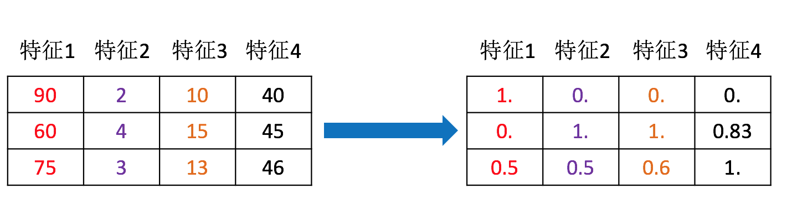
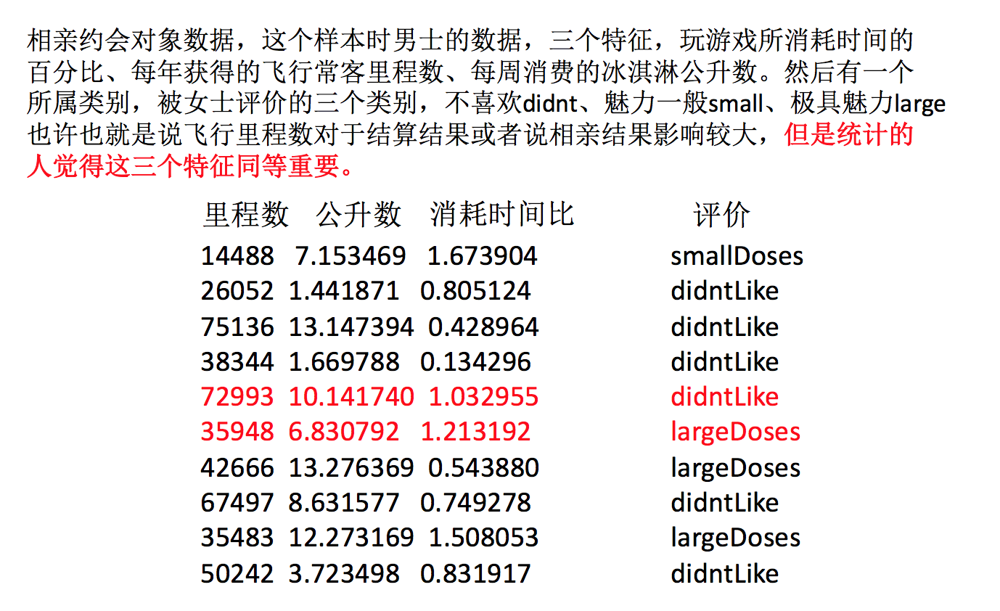
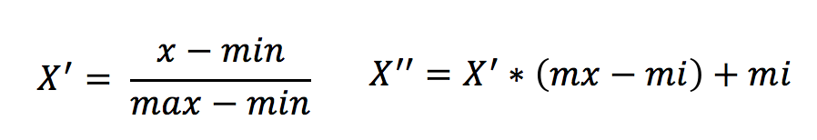
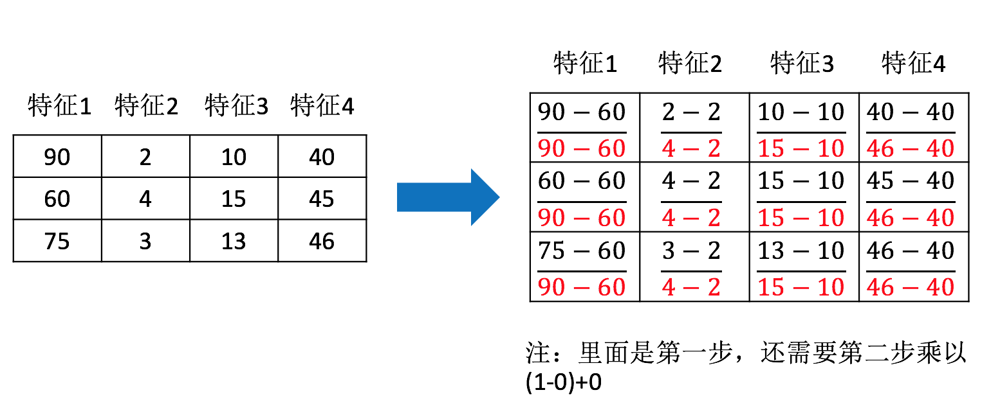
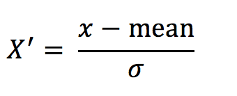

# 特征工程-特征预处理

我们的数据在很多时候往往是成十几、甚至几十、几百列的。如我们们在正则化的章节中提到，不同的数据往往对相同的特征有不同的量纲，这就导致了不同特征之间存在不同量级的差异，这就需要对数据进行预处理，将其转换为相同的量纲，使得不同特征之间能够进行比较。

## 什么是特征预处理

通过一些**转换函数**将特征数据转换成**更加适合算法模型**的特征数据过程



为什么我们要进行特征预处理？

特征的单位或者大小相差较大，或者某特征的方差相比其他的特征要大出几个数量级，容易影响（支配）目标结果，使得一些算法无法学习到其它的特征

举例：约会对象数据



最常见的预处理方式有归一化与标准化

## 归一化

通过对原始数据进行变换把数据映射到(默认为\[0, 1\])之间，其数学公式如下：



作用于每一列，max 为一列的最大值，min 为一列的最小值,那么 X’’为最终结果，mx，mi 分别为指定区间值默认 mx 为 1,mi 为 0

那么怎么理解这个过程呢？我们通过一个例子：



sklearn 为我们封装好了归一化的函数，我们只需要调用即可：

```python
sklearn.preprocessing.MinMaxScaler(feature_range=(0, 1))
```

注意最大值最小值是变化的，另外，最大值与最小值非常容易受异常点影响，所以这种方法鲁棒性较差，只适合传统精确小数据场景。

## 标准化

通过对原始数据进行变换把数据变换到均值为 0,标准差为 1 范围内，其数学公式如下：



作用于每一列，mean 为平均值，σ 为标准差

```python
sklearn.preprocessing.StandardScaler()
```

## 总结

- 对于归一化来说：如果出现异常点，影响了最大值和最小值，那么结果显然会发生改变
- 对于标准化来说：如果出现异常点，由于具有一定数据量，少量的异常点对于平均值的影响并不大，从而方差改变较小。
