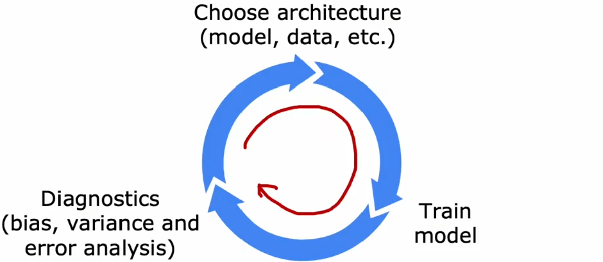
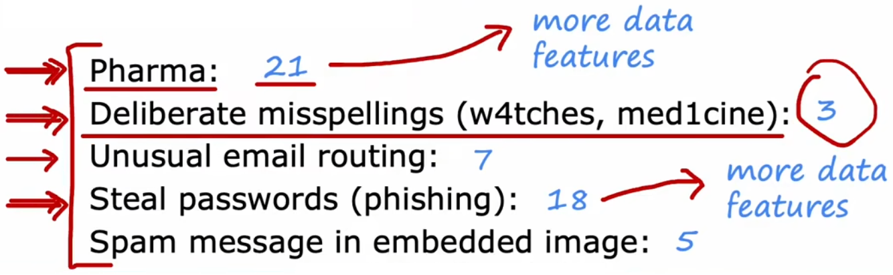
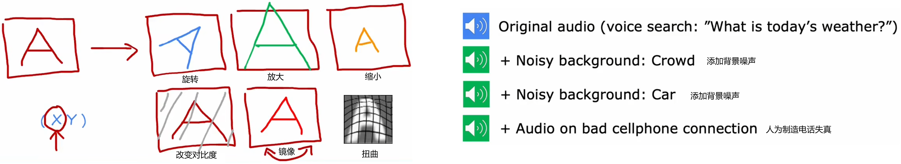
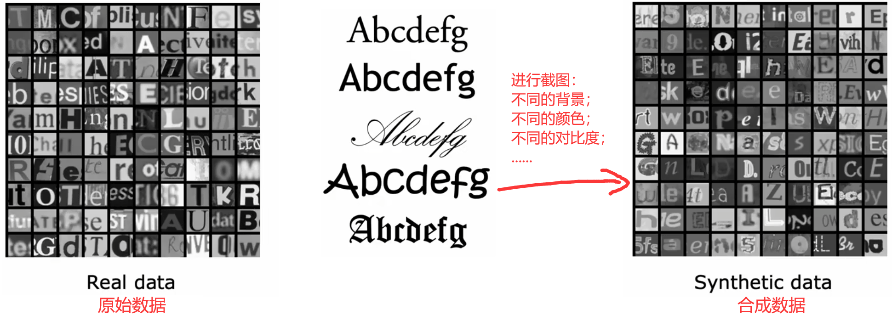
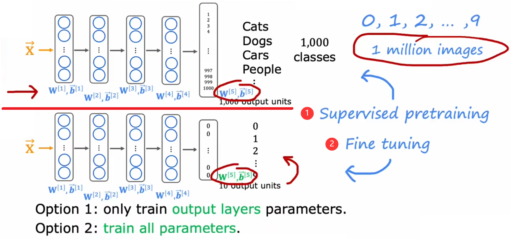
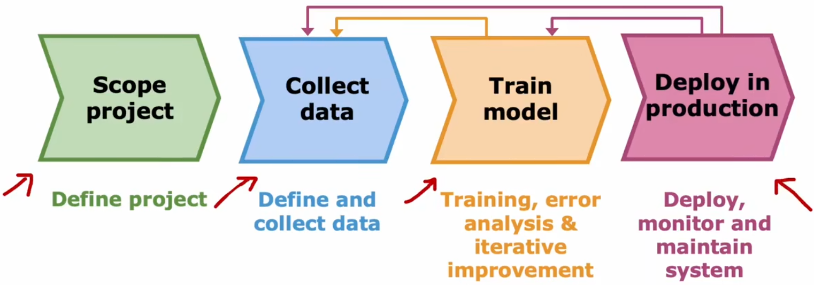

# 机器学习项目开发的技巧

## 前期开发过程的迭代

先来看看机器学习在前期开发过程中，如何进行迭代训练：

1. **选择模型**：决定系统的整体架构，并选择系统中需要使用哪些参数。
2. **训练模型**：第一次训练时，通常都不会成功。
3. **诊断分析**：分析错误原因，比如查看“偏差”和“方差”、进行“误差分析”，然后重新改进模型。

不断重复上述迭代过程，直到性能达到预期要求。

假设现在使用“垃圾邮件分类器”举例（如下），在完成最初的训练后，结果并不如预期，可能会想到改进方法如下：

可能的改进方法：

1. 收集更多的垃圾邮件训练集。比如“蜜罐计划”故意创造大量假地址，收集垃圾邮件。
2. 依据邮件的路由信息定义更复杂的特征。比如邮件头通常包括路由信息。
3. 依据邮件内容改进特征。比如将“discounting”和“discount”视作相同的单词。
4. 设计识别错别字的算法。比如识别出“w4tchs”、“Med1cine”、“M0rgages”等，这种垃圾邮件最显著的特征。

那我们该如何从这些方法中，选出最有效的方法呢？

## 误差分析

“误差分析”是除了“偏差和方差”以外，另一组诊断方法。“误差分析”指的是将“验证集”中分类错误的样本进行手动分组，观察这些错误样本是否有相似的主题或特征。回到“垃圾邮件分类器”中，假设现在“验证集”有 500 个样本，但是有 100 个错误的分类。我们手动分类这些出现错误的样本，并发现可以分为以下几类(蓝色的数字表示数量)：

显然，应该首先解决“药品”或“盗窃密码”主题的问题，比如收集更多“药品”或“盗窃密码”主题的数据集，或者改进输入特征等。而解决“错别字”问题并不能显著提升系统性能！也就不值得花太多时间去修复。对应上一节的方法二、四并不值得首先考虑，方法一有些困难，方法三值得一试。

最后要说，误差分析更容易解决人类擅长的问题，但对于人类也不擅长的任务，误差分析就会很困那，比如分析“人们会在网页上点击哪个广告”这种相当随机的问题。但总的来说，“误差分析”是一个很有用的工具，并可能帮助避免大量的徒劳工作。

## 增加数据集

一个好的数据集可以让神经网络的训练事半功倍。若“误差分析”的分类结果说明目前的算法对于某一类数据的表现很差，那么额外收集一点此类型的数据集，就可以获得很大的性能提升。而不是再继续收集所有类型的数据集，不仅耗时耗力，并且性能也不会提升很多。比如上一节对于“药品”分类效果很差，就可以只专注于收集“药品主题”的邮件，从而获得更多的性能提升。那该如何获取更多特定类型的数据呢？除了实际收集，还有下面两种高效的创造数据集的方法：

### 数据增强

“数据增强(data augmentation)”使用现有数据集创建全新的数据集。对输入 X 应用变换或失真，来创建另一个具有相同标签的示例。该技术常用于图像或音频领域，用于增加数据集大小：

- 图像的数据增强：常见的可以旋转、缩放、改变对比度、镜像、扭曲。
- 语音的数据增强：添加不同的背景噪音、人工制造电话失真等。

注意上述“数据增强”应该是“测试集”中典型的失真类型，不能乱加无意义的失真，比如对“A”图像中的每个像素点都加入噪声，这并没有改变“A”的形状，所以并不能看成是一个新的训练集。

### 合成数据

“合成数据(synthetic data)”是从头开始构建全新的数据，而不是修改原有的训练数据。相比于“数据增强”来说，“合成数据”的应用领域较少，通常只用于计算机视觉。比如下面的“字符识别”中，左侧是现实世界中拍照的字体；右侧是对理想字体人为编码添加一些失真，两者相似，可以认为是同类型的数据集。虽然编写代码添加失真的过程需要一些时间，但是一旦设置好后就会获得大量的数据集，进而为神经网络性能带来巨大的提升：

- 原始数据：从现实世界拍摄的照片。
- 合成数据：对不同的标准字体进行人工添加失真，再进行截图得到的数据。

## 迁移学习-借鉴他人的模型

若想解决一些没有太多数据集的问题，那么可以首先考虑“迁移学习(transfer learning)”，也就是借鉴别人的智慧。比如针对上述的“【问题 1】图片分类”，下图中已经有一个训练好的神经网络。此时，我们想进行“手写数字识别”，但数据集只有 50 张图片非常小，重新训练一个新的神经网络显然不可能。于是我们就可以进行“迁移学习”，将前面训练好的大型神经网络拷贝下来，保留所有隐藏层不动，只替换其输出层，然后重新训练即可：

即使我们的数据集非常小，最后也可以获得相当不错的训练效果。这也是因为两项任务要求相似，所以才能进行借鉴。下面给出“迁移学习”的一般步骤及其注意事项：

1. 有监督的预训练(supervised pre-training)：首先对有较大的数据集的其他相似问题，进行“有监督的预训练”，得到具有相同类型的输入特征的神经网络。
2. 微调(fine tuning)：然后借用上述神经网络，仅需更改其输出层，再按照当前任务的数据集继续训练。若当前任务的数据集较小，只需训练输出层参数；若当前任务的数据集较大，可以考虑重新训练全部参数。

注意到很多机器学习社区中，都有很多别人训练好的神经网络，所以“迁移学习”可以直接“站在巨人的肩膀上”.比如 GPT3、GPT4、BERTs、在 ImageNet 上预训练的神经网络等，这些都是其他人在大型图像数据集或文本数据集上训练过的神经网络，可以在其他场景下微调。“迁移学习”的魅力在于共享，也就是开源精神，所有人的工作加起来肯定比一个人走得更远。

## 机器学习项目的完整周期

