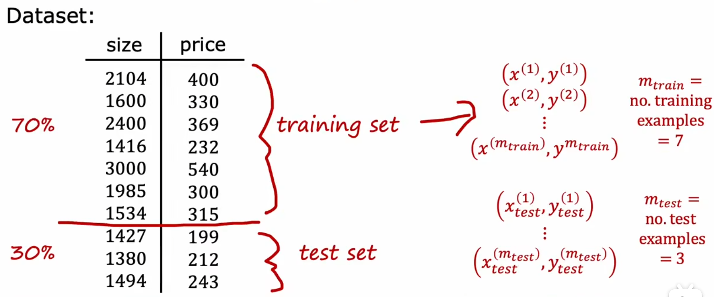
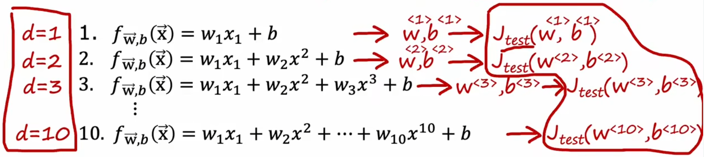
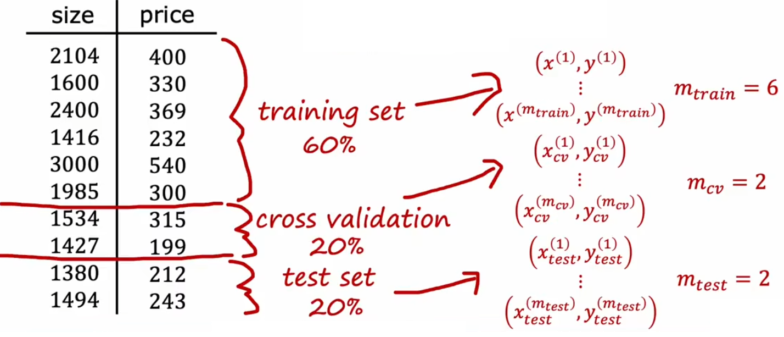
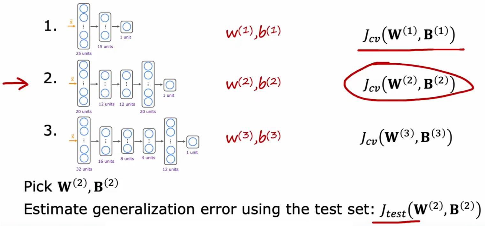

# 拆分原始训练集

## 如何改进模型

前面已经介绍了线性回归模型。但若算法的性能不好，我们下一步又该做什么来进行改进呢？前面我们只是进行了简单的介绍，如果训练结束后，发现预测的结果和预期的偏差非常大该怎么办？通常可以考虑以下几个步骤：

1. 收集更多的训练样本【耗费大量时间】。
2. 减少特征数量。
3. 增加特征数量。
4. 使用特征的多项式拟合
5. 减少正则化参数 λ
6. 增加正则化参数 λ

那我们具体要选择哪一个方法呢？如果直接去选择收集更多的样本，最后却发现更多的样本也不能改进算法性能，这显然会浪费大量的时间。所以在机器学习中，做出正确的决策非常重要。

## 二拆分：训练集、测试集

我们使用“原始训练集”完成模型的训练后，通常会希望衡量模型的“泛化”能力如何。但是我们手头上除了“原始训练集”也没有其他的样本了。所以，这就启示我们将“原始训练集”进行二拆分(如三七分，或者其他比例)，70%作为新的“训练集(train set)”用于正常训练，30%作为“测试集(test set)”用于测试（如上图）。模型训练结束后，通过计算“训练误差(training error)”和“测试误差(test error)”就能衡量模型性能。注意这个“测试误差”和“训练误差”是新定义的，和原本的“损失函数”或“代价函数”毫无关系。

于是，“测试误差”便可以用来评估模型的泛化程度。

- **过拟合**：训练误差很小，但是测试误差很大。
- **欠拟合**：训练误差很大，但是测试误差很小。
- **模型适中**：训练误差和测试误差都很小。

## 三拆分：训练集、验证集、测试集

虽然“二拆分”看起来很不错，但是也有局限性。比如“房价预测问题”中存在许多可能的多项式模型，我们要选择最合适的，显然可以选择测试误差最小的模型。但一旦这么做，就会导致“训练集”也用于模型的训练，这就导致训练误差可能要比实际上的泛化误差低。于是来进行改进，将模型进行“三拆分”。

- **训练集**：用于模型的训练，模型参数的选择。
- **交叉验证集**：用于计算验证误差模型的选择，并利用其选择合适的模型整体参数，比如“房价预测问题”中的多项式次数、神经网络的层数/神经元数量、模型的正则化参数等。
- **测试集**：用于模型的测试，模型的泛化能力的评估。

回到“房价预测问题”，现在我们进行三拆分之后，就可以使用“训练集”训练模型，然后使用“验证集”取计算每个模型的误差，并找出“验证误差”最小的参数，最后就可以使用“测试集”来计算当前模型的泛化误差了。由于没有使用“测试集”拟合任何参数，所以此时“测试集”就能良好的反映出模型的“泛化误差”。

同样的，我们也可以使用“验证误差”来决定神经网络的层数和每层的神经元数量。如下图，“验证误差”最小，于是第二个结构的神经网络就是最合适的：

最后注意的是，三拆分后，要使用“训练误差”、“验证误差”对模型进行判断：

- **过拟合**：训练误差很小，验证误差很大。
- **欠拟合**：训练误差很大，验证误差很小。
- **模型适中**：训练误差和验证误差都很小。
