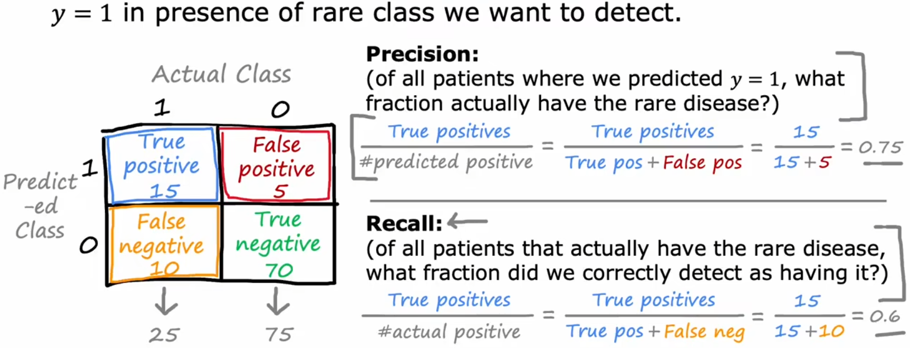

# 处理倾斜数据集

对于倾斜数据集，前面所学的误差衡量指标不再使用，本节就来介绍针对“倾斜数据集”的误差衡量指标。

## 倾斜数据集的误差指标

若数据集中的正向样本和反向样本的比例严重失衡，就称这个数据集为“倾斜数据集(skewed datasets)”。使用“倾斜数据集”训练的模型，一般不能使用通常的错误指标来进行衡量，比如前面的“训练误差”、“验证误差”、“测试误差”。

举个例子，假如某该罕见病在人群中只有 0.5%的发病率(倾斜数据集)，现在需要开发识别病人是否具有罕见病的神经网络分类器。若分类器对于“测试集”的“测试误差(预测错误的样本占比)”仅为 1%，这看起来很好。但是，由于发病率只有 0.5%，这个分类器显然并不能很好的完成工作。毕竟，就算把所有的输入样本都判定为没有罕见病，其“测试误差”都能达到更低的 0.5%。

所以对于“倾斜数据集”，就需要使用不同的误差指标，一对常见的误差指标是使用“混淆矩阵(confusion matrix)”计算的“准确率(precision)”和“召回率(recall)”：

其中：

- True Positive(真阳性)：实际为 1，预测为 1。预测正确。
- False Positive(假阳性)：实际为 0，预测为 1。预测错误。
- False Negative(假阴性)：实际为 1，预测为 0。预测错误。
- True Negative(真阴性)：实际为 0，预测为 0。预测正确。

对于“倾斜数据集”，当算法的“准确率”、“召回率”都很高时，就可以说明算法有效。

## 准确率与召回率的权衡

理想情况下，我们会希望“准确率”和“召回率”都很高。但实际上，会有这两者之间的权衡(trade-off)。这是由于在分类问题中，我们通常会在最后输出一个 0~1 之间的数字(如 Sigmoid 函数)，然后设定一个阈值，来判断正负：

- 不能冤枉一个好人：提升阈值，准确率上升，召回率下降。
- 宁可错杀也不放过：降低阈值，准确率下降，召回率上升。

如果想同时考虑两个指标，方便自动调整阈值，可以使用“F1 score”。“F1 score”是“准确率”和“召回率”的调和平均数，越大越好：

