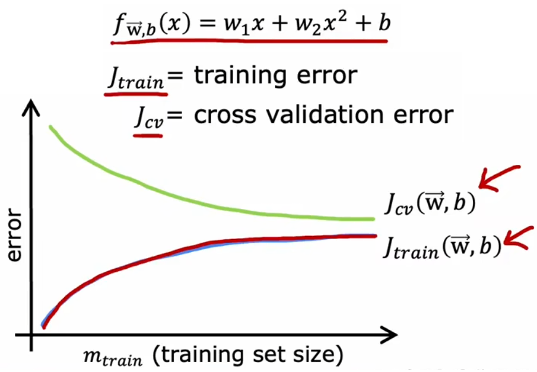

# 避免高偏差和高方差

本节学习如何分析模型的“偏差(bias)”和“方差(variance)”，并介绍一系列避免“高偏差”或“高方差”的方法。注意，“偏差”和“方差”是非常重要的概念，是对模型进行“诊断”的最重要的工具之一，吴恩达老师提到自己一个工作多年的博士说过：

> 虽然“偏差”和“方差”很容易就学会了，但是需要一辈子才能真正掌握。

## 使用训练误差和验证误差进行分析

之前我们提到，“高偏差”等价于“欠拟合”、“高方差”等价于“过拟合”，所以“偏差(bias)”和“方差(variance)”是“诊断”模型非常重要的概念。上一节的最后，已经介绍了如何使用“训练误差”和“验证误差”来判断模型的拟合情况（如上图）。现在不妨继续以“房价预测问题”为例，观察“训练误差”和“验证误差”是如何随着模型最高幂次变化的：

- **高偏差**：当模型幂次较低时，训练误与验证误差较高，即模型欠拟合。
- **恰当**：当模型幂次契合数据集时，训练误差较低，验证误差较低，即模型在训练数据上拟合得很好。
- **高方差**：当模型幂次较高时，训练误差较低，但验证误差较高，即模型过拟合。
- **高偏差且高方差**：训练误差较大，且验证误差更大。

当模型的预测不理想时，只有首先判断模型是“高偏差”还是“高方差”，才能对症下药，解决模型中的问题。下面就来依次介绍这些解决方法。

## 选择合适的正则化参数

在选择正则化参数时，我们一般会遇到以下情况：

- **λ 过大**：强烈抑制所有模型参数，导致模型过于简化，于是“高偏差”。
- **λ 适中**：情况较为理想，可以恰当的只抑制某些高阶特征的参数。
- **λ 过小**：相当于没有正则化，很可能“高方差”。

回到“房价预测问题”，假定现在已经确定了模型为四阶多项式，所以可以使用“验证集”选择合适的正则化参数 λ 。与使用“验证集”选择最合适的模型幂次相似，设置不同的 λ 作为待选择的模型参数，然后分别计算这个参数所对应的“验证误差”，最小的“验证误差”所对应的 λ 即为最优，如下图最小的验证误差对应参数为 λ = 0.08。下图还给出“训练误差”、“验证误差”随着 λ 变化的曲线：

## 性能评估的基准

前面介绍了如何使用验证误差与训练误差判断“高偏差”/“高方差”，但是一直是很模糊的“很大”、“很小”，本部分就来介绍如何具体衡量他们的大小。想要衡量一个指标的具体大小时，通常需要一个“基准”。构建“基准”的常见方法是：

1. 使用人类在解决该问题时的误差。因为人类很擅长理解语音处理、图像、文本等，使用上述非结构化数据时，人类就是很好的基准。
2. 使用之前存在的算法的误差。也就是，之前有人提出过算法解决当前问题，所以可以把以前的算法作为基准。

比如下面的“语音识别应用”中，某算法的“训练误差”为 10.8%，那么能说这个算法的训练效果很差吗？并不能。因为人类对这些音频进行转录时，转换错误的样本占比为 10.6%，和人类的“错误占比”持平。所以在没找到“基准”之前，不要盲目说“训练误差”很大：

- 第一列数据：训练误差与基准持平，所以偏差不高；验证误差远高于训练误差，所以方差很高。
- 第二列数据：训练误差远高于基准，所以偏差很高；验证误差与训练误差持平，所以方差不高。
- 第三列数据：训练误差远高于基准，所以偏差很高；证误差远高于训练误差，所以方差很高。

## 训练集的样本数量

现在我们来讨论一下，一味的“增加训练样本数量”能否不断地改善模型性能。先说结论，**到达一定限度后，增加训练样本数量并不能改善模型性能**。现在回到“房价预测问题”，使用“最合适的二阶多项式模型”、“高偏差模型”、“高方差模型”，下面画出其学习曲线：

可以看到，随着训练样本的增多，模型的泛化能力越强，验证误差下降表明方差减小，符合直观。而训练集越大，越难完美拟合全部训练样本，所以训练误差会逐渐增大，但是模型的泛化能力会增强。而且，验证误差一般高于训练误差。

通过上面三个图片可以看到，对于“合适的模型”来说，增加样本才能显著提升系统性能。而如果模型本身不合适时，首先考虑的应当是改进模型，而不是一味的增加训练数据。所以实际上，在进行正式的训练之前，可以先画出上述曲线判断一下模型是否存在“高偏差”或“高方差”。但显然，这种方法的缺点就是计算量会非常大，所以实际上不会完整地画出上述曲线，但是记住上述学习曲线的样子，有助于判断模型潜在的问题。
