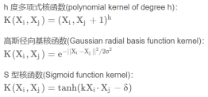

# 核方法

## 使用核方法的动机

在线性 SVM 中转化为最优化问题时求解的公式计算都是以内积(dot product)形式出现的，其中 ϕ(X) 是把训练集中的向量点转化到高维的非线性映射函数，因为内积的算法复杂度非常大，所以我们利用核函数来取代计算非线性映射函数的内积。

以下核函数和非线性映射函数的内积等同，但核函数 K 的运算量要远少于求内积：

## 常用的核函数（kernel functions）

## 如何选择使用哪个 kernel ？

- 根据先验知识，比如图像分类，通常使用 RBF（高斯径向基核函数），文字不使用 RBF。
- 尝试不同的 kernel，根据结果准确度而定尝试不同的 kernel，根据结果准确度而定。
