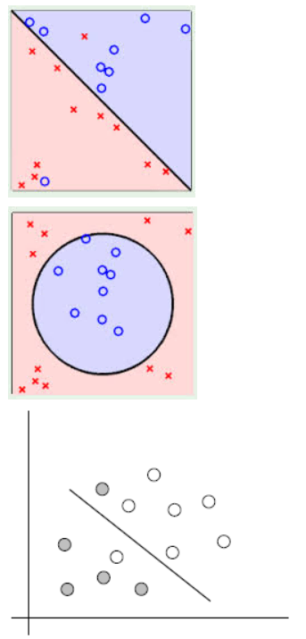
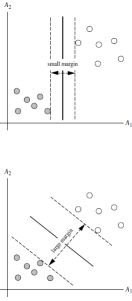
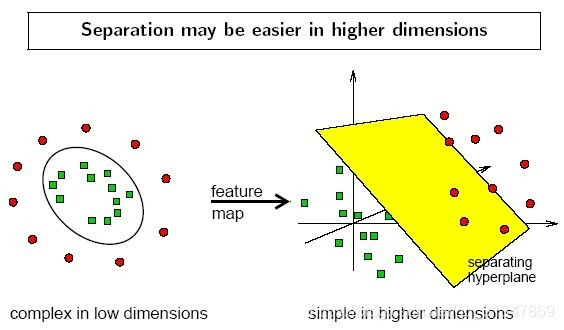
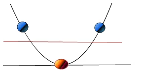

# 线性可区分问题

## 线性可区分与线性不可区分

能够用一条直线对样本点进行分类的属于线性可区分（linear separable），否则为线性不可区分（linear inseparable）。

以下三个例子，都是线性不可区分的，即无法用一条直线将两类样本点区分开：

而刚才的例子就是线性可区分的：

## 解决线性不可分

在线性不可分的情况下，数据集在空间中对应的向量无法被一个超平面区分开，如何处理？

两个步骤来解决：

1. 利用一个非线性的映射把原数据集中的向量点转化到一个更高维度的空间中（比如下图将二维空间中的点映射到三维空间）
2. 在这个高维度的空间中找一个线性的超平面来根据线性可分的情况处理

比如想要将红点和蓝点变成线性可分的，那么就将映射$y=x$变成映射 $y=x^2$，这样就线性可分了。

这里有一个可视化演示的[视频](https://www.youtube.com/watch?v=3liCbRZPrZA)

## 利用非线性映射将原始数据转化到高维空间中

使用核方法（kernel trick）
