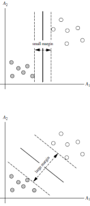

# 支持向量机(SVM)

支持向量机（support vector machines，SVM）是一种二分类模型，它将实例的特征向量映射为空间中的一些点，SVM 的目的就是想要画出一条线，以 “最好地” 区分这两类点，以至如果以后有了新的点，这条线也能做出很好的分类。SVM 适合中小型数据样本、非线性、高维的分类问题。

SVM 最早是由 Vladimir N. Vapnik 和 Alexey Ya. Chervonenkis 在 1963 年提出，目前的版本（soft margin）是由 Corinna Cortes 和 Vapnik 在 1993 年提出，并在 1995 年发表。深度学习（2012）出现之前，SVM 被认为机器学习中近十几年来最成功，表现最好的算法。

与我们之前提到的降维相反，SVM 通过“升维”的方式进行建模。

SVM 是一种有**监督学习**、二**分类**的算法。

## SVM 基本概念

将实例的特征向量（以二维为例）映射为空间中的一些点，如下图的实心点和空心点，它们属于不同的两类。SVM 的目的就是想要画出一条线，以“最好地”区分这两类点，以至如果以后有了新的点，这条线也能做出很好的分类。

我们通过一些问题来对所有的细节进行拆解：

**Q1：能够画出多少条线对样本点进行区分？**

答：线是有无数条可以画的，区别就在于效果好不好，每条线都可以叫做一个划分超平面。比如上面的绿线就不好，蓝线还凑合，红线看起来就比较好。我们所希望找到的这条效果最好的线就是具有 “最大间隔的划分超平面”。

**Q2：为什么要叫作“超平面”呢？**

答：因为样本的特征很可能是高维的，此时样本空间的划分就不是一条线了。

**Q3：画线的标准是什么？/ 什么才叫这条线的效果好？/ 哪里好？**

答：SVM 将会寻找可以区分两个类别并且能使间隔（margin）最大的划分超平面。比较好的划分超平面，样本局部扰动时对它的影响最小、产生的分类结果最鲁棒、对未见示例的泛化能力最强。

**Q4：间隔（margin）是什么？**

答：对于任意一个超平面，其两侧数据点都距离它有一个最小距离（垂直距离），这两个最小距离的和就是间隔。比如下图中两条虚线构成的带状区域就是 margin，虚线是由距离中央实线最近的两个点所确定出来的（也就是由支持向量决定）。但此时 margin 比较小，如果用第二种方式画，margin 明显变大也更接近我们的目标。

**Q5：为什么要让 margin 尽量大？**
答：因为大 margin 犯错的几率比较小，也就是更鲁棒啦。

**Q6：支持向量是什么？**
答：从上图可以看出，虚线上的点到划分超平面的距离都是一样的，实际上只有这几个点共同确定了超平面的位置，因此被称作 “支持向量（support vectors）”，“支持向量机” 也是由此来的。

## hard-margin SVM

划分超平面可以定义为一个线性方程：

$$w^T\vec{x} + b = 0$$

只要确定了法向量 w 和位移 b ，就可以唯一地确定一个划分超平面。

利用 Karush-Kuhn-Tucker (KKT)条件和拉格朗日公式，可以推出 MMH 可以被表示为以下“决定边界 (decision boundary)”

此方程就代表了边际最大化的划分超平面。

每当有新的测试样本 X ，将它带入该方程，看看该方程的值是正还是负，根据符号进行归类。

## SVM 扩展到多分类问题

SVM 扩展可解决多个类别分类问题：

- 对于每个类，有一个当前类和其他类的二类分类器（one-vs-rest）
- 将多分类问题转化为 n 个二分类问题，n 就是类别个数。

## SVM 算法特性

- 训练好的模型的算法复杂度是由支持向量的个数决定的，而不是由数据的维度决定的。所以 SVM 不太容易产生 overfitting。
- SVM 训练出来的模型完全依赖于支持向量，即使训练集里面所有非支持向量的点都被去除，重复训练过程，结果仍然会得到完全一样的模型。
- 一个 SVM 如果训练得出的支持向量个数比较少，那么 SVM 训练出的模型比较容易被泛化。
