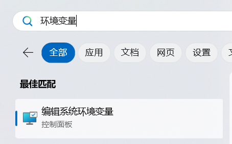
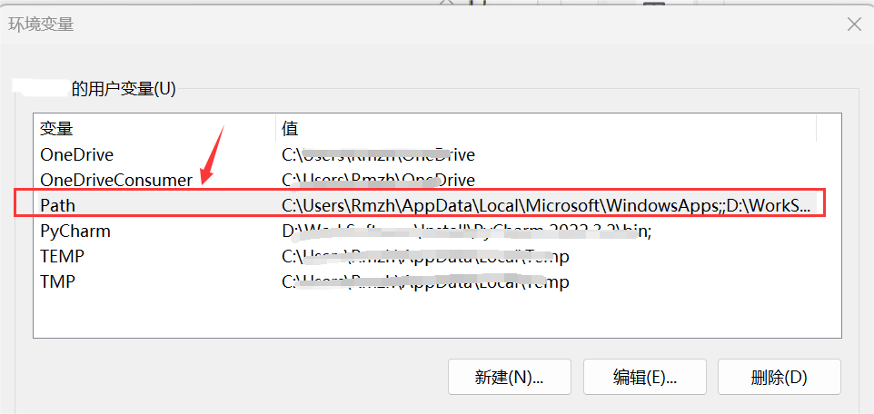
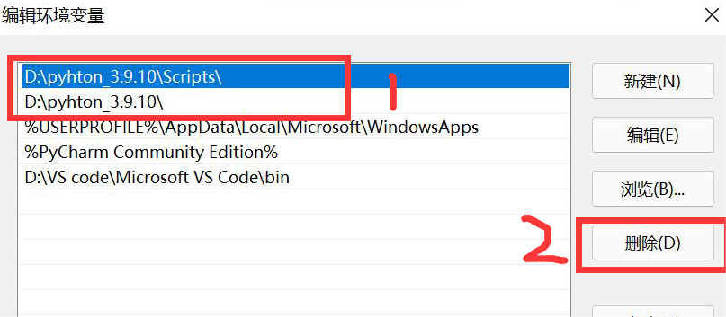
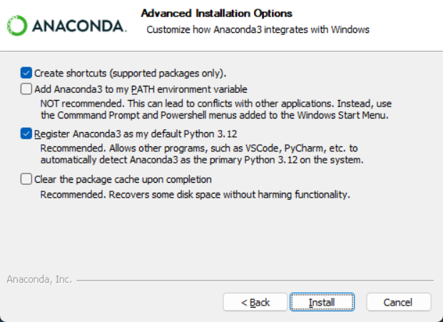
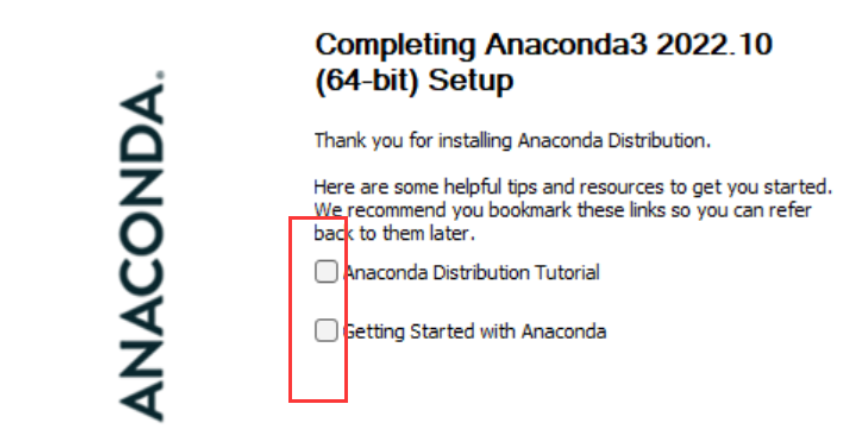
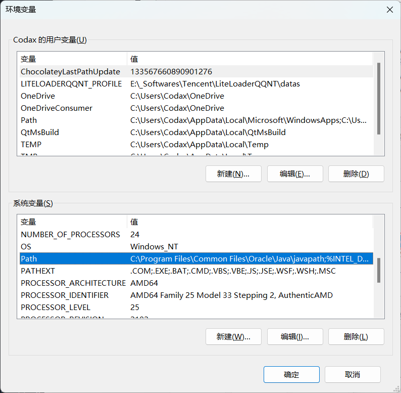
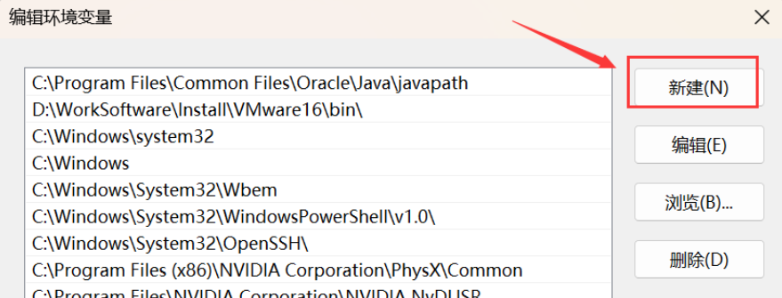
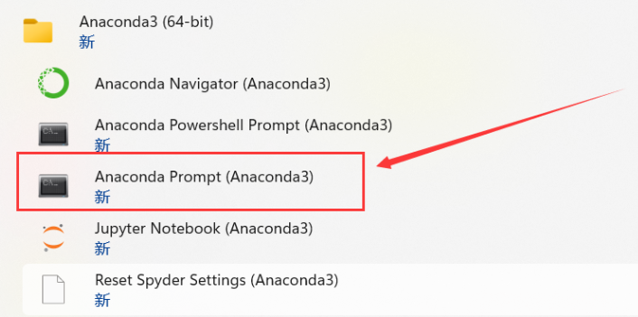

# Anaconda 环境搭建

在本节，我们将从卸载 Python 开始，一步步地搭建完整的机器学习环境。

对于所有的安装包，可以使用[网盘](https://www.123pan.com/s/7vwRjv-lRpxv.html)下载

## 关于 Anaconda

对于 Anaconda，我们在上一节的开头已经分析了他的利弊。如果只看他的好处，Anaconda 是一个强大的开源数据科学平台,它将很多好的工具整合在一起，极大地简化了使用者的工作流程，并能够帮助使用者解决一系列数据科学难题。

如果你已经决定使用 Anaconda（如果你之前没有用过 Python，直接上手 Anaconda 会失去练习调试 Python 的机会，不过其实不会调试也问题不大），那么下面我们就开始安装 Anaconda。

## 视频教程（完整流程）

> 本教程已经相当基础，直接跟着步骤复制代码即可。如果你对于文档类教程不甚敏感，可以参考下面的视频教程（代码与文档一致，可以在本页代码块中直接复制粘贴）。

<div v-if="!isShow" style="width:100%; display: flex; flex-direction: column; justify-content: center; align-items: center;">
    
    <p style="font-size: 20px;">视频绝赞加载中😋...</p>
</div>
<video v-show="isShow" controls="controls" src="../videos/env_anaconda.mp4" @canplay="isShow = true"></video>

<script setup>
    import { ref } from 'vue'
    const isShow = ref(false)
</script>

## 卸载 Python

> 如果你从未安装过 Python，请忽略这一步。

Anaconda 的安装分两种情况：

- 情况一：电脑现在没有装 python 或者现在装的可以卸载掉（装 Anaconda 时先卸 python）
- 情况二： 电脑目前装了 python，但想保留它 (比较复杂，请参考网上其他教程)

如果是情况二，我强烈建议把你的情况改成情况一！

### 验证是否安装了 Python

在开始安装 Anaconda 之前，我们需要先确认电脑上是否已经安装了 Python。

打开命令提示符（Windows，按下 `Win+R` 打开运行框，输入 `cmd`）或终端（Mac/Linux），输入以下命令：

```shell
python --version
```

如果输出 Python 的版本号，说明 Python 已经安装，我们需要卸载它。

### 卸载 Python（若已安装了 Python）

- Windows：在开始菜单中搜索 `控制面板`，然后点击 `程序`，然后点击 `卸载或更改程序`。找到（可以直接搜索`python`）并点击 `Python 3.x`，然后点击 `卸载`。
- Mac/Linux：打开终端，输入以下命令：

```shell
sudo apt-get remove python3
```

### 删除环境变量（若已安装了 Python）

查看用户自己设置的环境变量（使用 windows 自带的搜索，关键词为“环境变量”），也就是上面那一栏



找到 path，双击 path 后面的值，进入查看自己设置过的环境变量



将安装 python 的变量全部删除，如图中两个值，都选中，然后点击删除，再确定（如果卸载完 python 的时候环境变量自动删掉了就不用管）



在退出时，不要忘记外面还有几个确认按钮，也需要点击，不要直接叉掉，否则并没有保存设置。

## 下载 Anaconda 安装包

进入 [Anaconda 官网](https://www.anaconda.com/)，注册或登录，在 Hub 中点击 **Install Distribution**，填写信息后下载即可。

如果你的网络无法访问 Anaconda 官网或者下载速度较慢，可以从 [清华大学开源软件镜像站](https://repo.anaconda.com/archive/) 下载。

或者，直接使用本文档提供的[网盘](https://www.123pan.com/s/7vwRjv-lRpxv.html)下载。

在版本方面，可以使用最新版，但网上风评比较好的是 22 版，不过用起来其实差距不大。

## 安装 Anaconda

> 在 Anaconda 安装的过程中，比较容易出错的环节是环境变量的配置，所以大家在配置环境变量的时候，要细心一些。

双击下载好的安装包，点击 **Next**，点击 **I Agree**，选择 **Just Me**，选择安装路经（安装在 C 盘也有好处，不过与 C 盘爆炸来说不值一提，建议按在其他盘）然后 Next，来到如下界面：



请选择 **Register Anaconda as my default Python 3.x**，不要选 Add Anaconda to my PATH environment variable，我们需要后期手动添加环境变量。

点击 Install，安装需要等待一会儿。

最后一直 Next，直到安装完成。

对于两个“learn”，都取消打勾，不用打开去看了，耽误时间。



安装好后我们需要手动配置环境变量。

## 配置环境变量

计算机（右键）→ 属性 → 高级系统设置 →（点击）环境变量

在下面系统变量里，找到并点击 Path



在编辑环境变量里，点击新建



输入下面的五个环境变量。（**这里不是完全一样的！你需要将以下五条环境变量中涉及的到的"D:\\\_Producers\Anaconda3"都修改为你的 Anaconda 的安装路径！**）

```
D:\_Producers\Anaconda3
D:\_Producers\Anaconda3\Scripts
D:\_Producers\Anaconda3\Library\bin
D:\_Producers\Anaconda3\Library\mingw-w64\bin
D:\_Producers\Anaconda3\Library\usr\bin
```

> 简要说明五条路径的用途：这五个环境变量中，1 是 Python 需要，2 是 conda 自带脚本，3 是 jupyter notebook 动态库, 4 是使用 C with python 的时候

新建完成后点击确定。

## 验证

打开 cmd，在弹出的命令行查看 anaconda 版本，依次输入 ：

```shell
conda --version
python --version
```

若各自出现版本号，即代表配置成功。

在开始菜单或桌面找到 **Anaconda Navifator** 将其打开（若桌面没有可以发一份到桌面，方便后续使用），出现 GUI 界面即为安装成功。

## 更改 conda 源

如果你没有魔法上网工具，建议更改 conda 源，这样可以加快下载包的速度。清华大学提供了 Anaconda 的镜像仓库，我们把源改为清华大学镜像源。

找到 Anaconda prompt，打开 shell 面板。



在命令行输入以下命令：

```shell
conda config --add channels https://mirrors.tuna.tsinghua.edu.cn/anaconda/pkgs/free/
conda config --add channels https://mirrors.tuna.tsinghua.edu.cn/anaconda/cloud/conda-forge
conda config --add channels https://mirrors.tuna.tsinghua.edu.cn/anaconda/cloud/msys2/
conda config --set show_channel_urls yes
```

查看是否修改好通道：

```shell
conda config --show channels
```

## 安装 Python 库

Anaconda 自带了一些常用的机器学习库，如 numpy、pandas、matplotlib、seaborn、scikit-learn 等。

如果需要安装其他库，可以直接在 Anaconda Navigator 里搜索安装。

## Hello, sklearn!

至此，我们已经在本地配置好了 sklearn 的运行环境，我们可以用一个非常简单的例子来测试一下。

新建 Python 文件，输入以下代码并运行：

```python
from sklearn.datasets import load_iris
from sklearn.model_selection import train_test_split, GridSearchCV
from sklearn.preprocessing import StandardScaler
from sklearn.neighbors import KNeighborsClassifier

# 1.获取数据
iris = load_iris()

# 2.数据基本处理
x_train, x_test, y_train, y_test = train_test_split(iris.data, iris.target, test_size=0.2, random_state=22)

# 3.特征工程 - 特征预处理
transfer = StandardScaler()
x_train = transfer.fit_transform(x_train)
x_test = transfer.transform(x_test)

# 4.机器学习-KNN
# 4.1 实例化一个估计器
estimator = KNeighborsClassifier()
# 4.2 模型调优 -- 交叉验证,网格搜索
param_grid = {"n_neighbors": [1, 3, 5, 7]}
estimator = GridSearchCV(estimator, param_grid=param_grid, cv=5)
# 4.3 模型训练
estimator.fit(x_train, y_train)

# 5.模型评估
# 5.1 预测值结果输出
y_pre = estimator.predict(x_test)
print("预测值是:\n", y_pre)
print("预测值和真实值的对比是:\n", y_pre == y_test)
# 5.2 准确率计算
score = estimator.score(x_test, y_test)
print("准确率为:\n", score)
# 5.3 查看交叉验证,网格搜索的一些属性
print("在交叉验证中,得到的最好结果是:\n", estimator.best_score_)
print("在交叉验证中,得到的最好的模型是:\n", estimator.best_estimator_)
print("在交叉验证中,得到的模型结果是:\n", estimator.cv_results_)

print("Hello, sklearn!")
```

运行后便可以看到相应的结果，具体的使用方法与我们会在后续内容中详细介绍。

## \[选读\]常用的命令

在没有 GUI 的情况下，以下命令比较常用：

1.查看当前环境下安装的库：

```shell
conda list
```

2.查看所有环境：

```shell
conda info --envs
```

3.创建新的环境：

```shell
conda create -n 环境名称 python=版本号
```

4.激活环境：

```shell
conda activate 环境名称
```

5.退出环境：

```shell
conda deactivate
```

6.删除环境：

```shell
conda remove -n 环境名称 --all
```

7.导出环境：

```shell
conda env export > environment.yaml
```

8.导入环境：

```shell
conda env create -f environment.yaml
```

9.列出所有可用的包：

```shell
conda search 包名
```

10.安装包：

```shell
conda install 包名
```

11.更新包：

```shell
conda update 包名
```

12.卸载包：

```shell
conda uninstall 包名
```
