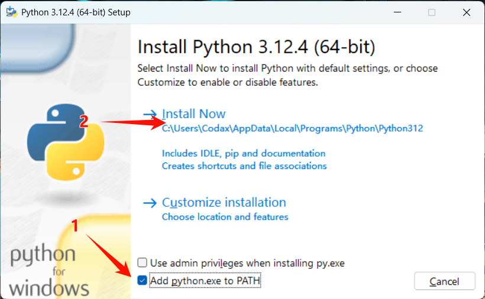

# Python 解释器环境搭建

在本节，我们将从 Python 安装开始，一步步地搭建完整的机器学习环境。

对于所有的安装包，可以使用[网盘](https://www.123pan.com/s/7vwRjv-lRpxv.html)下载

:::tip
Python 解释器搭建方法（传统官方方案）与 Anaconda 环境搭建方法二选一即可。

Anaconda 提供了更加便捷的环境管理与包管理，但对本部分用处不大，如果希望进一步学习深度学习建议使用。（相见“关于 Anaconda”）

如果你希望使用 Anaconda，可以直接跳转至[Anaconda 环境搭建](./anaconda.md)。
:::

## 环境使用概述

- **Python 环境**：Python 3.12.4（其他版本也可，但不保证兼容性。如果使用 Anaconda 只需新建支持 sklearn 的环境即可。推荐搭配 virtualenv 使用，在后文会详细讲解）
- **代码编写环境（IDE）**：Visual Studio Code \[PyCharm 等其他 IDE 都可，挑习惯的用就行\]、Jupyter Notebook（选用）

以上环境在 Windows 环境与 mac 环境下都有相应版本，本文档以 Windows 11 为例进行说明，其他系统环境请自行百度。

IDE 的安装已经多次讲解，若仍有问题请自行搜索教程，建议使用 `vscode` 或 `PyCharm` 编写 Python 程序。

::: details 关于 Anaconda
**为什么本部分不使用 Anaconda？**

Anaconda 有非常多的好处，包括 Python 包管理、环境管理、科学计算库、数据处理工具等，特别是在深度学习场景下使用非常广泛。

但 Anaconda 并不是一个纯粹的 Python 发行版，它还包括了很多其他工具，如 Jupyter Notebook、Spyder、TensorFlow、PyTorch 等，这些工具在机器学习场景下可能并不是必须的，而且会占用更多的磁盘空间。

在传统机器学习应用阶段（sklearn），我们实际上用不到 Anaconda 提供的优势。如果你希望进一步学习深度学习，推荐进行安装。

最关键的是笔者更习惯使用 pip 与虚拟环境，~~所以入乡随俗吧~~。

**Anaconda 适合什么情况下使用？**

Anaconda 在大多数的场景下适用于高频的场景切换（如临时服务器）与数据科学计算（如人工智能）等领域。如果你的磁盘空间比较大，并希望学习一个图形化管理器与一大堆新的指令，那么 Anaconda 是一个不错的选择。

特别的，如果经过一通折腾后你成功安装了 Anaconda，那后续的使用将会非常简单，适合只用 Python 做机器学习的同学使用。

**我已经决定好了使用 Anaconda！**

请跳转至[Anaconda 环境搭建](./anaconda.md)。也可以参考此[教程](https://www.bilibili.com/video/BV1cD4y1H7Tk)，非常详细。

需要提醒的是，在安装 Anaconda 前建议删除之前的 Python 环境，否则可能会导致冲突。
:::

在本节内容中，只需要跟随流程安装即可，相应介绍会在后文中详细展开。

## 视频教程（完整流程）

> 本教程已经相当基础，直接跟着步骤复制代码即可。如果你对于文档类教程不甚敏感，可以参考下面的视频教程（代码与文档一致，可以在本页代码块中直接复制粘贴）。

<div v-if="!isShow" style="width:100%; display: flex; flex-direction: column; justify-content: center; align-items: center;">
    
    <p style="font-size: 20px;">视频绝赞加载中😋...</p>
</div>
<video v-show="isShow" controls="controls" src="../videos/env_python.mp4" @canplay="isShow = true"></video>

<script setup>
    import { ref } from 'vue'
    const isShow = ref(false)
</script>

## Python

### 下载

首先，我们安装 Python 环境。你可以从 [Python 官网](https://www.python.org/downloads/)下载相应版本的安装包安装，也可以使用本文档提供的[网盘](https://www.123pan.com/s/7vwRjv-lRpxv.html)进行下载。

### 安装

下载完成后，双击打开.exe 安装文件

如果你是第一次安装 Python，可以勾选 `Add python.exe to Path`，点击 Install Now，等待安装完成后关闭即可。

::: tip
如果你的电脑上已经安装好了 Python，在可以正常使用后续相关库的情况下直接使用即可，请不要勾选`Add python.exe to Path`或不安装其他 Python 版本。
:::



### 验证

打开命令提示符（`Win键 + R键`，输入 `cmd` 回车），输入 `python` 回车，如果出现 Python 的版本信息，则说明安装成功。

## 相关 Python 库

### 设置镜像源

1. 打开命令提示符或其他终端，输入以下命令：

```shell
pip config set global.index-url https://mirrors.aliyun.com/pypi/simple/
```

2. 输入以下命令，查看是否设置成功：

```shell
pip config list
```

如果输出中有 `global.index-url`，则说明设置成功。

### 清单

在机器学习阶段，我们需要用到以下 Python 库：

- **NumPy**：用于数值计算
- **Pandas**：用于数据处理
- **Matplotlib**：用于数据可视化
- **Scikit-learn**：用于机器学习
- \[选用\]Jupyter Notebook：用于代码编写与交互式执行
- \[选用\]virtualenv：虚拟环境管理

对于 `Jupyter` 与 `virtualenv`，本文档不会明文说明使用，自己在需要使用时自行调用即可。

如果有其他需要，可以自行安装相应库。

### 安装

打开命令提示符或其他终端，输入以下命令进行安装：

```shell
pip install numpy pandas matplotlib scikit-learn
```

如果安装过程中出现错误，请尝试使用管理员权限运行命令提示符或终端。

### 验证

新建 Python 文件，输入以下代码并运行以验证安装：

```python
import numpy as np
import pandas as pd
import matplotlib.pyplot as plt
from sklearn import datasets
```

如果没有报错，则说明安装成功。

## Hello, sklearn!

至此，我们已经在本地配置好了 sklearn 的运行环境，我们可以用一个非常简单的例子来测试一下。

新建 Python 文件，输入以下代码并运行：

```python
from sklearn.datasets import load_iris
from sklearn.model_selection import train_test_split, GridSearchCV
from sklearn.preprocessing import StandardScaler
from sklearn.neighbors import KNeighborsClassifier

# 1.获取数据
iris = load_iris()

# 2.数据基本处理
x_train, x_test, y_train, y_test = train_test_split(iris.data, iris.target, test_size=0.2, random_state=22)

# 3.特征工程 - 特征预处理
transfer = StandardScaler()
x_train = transfer.fit_transform(x_train)
x_test = transfer.transform(x_test)

# 4.机器学习-KNN
# 4.1 实例化一个估计器
estimator = KNeighborsClassifier()
# 4.2 模型调优 -- 交叉验证,网格搜索
param_grid = {"n_neighbors": [1, 3, 5, 7]}
estimator = GridSearchCV(estimator, param_grid=param_grid, cv=5)
# 4.3 模型训练
estimator.fit(x_train, y_train)

# 5.模型评估
# 5.1 预测值结果输出
y_pre = estimator.predict(x_test)
print("预测值是:\n", y_pre)
print("预测值和真实值的对比是:\n", y_pre == y_test)
# 5.2 准确率计算
score = estimator.score(x_test, y_test)
print("准确率为:\n", score)
# 5.3 查看交叉验证,网格搜索的一些属性
print("在交叉验证中,得到的最好结果是:\n", estimator.best_score_)
print("在交叉验证中,得到的最好的模型是:\n", estimator.best_estimator_)
print("在交叉验证中,得到的模型结果是:\n", estimator.cv_results_)

print("Hello, sklearn!")

```

运行后便可以看到相应的结果，具体的使用方法与我们会在后续内容中详细介绍。
