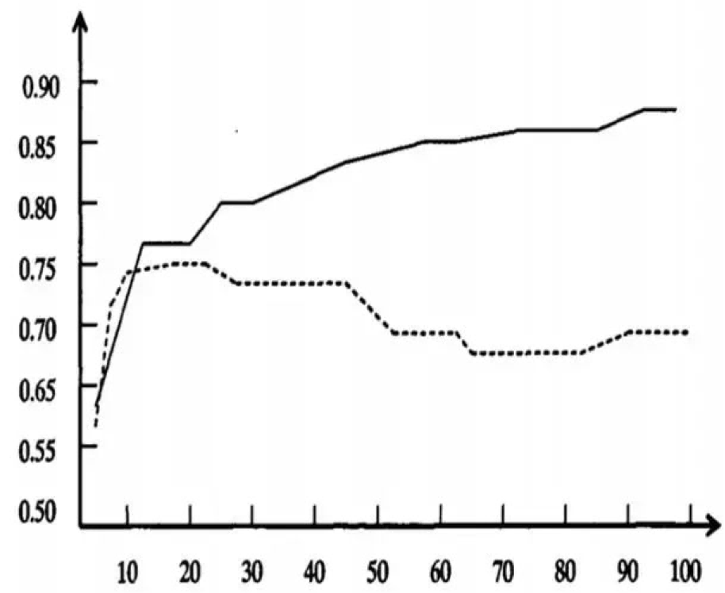

# cart 剪枝

## 为什么要剪枝

先看下图：

图中：

- 横轴表示在决策树创建过程中树的结点总数，纵轴表示决策树的预测精度。
- 实线显示的是决策树在训练集上的精度，虚线显示的则是在一个独立的测试集上测量出来的精度。

随着树的增长，在训练样集上的精度是单调上升的， 然而在独立的测试样例上测出的精度先上升后下降。

出现这种情况的原因：

- 原因 1：噪声、样本冲突，即错误的样本数据。
- 原因 2：特征即属性不能完全作为分类标准。
- 原因 3：巧合的规律性，数据量不够大。

这时，我们需要对决策树进行剪枝，以达到降低预测误差的目的。

## 常用的剪枝方法

### 预剪枝

1. 每一个结点所包含的最小样本数目，例如 10，则该结点总样本数小于 10 时，则不再分；
2. 指定树的高度或者深度，例如树的最大深度为 4；
3. 指定结点的熵小于某个值，不再划分。随着树的增长， 在训练样集上的精度是单调上升的， 然而在独立的测试样例上测出的精度先上升后下降。

### 后剪枝

在已生成过拟合决策树上进行剪枝，可以得到简化版的剪枝决策树。
