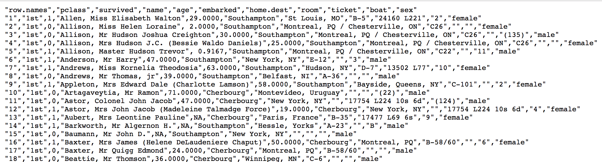

# 案例：泰坦尼克号乘客生存预测

## 案例背景

泰坦尼克号沉没是历史上最臭名昭着的沉船之一。1912 年 4 月 15 日，在她的处女航中，泰坦尼克号在与冰山相撞后沉没，在 2224 名乘客和机组人员中造成 1502 人死亡。这场耸人听闻的悲剧震惊了国际社会，并为船舶制定了更好的安全规定。 造成海难失事的原因之一是乘客和机组人员没有足够的救生艇。尽管幸存下沉有一些运气因素，但有些人比其他人更容易生存，例如妇女，儿童和上流社会。 在这个案例中，我们要求您完成对哪些人可能存活的分析。特别是，我们要求您运用机器学习工具来预测哪些乘客幸免于悲剧。

我们提取到的数据集中的特征包括票的类别，是否存活，乘坐班次，年龄，登陆 home.dest，房间，船和性别等。

数据地址：http://biostat.mc.vanderbilt.edu/wiki/pub/Main/DataSets/titanic.txt



经过观察数据得到:

- 乘坐班是指乘客班（1，2，3），是社会经济阶层的代表。
- 其中 `age` 数据存在缺失。

## 步骤分析

1. 获取数据
2. 数据基本处理
   1. 确定特征值,目标值
   2. 缺失值处理
   3. 数据集划分
3. 特征工程(字典特征抽取)
4. 机器学习(决策树)
5. 模型评估

## 代码实现

```python
import pandas as pd
from sklearn.model_selection import train_test_split
from sklearn.feature_extraction import DictVectorizer
from sklearn.tree import DecisionTreeClassifier

# 1.获取数据
titan = pd.read_csv(r"D:\_Projects\机器学习\教学助理\doc\codes\决策树\titanic.csv")
print(titan.head())

# 2.数据基本处理
# 2.1 确定特征值,目标值
x = titan[["Pclass", "Age", "Sex"]]
y = titan["Survived"]
# 2.2 缺失值处理
x['Age'].fillna(x['Age'].mean(), inplace=True)
# 2.3 数据集划分
x_train, x_test, y_train, y_test = train_test_split(x, y, random_state=22)

# 3.特征工程(字典特征抽取)
# 对于x转换成字典数据x.to_dict(orient="records")
# [{"pclass": "1st", "age": 29.00, "sex": "female"}, {}]
transfer = DictVectorizer(sparse=False)
x_train = transfer.fit_transform(x_train.to_dict(orient="records"))
x_test = transfer.fit_transform(x_test.to_dict(orient="records"))

# 4.机器学习(决策树)
estimator = DecisionTreeClassifier(criterion="entropy", max_depth=5)
estimator.fit(x_train, y_train)

# 5.模型评估
print(estimator.score(x_test, y_test))
print(estimator.predict(x_test))
```

输出结果：

```shell
0.7757847533632287
[1 0 0 1 1 0 1 0 0 1 1 1 0 0 0 0 1 0 1 0 1 0 1 0 0 0 0 0 1 0 0 0 1 1 1 0 0
 0 0 0 0 1 1 1 1 0 0 0 1 0 1 0 0 0 0 0 0 0 1 1 0 1 0 1 0 0 0 0 0 0 0 0 0 0
 0 0 0 1 0 1 0 0 0 0 0 0 1 0 0 0 1 0 0 0 1 0 0 0 0 0 1 1 0 0 1 0 0 1 0 0 0
 0 1 1 1 0 1 0 0 1 0 1 0 0 1 0 0 0 1 1 0 0 0 1 0 1 1 1 0 0 1 0 0 0 0 0 0 1
 0 0 1 0 1 0 0 1 1 0 1 1 0 0 0 0 0 1 0 1 0 1 0 1 0 0 1 1 1 0 0 0 0 0 1 0 0
 0 0 0 0 1 0 1 0 0 0 0 0 0 0 1 1 0 1 1 0 0 1 0 0 1 0 1 0 1 1 1 0 1 0 0 0 1
 1]
```
