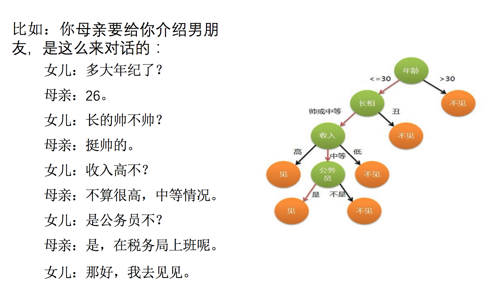
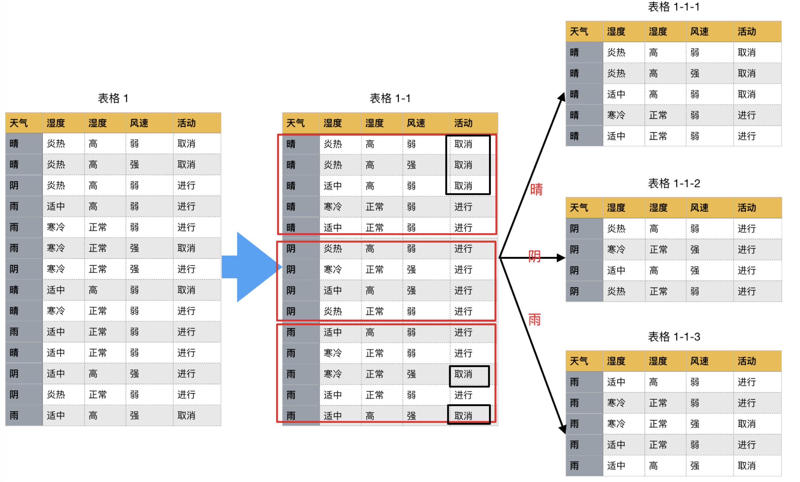
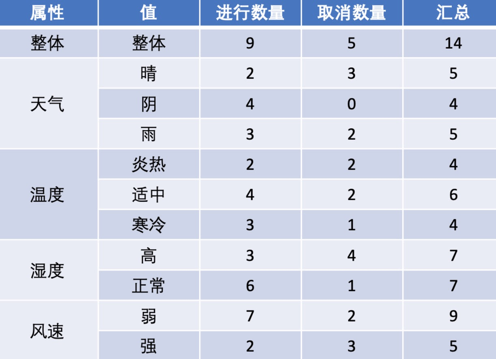
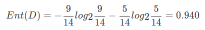
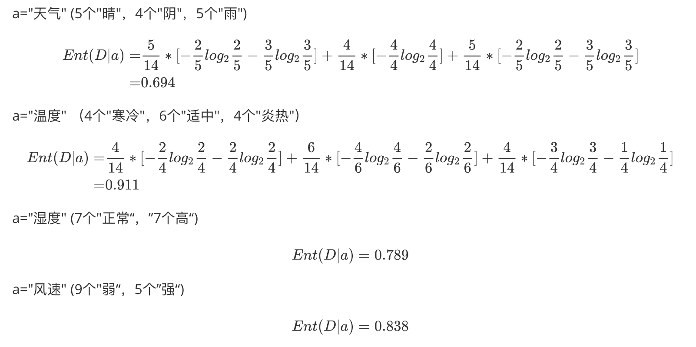
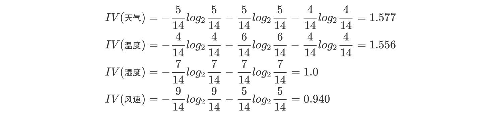
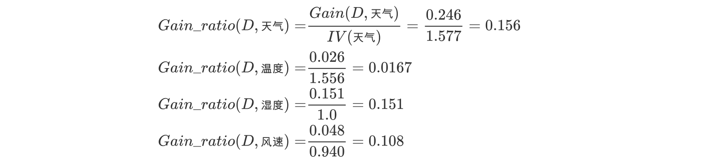
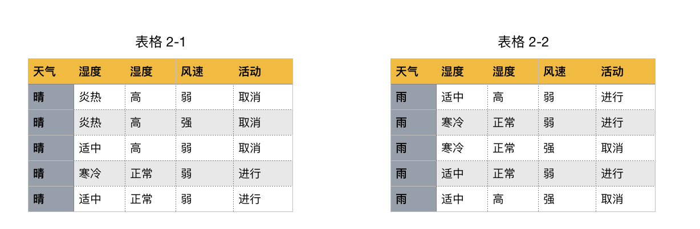
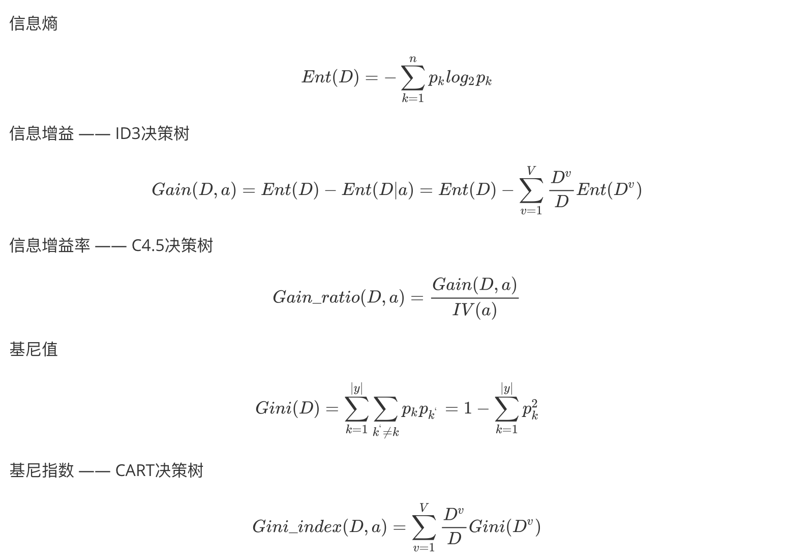

# 决策树

决策树思想的来源非常朴素，程序设计中的条件分支结构就是 if-else 结构，最早的决策树就是利用这类结构分割数据的一种分类学习方法

**决策树：是一种树形结构，其中每个内部节点表示一个属性上的判断，每个分支代表一个判断结果的输出，最后每个叶节点代表一种分类结果，本质是一颗由多个判断节点组成的树。**

怎么理解这句话？我们可以看一个几年前非常经典的对话例子：



上面案例是女生通过定性的主观意识，把年龄放到最上面，那么如果需要对这一过程进行量化，该如何处理呢？

此时需要用到信息论中的知识：信息熵，信息增益。

决策树是一种有**监督学习**、**分类**算法。

## 熵

物理学上，熵 Entropy 是“混乱”程度的量度。

**系统越有序，熵值越低；系统越混乱或者分散，熵值越高。**

1948 年香农提出了信息熵（Entropy）的概念：

- 从信息的完整性上进行的描述：当**系统的有序状态一致**时，数据越集中的地方熵值越小，数据越分散的地方熵值越大。
- 从信息的有序性上进行的描述：当**数据量一致时，系统越有序，熵值越低；系统越混乱或者分散，熵值越高**。

"信息熵" (information entropy)是度量样本集合纯度最常用的一种指标。

假定当前样本集合 D 中第 k 类样本所占的比例为$p_k (k = 1, 2,. . . , |y|)$ ，$p_k=\frac{c_k}{D}$， D 为样本的所有数量，$C^k$为第 k 类样本的数量，则 D 的信息熵定义为：


其中：Ent(D) 的值越小，则 D 的纯度越高

不太好理解对吧，我们举个例子：

假设我们没有看世界杯的比赛，但是想知道哪支球队会是冠军，我们只能猜测某支球队是或不是冠军，然后观众用对或不对来回答，我们想要猜测次数尽可能少，你会用什么方法？

如果你学过数据结构，你很可能想到使用二分法作为猜测的方法。

假如有 16 支球队，分别编号，先问是否在 1-8 之间，如果是就继续问是否在 1-4 之间，以此类推，直到最后判断出冠军球队是哪支。如果球队数量是 16，我们需要问 4 次来得到最后的答案。那么世界冠军这条消息的信息熵就是 4。

那么信息熵等于 4，是如何进行计算的呢？

$$Ent(D)=-(p_1*log_2p_1+p_2*log_2p_2+...+p_16*log_2p_16)$$

其中 p1, ..., p16 分别是这 16 支球队夺冠的概率。

当每支球队夺冠概率相等都是 1/16 时，熵最大，这件事越不确定。

在其他领域，类似的计算方法也被广泛使用，如果对公式不太敏感看这个视频：

<iframe src="//player.bilibili.com/player.html?isOutside=true&aid=716662645&bvid=BV1oX4y1w7aG&cid=370896828&p=1" scrolling="no" border="0" frameborder="no" framespacing="0" allowfullscreen="true" style="width: 100%; height: 400px;"></iframe>

## 信息增益

信息增益：以某特征划分数据集前后的熵的差值。熵可以表示样本集合的不确定性，熵越大，样本的不确定性就越大。因此可以**使用划分前后集合熵的差值来衡量使用当前特征对于样本集合 D 划分效果的好坏**。

**信息增益 = entroy(前) - entroy(后)**

> 注：信息增益表示得知特征 X 的信息而使得类 Y 的信息熵减少的程度

定义与公式

假定离散属性 a 有 V 个可能的取值，若使用 a 来对样本集 D 进行划分，则会产生 V 个分支结点，其中第 v 个分支结点包含了 D 中所有在属性 a 上取值为$a^v$的样本，记为$D^v$。我们可根据前面给出的信息熵公式计算出$D^v$的信息熵，再考虑到不同的分支结点所包含的样本数不同，给分支结点赋予权重$\frac{|D^v|}{|D|}$

即样本数越多的分支结点的影响越大，于是可计算出用属性 a 对样本集 D 进行划分所获得的"信息增益" (information gain)

其中：

特征 a 对训练数据集 D 的信息增益 Gain(D,a),定义为集合 D 的信息熵 Ent(D)与给定特征 a 条件下 D 的信息条件熵 Ent(D∣a)之差，即公式为：


公式的详细解释：

信息熵的计算：


条件熵的计算：


一般而言，信息增益越大，则意味着**使用属性 a 来进行划分所获得的"纯度提升"越大**。因此，我们可用信息增益来进行决策树的划分属性选择，著名的 ID3(Iterative Dichotomiser III) 决策树学习算法 [Quinlan， 1986] 就是以信息增益为准则来选择划分属性。

## 信息增益率

实际上，**信息增益准则对可取值数目较多的属性有所偏好**，为减少这种偏好可能带来的不利影响，著名的 C4.5 决策树算法 \[Quinlan， 1993\] 不直接使用信息增益，而是使用"增益率" (gain ratio) 来选择最优划分属性.

增益率：增益率是用前面的信息增益 Gain(D, a)和属性 a 对应的"固有值"的比值来共同定义的。


我们上个案例。

如下图，第一列为天气，第二列为温度，第三列为湿度，第四列为风速，最后一列该活动是否进行。

我们要解决：根据下面表格数据，判断在对应天气下，活动是否会进行？





该数据集有四个属性，属性集合 A={ 天气，温度，湿度，风速}， 类别标签有两个，类别集合 L={进行，取消}。

**a.计算类别信息熵**

类别信息熵表示的是所有样本中各种类别出现的不确定性之和。根据熵的概念，熵越大，不确定性就越大，把事情搞清楚所需要的信息量就越多。



**b.计算每个属性的信息熵**

每个属性的信息熵相当于一种条件熵。他表示的是在某种属性的条件下，各种类别出现的不确定性之和。属性的信息熵越大，表示这个属性中拥有的样本类别越不“纯”。



**c.计算信息增益**

信息增益的 = 熵 - 条件熵，在这里就是 类别信息熵 - 属性信息熵，它表示的是信息不确定性减少的程度。如果一个属性的信息增益越大，就表示用这个属性进行样本划分可以更好的减少划分后样本的不确定性，当然，选择该属性就可以更快更好地完成我们的分类目标。

**信息增益就是 ID3 算法的特征选择指标。**


假设我们把上面表格 1 的数据前面添加一列为"编号",取值(1--14). 若把"编号"也作为一个候选划分属性,则根据前面步骤: 计算每个属性的信息熵过程中,我们发现,该属性的值为 0, 也就是其信息增益为 0.940. 但是很明显这么分类,最后出现的结果不具有泛化效果.此时根据信息增益就无法选择出有效分类特征。所以，C4.5 选择使用信息增益率对 ID3 进行改进。

**d.计算属性分裂信息度量**

用分裂信息度量来考虑某种属性进行分裂时分支的数量信息和尺寸信息，我们把这些信息称为属性的内在信息（instrisic information）。信息增益率用信息增益/内在信息，会导致属性的重要性随着内在信息的增大而减小（也就是说，如果这个属性本身不确定性就很大，那我就越不倾向于选取它），这样算是对单纯用信息增益有所补偿。



**e.计算信息增益率**



天气的信息增益率最高，选择天气为分裂属性。发现分裂了之后，天气是“阴”的条件下，类别是”纯“的，所以把它定义为叶子节点，选择不“纯”的结点继续分裂。



在子结点当中重复过程 1~5，直到所有的叶子结点足够"纯"。

现在我们来总结一下 C4.5 的算法流程：

```
while(当前节点"不纯")：
    1.计算当前节点的类别熵(以类别取值计算)
    2.计算当前阶段的属性熵(按照属性取值吓得类别取值计算)
    3.计算信息增益
    4.计算各个属性的分裂信息度量
    5.计算各个属性的信息增益率
end while
当前阶段设置为叶子节点
```

## 基尼值和基尼指数

CART(Classification and Regression Tree) 决策树 \[Breiman et al., 1984\] 使用"基尼指数" (Gini index)来选择划分属性

基尼值 Gini（D）：从数据集 D 中随机抽取两个样本，其类别标记不一致的概率。故，Gini（D）值越小，数据集 D 的纯度越高。

数据集 D 的纯度可用基尼值来度量:


基尼指数 Gini_index（D）：一般，选择使划分后基尼系数最小的属性作为最优化分属性。


## 对比与总结

### 常见决策树的启发函数比较



| 名称 | 提出时间 |  分支方式  |                           备注                           |
| :--: | :------: | :--------: | :------------------------------------------------------: |
| ID3  |   1975   |  信息增益  |           ID3 只能对离散属性的数据集构成决策树           |
| C4.5 |   1993   | 信息增益率 |  优化后解决了 ID3 分支过程中总喜欢偏向选择值较多的 属性  |
| CART |   1984   | Gini 系数  | 可以进行分类和回归，可以处理离散属性，也可以处理连续属性 |

### ID3 算法

- ID3 算法在选择根节点和各内部节点中的分支属性时，采用信息增益作为评价标准。信息增益的缺点是倾向于选择取值较多的属性，在有些情况下这类属性可能不会提供太多有价值的信息.
- ID3 算法只能对描述属性为离散型属性的数据集构造决策树。

### C4.5 算法

做出的改进(为什么使用 C4.5 要好)：

1. 用信息增益率来选择属性
2. 可以处理连续数值型属性
3. 采用了一种后剪枝方法
4. 对于缺失值的处理

C4.5 算法的优缺点：

- 优点：产生的分类规则易于理解，准确率较高。
- 缺点：在构造树的过程中，需要对数据集进行多次的顺序扫描和排序，因而导致算法的低效。此外，C4.5 只适合于能够驻留于内存的数据集，当训练集大得无法在内存容纳时程序无法运行。

### CART 算法

CART 算法相比 C4.5 算法的分类方法，采用了简化的二叉树模型，同时特征选择采用了近似的基尼系数来简化计算。

C4.5 不一定是二叉树，但 CART 一定是二叉树。

### 多变量决策树(multi-variate decision tree)

同时，无论是 ID3, C4.5 还是 CART,在做特征选择的时候都是选择最优的一个特征来做分类决策，但是大多数，分类决策不应该是由某一个特征决定的，而是应该由一组特征决定的。这样决策得到的决策树更加准确。这个决策树叫做多变量决策树(multi-variate decision tree)。在选择最优特征的时候，多变量决策树不是选择某一个最优特征，而是选择最优的一个特征线性组合来做决策。这个算法的代表是 OC1，这里不多介绍。

如果样本发生一点点的改动，就会导致树结构的剧烈改变。这个可以通过集成学习里面的随机森林之类的方法解决。

### 决策树变量的两种类型

- 数字型（Numeric）：变量类型是整数或浮点数，如前面例子中的“年收入”。用“>=”，“>”,“<”或“<=”作为分割条件（排序后，利用已有的分割情况，可以优化分割算法的时间复杂度）。
- 名称型（Nominal）：类似编程语言中的枚举类型，变量只能从有限的选项中选取，比如前面例子中的“婚姻情况”，只能是“单身”，“已婚”或“离婚”，使用“=”来分割。

### 如何评估分割点的好坏？

如果一个分割点可以将当前的所有节点分为两类，使得每一类都很“纯”，也就是同一类的记录较多，那么就是一个好分割点。

比如上面的例子，“拥有房产”，可以将记录分成了两类，“是”的节点全部都可以偿还债务，非常“纯”；“否”的节点，可以偿还贷款和无法偿还贷款的人都有，不是很“纯”，但是两个节点加起来的纯度之和与原始节点的纯度之差最大，所以按照这种方法分割。

构建决策树采用贪心算法，只考虑当前纯度差最大的情况作为分割点。
