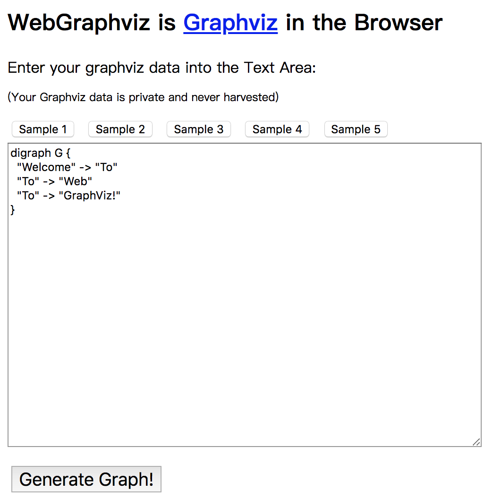
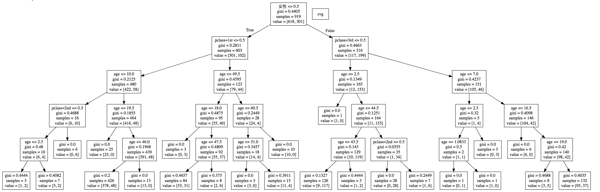

# 决策树可视化

决策树的结构是可以直接显示的。

## 保存树的结构到 dot 文件

sklearn 封装了`export_graphviz()`函数，可以将决策树的结构保存为 dot 文件：

```python
sklearn.tree.export_graphviz(decision_tree, out_file='tree.dot', feature_names=iris.feature_names, class_names=iris.target_names, filled=True, rounded=True, special_characters=True)
```

其中：

- `decision_tree`：决策树模型
- `out_file`：保存的文件名
- `feature_names`：特征的名称
- `class_names`：类别的名称
- `filled`：是否填充节点
- `rounded`：是否圆角
- `special_characters`：是否使用特殊字符

例如：

```python
export_graphviz(estimator, out_file="./data/tree.dot", feature_names=['age', 'pclass=1st', 'pclass=2nd', 'pclass=3rd', '女性', '男性'])
```

dot 文件当中的内容如下：

```
digraph Tree {
node [shape=box] ;
0 [label="petal length (cm) <= 2.45\nentropy = 1.584\nsamples = 112\nvalue = [39, 37, 36]"] ;
1 [label="entropy = 0.0\nsamples = 39\nvalue = [39, 0, 0]"] ;
0 -> 1 [labeldistance=2.5, labelangle=45, headlabel="True"] ;
2 [label="petal width (cm) <= 1.75\nentropy = 1.0\nsamples = 73\nvalue = [0, 37, 36]"] ;
0 -> 2 [labeldistance=2.5, labelangle=-45, headlabel="False"] ;
3 [label="petal length (cm) <= 5.05\nentropy = 0.391\nsamples = 39\nvalue = [0, 36, 3]"] ;
2 -> 3 ;
4 [label="sepal length (cm) <= 4.95\nentropy = 0.183\nsamples = 36\nvalue = [0, 35, 1]"] ;
3 -> 4 ;
5 [label="petal length (cm) <= 3.9\nentropy = 1.0\nsamples = 2\nvalue = [0, 1, 1]"] ;
4 -> 5 ;
6 [label="entropy = 0.0\nsamples = 1\nvalue = [0, 1, 0]"] ;
5 -> 6 ;
7 [label="entropy = 0.0\nsamples = 1\nvalue = [0, 0, 1]"] ;
5 -> 7 ;
8 [label="entropy = 0.0\nsamples = 34\nvalue = [0, 34, 0]"] ;
4 -> 8 ;
9 [label="petal width (cm) <= 1.55\nentropy = 0.918\nsamples = 3\nvalue = [0, 1, 2]"] ;
3 -> 9 ;
10 [label="entropy = 0.0\nsamples = 2\nvalue = [0, 0, 2]"] ;
9 -> 10 ;
11 [label="entropy = 0.0\nsamples = 1\nvalue = [0, 1, 0]"] ;
9 -> 11 ;
12 [label="petal length (cm) <= 4.85\nentropy = 0.191\nsamples = 34\nvalue = [0, 1, 33]"] ;
2 -> 12 ;
13 [label="entropy = 0.0\nsamples = 1\nvalue = [0, 1, 0]"] ;
12 -> 13 ;
14 [label="entropy = 0.0\nsamples = 33\nvalue = [0, 0, 33]"] ;
12 -> 14 ;
}
```

有点不太直观对吧，我们可以在一个网站上显示

## 网站显示结构

http://webgraphviz.com/



将 dot 文件内容复制到该网站当中即可显示：


